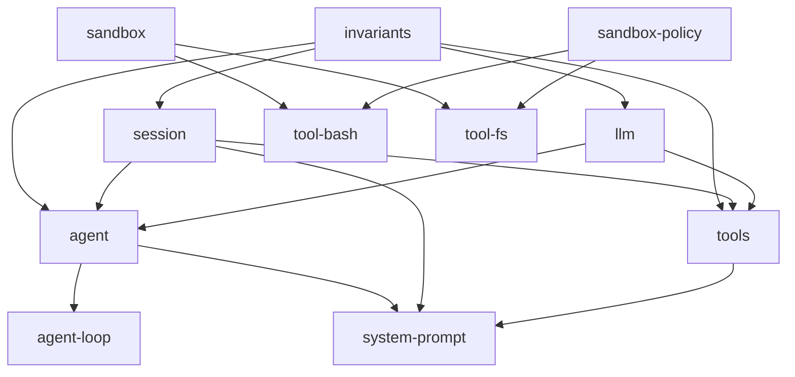

# LLM Benchmark Harness — Roadmap Backlog

This file is the forward-looking backlog for the LLM benchmark harness on
benebsworth.com (`/lab/llm-benchmark/`). It records **features, not bug fixes**
— hardening that already shipped lives in the git log (see "Already shipped"
at the bottom). Items are ordered by priority within each tier.

## How to use this file

- Pick an item, implement it, then mark it `[x]` and move the "Design sketch"
  notes into the skill (`lib/lab/llm-benchmark/../.claude/skills/llm-benchmark/SKILL.md`)
  so the runbook stays current.
- Each item references the code it touches and the external example it was
  inspired by (primarily the DeepSeek Harness, `dsh`).
- Effort is rough relative sizing: S (< 1 session), M (1-3 sessions),
  L (multi-session project).

## Deep-dive provenance

Items marked "dsh code study" were pulled from a local clone of
deepseek-ai/deepseek-harness (`git clone --depth 1
https://github.com/deepseek-ai/deepseek-harness /tmp/dsh`, 2026-08-13):
`docs/defensive-patterns.md`, `docs/subsystems/sandbox.md`,
`packages/feedback/`, `packages/runtime-diagnostics/invariants/`,
`packages/session/session-persistence-jsonl/`,
`packages/session/session-stats/`, `packages/code-runtime/`,
`packages/spill/`, `docs/postmortem/`. When implementing, refresh the clone
first (`cd /tmp/dsh && git pull`) since the repo is in active developer
preview and its API churns.

## Reference: DeepSeek Harness (dsh)

**Repo:** https://github.com/deepseek-ai/deepseek-harness (MIT, 103k stars,
"Everything is a Plugin", built on the Cordis plugin framework:
https://github.com/cordiverse/cordis).

The single most valuable ideas for this benchmark:

1. **Session log as source of truth.** An append-only `SessionEvent` log with a
   runtime invariant: *"model-visible means logged"* — anything that reached a
   model request must be reconstructable from the log. Fork, resume,
   transcripts, telemetry, and persistence all derive from this one stream.
   (https://github.com/deepseek-ai/deepseek-harness/blob/master/docs/architecture.md,
   https://github.com/deepseek-ai/deepseek-harness/blob/master/docs/subsystems/session.md)
2. **Profiles + bundles + patchable config.** A running harness is a layered,
   named composition; `dsh --dump-config` prints the booted tree and any row
   is replaceable via a config patch. There is no privileged core.
   (architecture.md § "Profiles and bundles")
3. **Capability seams.** A seam = Service Definition + Service Provider +
   Consumer. Filesystem, subprocess, sandbox, shell, subagent are all seams,
   so one provider swap moves every consumer with it (e.g. pointing fs+shell
   at a remote sandbox). (architecture.md § "Capability seams")
4. **Telemetry is a first-class plugin**, not an afterthought.
   (architecture.md § "Events" / dsh-base bundle description)
5. **Benchmarks are just isolated invocations of the real harness.** Separate
   workspace + session ID per task; the same tool that does real work runs the
   eval. (https://github.com/deepseek-ai/deepseek-harness/blob/master/BENCHMARK.md,
   https://github.com/deepseek-ai/deepseek-harness/blob/master/docs/user/guide/python-sdk.md)
6. **Retries are durable, loop-level events.** `packages/llm/llm-retry` never
   wraps the adapter call: every provider attempt stays one call, and each
   retry opens a fresh turn over the same durable history, appending
   `llm/retry` + `llm/retry-started` events with a canonical policy key
   (provider + every behavior-affecting field). Honoring
   `providerRetryAfterMs` replaces local backoff. The invariant companion
   checks every retry event pairs with a started event and names the right
   turn/step. (packages/llm/llm-retry/README.md)
7. **Per-session composition ("presets").** An agent preset is a directory
   holding an `agent.cordis.yml` that gives one session its own tools and
   prompt sections while other sessions keep theirs; a preset naming a
   process-global service is rejected at mount rather than colliding.
   (packages/preset/README.md)
8. **Projection is one pure function with an incremental cache.** Session
   history is derived by folding `deriveEventMessage` over the log's surface
   (O(new nodes), cached per generation, deep-frozen shared messages) — the
   same function drives live history, external reconstruction, and pure
   projections, so they can never disagree.
   (packages/core/session/src/{index.ts,surface.ts})

---

# Deep-dive #2: graph analysis (2026-08-13)

Processed the full package tree with a standalone graph script
(`/tmp/dsh-graph.cjs`; edges = in-repo `peerDependencies`, the canonical
runtime-dependency signal — same semantics as dsh's own
`scripts/gen-module-graph.ts`).

Topology facts:

- **219 packages, 1089 edges, ZERO cycles.** The tree is a strict DAG —
  the load-bearing claim behind "no privileged core": effects unwind on
  unload only because dependencies never point upward. `collectPackageGraph`
  enforces dependency-safe ordering structurally.
- **`invariants` is the universal hub: 218/218 packages depend on it, and it
  depends on nothing in-repo** (a leaf). Every package registers package-owned
  runtime checks — the invariant registry is the connective tissue, not a
  domain package.
- **The core is tiny.** Five packages anchor the tree: `invariants` (218
  consumers), `session` (80), `llm` (78), `agent` (58), `tools` (43).
  Everything hangs off the session log + the LLM adapter seam — consistent
  with "the log is the source of truth".
- **The client/web group is 39 packages (18% of the tree)** — the UI surface
  is as engineered as the runtime.
- **Leaf composition packages consume the most** (`agent-spine-demo` 22 deps,
  `client-ui-conversation` 19, `api-remotes` 15, `subagent` 15) — the heavy
  consumers are compositions, not libraries.
- **Every model-facing tool pulls the same pipeline stack** (`tool-bash`,
  `tool-pwsh`, `tool-fs` each depend on `sandbox` + `sandbox-policy` +
  `user-approval` + `system-prompt` + `tools`) — the tool pipeline is a
  repeated composition, which is why the seam pattern pays off.

Lessons for this benchmark:

- Keep our own dependency direction strict (`types.ts` → `scorers`/`runners`
  → `scripts`) and make it TESTED — see #17.
- The "projection is one pure function" rule (#8 above) is the implementation
  note for the run-trace UI (#9): one `projectIteration(log)` pure fold, never
  ad-hoc per-page logic.
- Retry-as-durable-event (#6 above) hardens the event-log design (#1) and the
  invariants suite (#5).

---

# P1 — Core integrity

## [ ] 1. Per-iteration event log ("model-visible means logged")

**Problem.** A `BenchmarkResult` persists only the BEST iteration's artifact,
the aggregate score, and `iterationScores`. The raw output of the other
iterations, the exact prompt sent, per-check details, retry counts, and
timings vanish when the sweep's /tmp log is deleted. Nobody can answer
"what did iteration 3 actually emit and why did it score 3?" six months
later — the exact trust property the benchmark exists to provide.

**Why now.** This session repeatedly needed forensic data that no longer
existed: the deepseek `[100,3,68,3,91]` n-body record could not be traced to
specific artifacts, and the "22-token" iteration was indistinguishable from a
short-error iteration after the fact.

**Inspiration.** dsh session log (see Reference #1). Their runtime invariant
is directly portable: if we record what we sent and what we got per
iteration, every published score is reproducible.

**Design sketch.**

- New module `lib/lab/llm-benchmark/runlog.ts` with a small append-only
  JSONL writer. On-disk contract borrowed from dsh's
  `session-persistence-jsonl` backend (packages/session/session-persistence-jsonl):
  - First logical line is an immutable header record
    `{ type: 'header', version, runId, modelId, taskId, createdAt, configSnapshot }`;
    every later line is one event. `seq` stays contiguous (`events[i].seq === i`).
  - Append-only: flushed events are never rewritten; each append batch is
    `fsync`ed; a caught write failure rolls the file back to its prior length.
  - Crash recovery: on load, keep complete records, truncate from the first
    incomplete tail line (raw mode; dsh does the same with compressed frames).
  - Batching: coalesce a fixed window (`writeBatchMaxDelayMs` ≈ 200 in dsh)
    so a busy iteration doesn't fsync per event; flush bypasses the window.
  - Spill (dsh `spill/` family): large outputs are NOT inlined in the log —
    the event stores a bounded preview + a locator (`artifacts/<file>`), full
    content lives in the sweep's artifact store (see #3). This keeps JSONL
    files small enough to serve to the UI.
  - Checkpoints (dsh `session-checkpoint-policy` wraps llm+tools at semantic
    boundaries): flush the log at iteration boundaries, so a killed sweep
    loses at most the in-flight iteration.
  - Events:
    - `{ type: 'request', ts, promptHash, promptLength, configSnapshot }`
    - `{ type: 'response', ts, rawOutput | spillRef, tokensIn, tokensOut, runtimeMs }`
    - `{ type: 'clean', ts, output | spillRef }` (post-`cleanOutput` / inline-deps)
    - `{ type: 'retry', ts, attempt, error, delayMs }`
    - `{ type: 'check', ts, iterationIndex, check: IterationCheckResult }`
    - `{ type: 'aggregate', ts, result: BenchmarkResult }`
  - Written from `runners/provider.ts` (in `generateOne` around
    `generateWithProvider` / `aggregateRuns`) — one shared seam rather than
    per-provider instrumentation.
- Storage: `sweeps/<run-id>/<model>-<task>.jsonl`, `run-id` = timestamp;
  gitignored. A `scripts/retrace.mjs --run <id> --model x --task y` reader
  that replays an iteration's full lifecycle to stdout (the "transcript").
- `BenchmarkResult` gains `runLogRef?: { runId, file }` pointing at its trace.
- UI (P2 #9) can then render run traces per iteration.

**Acceptance criteria.** A sweep writes one JSONL per (model, task); every
successful and failed iteration appears with raw + cleaned output; a retrace
script reproduces "why this score" for a given iteration from the log alone;
no record is ever written to results.json without a `runLogRef`.

**Effort.** M. **Dependencies.** none (foundational for #7).

## [ ] 2. Sweep profiles with effective-config dump

**Problem.** Sweep recipes are hand-assembled env var invocations
(`RUN_MODELS=... RUN_TASKS=... RUN_ITERATIONS=... RUN_CONCURRENCY=...
RUN_TIMEOUT_MS=... RUN_MAX_RETRIES=...`). We now have several real recipes
(smoke, slow-model, agy-quota) that must be remembered and retyped
correctly — get one wrong (e.g. forget `RUN_MAX_RETRIES=0` on a slow model)
and a sweep burns hours on guaranteed retries.

**Inspiration.** dsh profiles + `--dump-config` (Reference #2): named
compositions that print the effective booted config before running.

**Design sketch.**

- `scripts/sweep-profiles.mjs` (or JSON in `lib/lab/llm-benchmark/sweep-profiles.json`):
  - `smoke`: 1 model × 1 task × 1 iter, 10-min timeout, concurrency 1
  - `fast-refresh`: 2 tasks × 5 iters, concurrency 2, 10-min cap
  - `slow-model`: concurrency 2, `RUN_MAX_RETRIES=0`, 25-min cap (deepseek
    lesson), `RUN_BUST_CACHE=1`
  - `agy-quota`: concurrency 1, 5 iters, default timeouts
- `run-benchmark.mjs` accepts `--profile <name> [--model x --task y ...]`
  (overrides merge over the profile) and **prints the effective config**
  before starting — the dsh `--dump-config` behavior: model(s), tasks,
  iterations, concurrency, timeout, retries, bust-cache, expected duration
  estimate from per-task historical `runtimeMs`.

**Acceptance criteria.** Every documented sweep in the skill maps to a
profile; `--profile` + overrides produces the same env-var behavior today;
the pre-run dump shows exactly what will run.

**Effort.** S–M.

## [ ] 3. Forensic session retention (don't rm the scratch dir)

**Problem.** `generateFromCli` (`lib/lab/llm-benchmark/runners/cli.ts`) creates
a `mkdtemp` scratch dir per call and deletes it in `finally`. When a model
writes to ITS OWN session dir instead of the scratch (opencode
`/private/tmp`, agy's scratch), the artifact is orphaned and may be
overwritten by the next iteration or left behind as repo-root junk
(gitignored now, but unrecoverable and unlinked to the run).

**Inspiration.** dsh keeps `session_root` as a first-class directory with a
fresh session ID per task; the session JSONL + workspace are the run's
persistence layer (python-sdk.md "Choose workspace and session IDs").

**Design sketch.**

- `run-benchmark.mjs` gains `SWEEP_ROOT` (default `sweeps/<ts>/`) and passes
  it down; `generateFromCli` moves scratch dirs UNDER the sweep root
  (`<sweep-root>/scratch/<model>-<task>-<n>/`) instead of `os.tmpdir()`.
- On success the scratch dir is kept (gitignored); a `scripts/sweep-clean.mjs
  --keep <n> --older-than <days>` prunes old runs.
- Artifact handoff fallback #3 in cli.ts keeps working (absolute printed
  path) but a successful read also **copies** the artifact into the sweep
  root's `artifacts/` as `artifact-<model>-<task>-<n>.html`, so the run's
  outputs survive regardless of where the model wrote them.
- Outcome: every iteration's emitted artifact is recoverable post-hoc, and
  #1's event log can link to it.

**Acceptance criteria.** A sweep leaves a `sweeps/<ts>/` tree with scratch
dirs + a copied artifact per successful iteration; repo root stays clean;
prune script works; skill documents the layout.

**Effort.** S–M. **Dependencies.** none (makes #1's file links concrete).

---

# P1 — Security and integrity

## [ ] 4. Credential scrub for CLI spawns

**Problem.** `runCli` (`lib/lab/llm-benchmark/runners/cli.ts`) spawns the model
CLI with `env: { ...process.env, ...options.env }` — the model-running process
inherits EVERYTHING: `OPENROUTER_API_KEY`, `MOONSHOT_API_KEY`,
`ANTHROPIC_API_KEY`, `GOOGLE_API_KEY`, Cloudflare tokens, GitHub tokens,
OMEGA credentials. The model's output (the artifact) is then **published
publicly** on the benchmark site. A stressed model dumping `env` (we have seen
prompt-echoing and empty-body degeneracy from free-tier models) would leak
every credential in the repo environment into a public HTML page.

**Inspiration.** dsh `docs/defensive-patterns.md` — "Never hand untrusted
output the ambient environment": spawned commands get a scrubbed env
(drop `*KEY*`/`*SECRET*`/`*TOKEN*`/`*PASSWORD*`); spill/temp files use a
private (0700) dir, random names, and exclusive owner-only opens (`'wx'`,
`0o600`) to prevent symlink races and disclosure.

**Design sketch.**

- `cli.ts` `runCli`: filter `process.env` through a scrubber before merging
  `options.env` — drop (or blank) any key matching
  `/(key|secret|token|password|auth|credential|private)/i`, unless the
  provider's `env` override explicitly re-adds it.
- Verify opencode/agy/codex still authenticate with the scrubbed env (they
  use their own credential stores — opencode `~/.config/opencode` + keychain;
  agy/codex similar). Add a smoke test asserting a spawned child does NOT
  see the parent's API keys.
- Artifact copy path (from #3) writes with `{ flag: 'wx', mode: 0o600 }`.

**Acceptance criteria.** A CLI child's `process.env` in tests contains no
`*KEY*`/`*TOKEN*`/`*PASSWORD*` vars from the parent; the three CLI providers
still run authenticated; unit test for the scrubber.

**Effort.** S. **Dependencies.** none.

## [ ] 5. Results invariants verification (anti-regression)

**Problem.** The benchmark's integrity today rests on `registry.test.ts`
(static checks) and manual reading. dsh ships a **runtime invariant
registry**: every package registers package-owned checks
(`packages/runtime-diagnostics/invariants`), plus a
`verify-package-invariants` tool that rejects unexplained gaps. We want the
equivalent: a post-sweep verification that results.json + run logs are
internally consistent BEFORE deploy/push.

**Inspiration.** dsh `packages/runtime-diagnostics/invariants/` —
configurable registry, per-package `./invariant` companions, "runtime
assertions are deliberately not synthetic" (a check exists only when the
package owns an observable relationship).

**Design sketch.**

- `scripts/verify-results.mjs` running a checksuite over results.json:
  - `score === round(mean(iterationScores))` for every record with
    `iterationScores` (currently the mean is taken over successful runs —
    assert the invariant holds, or document the exception).
  - `iterationScores.length === iterationCheckResults.length` when both
    present (index-aligned contract from the event-log work).
  - `iterationsSucceeded <= iterations`; `status` matches
    (`success` ⇔ all succeeded, `partial` ⇔ some, `fail`/`timeout` ⇔ none).
  - every record's `taskId`/`modelId` resolve in the registry (already a
    test, make it a runnable script for CI/manual use).
  - every record has a `runLogRef` when the run log exists (after #1).
- Wire as `task bench:verify-results` in Taskfile + a pre-push hook step
  (guarded: skips when no `sweeps/` dir exists yet).
- dsh-style "empty installer with a reason" discipline: each check documents
  WHY it exists (which shipped bug it would have caught).

**Acceptance criteria.** Script finds the deepseek-style inconsistencies
(score vs iterationScores drift, index misalignment) in synthetic fixtures;
green on current results.json; wired into pre-push.

**Effort.** M. **Dependencies.** #1 (for the runLogRef check).

---

# P1 — Reliability and signal quality

## [ ] 6. Distinct failure reason for CLI timeouts (`cli_timeout`)

**Problem.** A CLI call that exceeds its cap is classified `endpoint_hung`
(`classifyFailureReason`, `lib/lab/llm-benchmark/runners/provider.ts`), which
reads as a network story. The deepseek sweeps showed the dominant failure is
actually **generation too slow** (10-20 tok/s free tier; tasks needing 20-50k
tokens can never finish in-window) — a capability story. The UI currently
labels these `timeout` (status) but the reason column says `endpoint_hung`.

**Why now.** The four deepseek timeout rows (landing, equation, pendulum,
circuit) are the board's most interesting data and their classification is
misleading to readers.

**Design sketch.**

- Add `'cli_timeout'` to `BenchmarkFailureReason` in `types.ts`.
- In `classifyFailureReason`, detect the CLI timeout shape:
  `Timeout after <ms>ms: <command> <args>` (from `runCli` in cli.ts) and the
  `withTimeout` label shape, returning `cli_timeout`.
- `provider.test.ts`: new assertions (CLI timeout ≠ endpoint_hung, still
  transient → retried).
- UI: `statusClass` already renders `timeout` amber; add the reason to the
  failure-reason histogram/summary wherever it's surfaced (model page).

**Acceptance criteria.** Deepseek-style slow-generation failures show
`cli_timeout`; unit tests lock the classification; docs/skill updated.

**Effort.** S.

## [ ] 7. Quota-reset estimator

**Problem.** Agy quota errors include "Resets in 57h27m" but the harness
discards it. A sweep started right after a trip dies instantly on every
iteration; the operator has to parse the error message themselves.

**Inspiration.** dsh surfaces provider errors through the telemetry/session
layers rather than burying them in retry logs; the point is operational
decision-support from structured signals.

**Design sketch.**

- In `isQuotaError` / breaker trip site (`generateOne`, provider.ts), regex
  `/(?:resets in|reset in)\s*(\d+h)?\s*(\d+m)?/i` from the error message and
  log `[harness] next window for <model>: ~57h27m (resets ~Fri 02:04)`.
- Persist `quotaNextResetAt?: string` on `BenchmarkResult` (from the breaker
  path) so a failed sweep's records carry the next window; UI can show "retry
  after" on timeout/quota rows.
- `run-benchmark.mjs`: pre-flight check — if any target model has a stored
  `quotaNextResetAt` in the future, warn and abort before burning calls.

**Acceptance criteria.** A quota-killed sweep prints the next window; a
subsequent sweep pre-flight warns about still-locked models; tests for the
regex parsing.

**Effort.** S.

---

# P2 — Presentation and composability

## [ ] 8. Completion + value stats on the UI

**Problem.** The model index and model page surface score first; a reader
sees `53` for deepseek n-body but has to count rows to learn "3/7 tasks
completed, 4 timeouts, ~$0". Completion rate and cost-per-point are the two
numbers that make a partial board legible.

**Design sketch.**

- `components/lab/llm-benchmark/format.ts` + a small stats helper
  (`aggregateResults` already exists in `harness.ts`): per model — tasks
  completed (status success/partial), timeout count, mean runtime, total
  cost, cost-per-point (`costUsd / max(score,0.1)` across tasks).
- Model index page: a compact stat strip per model card (or the table the
  index uses) with `x/7 done · N timeouts · $0.0 cost`.
- Model page header: same strip under the model name.

**Acceptance criteria.** Deepseek's partial board reads correctly at a glance;
no layout regression on mobile; tests for the stats helper.

**Effort.** S–M.

## [ ] 9. Run-trace UI (render the event log)

**Problem.** #1 produces the data but the benchmark pages only show
aggregates + the best artifact. The side-by-side comparison
(`components/lab/llm-benchmark/model-output-comparison.tsx`) compares final
artifacts; it can't show *why* an iteration failed.

**Inspiration.** dsh web app browses sessions and replays transcripts from
the session log (architecture.md "Session log"; `dsh web`).

**Design sketch.**

- On the task page's run section (per model), an expandable "iteration
  trace" panel fed by the run log JSONL (fetched like the on-demand output
  JSONs via `gen-benchmark-outputs.mjs`-style static publication, or only
  when `runLogRef` exists).
- Shows per iteration: prompt hash/length, raw vs cleaned output diff, each
  check (name/passed/points/detail — reuses `IterationChecks` pills), retry
  events, timings.
- Fall back to "no trace recorded (pre-event-log run)" on old records.

**Acceptance criteria.** Any iteration from a logged sweep is browsable in
the UI; old records degrade gracefully; demo remains snappy (lazy fetch).

**Effort.** L. **Dependencies.** #1.

## [ ] 10. Check/scorer registry formalization

**Problem.** Task → scorer → checks selection is code: `selectScorer()`
(`lib/lab/llm-benchmark/scorers/index.ts`) hardcodes the five HTML-runnable
category ids, `getChecksForTask` (`scorers/checks.ts`) switches on task id,
and `scripts/rescore-behavioral.mjs` + `scripts/backfill-iteration-checks.mjs`
each hardcode the same five ids in their own BEHAVIOURAL_TASK_IDS set.
Adding a sixth HTML task means touching four places.

**Inspiration.** dsh: no privileged core; the task row declares its
evaluator (tool/capability registration is config, architecture.md "Where
new behavior goes"). Our `BenchmarkTask` is the natural home for that row.

**Design sketch.**

- `BenchmarkTask` gains optional `scorer?: 'behavioral' | 'html' | 'text'`
  (default: current `selectScorer` heuristic → explicit beats heuristic).
- `scorers/index.ts` reads the task field first, falls back to the heuristic
  (backward compatible); `rescore-behavioral.mjs` and
  `backfill-iteration-checks.mjs` derive their task set from the registry
  instead of a duplicated constant.
- `registry.test.ts`: assert every HTML-runnable task declares a scorer
  (kills the "added a task, forgot it needs checks" failure mode).

**Acceptance criteria.** Adding an HTML task requires only registry changes;
no duplicated task-id sets remain; tests green.

**Effort.** S–M.

---

# P3 — Board completion and experiments

## [ ] 11. Board completion

- **gemini-3.6-flash** — registered, ZERO results (OpenRouter 402, $0
  credits). Needs an OpenRouter top-up ($5-10) then a normal sweep
  (`gemini-3.6-flash`, all 7 tasks, 5 iters). The only model with no board
  presence.
- **codex `-pro` variants** — never run (no `OPENAI_API_KEY`; codex CLI uses
  ChatGPT auth for the base tiers). Requires OpenAI API key to add.
- **deepseek-v4-flash-free retry** — landing-page-morph, equation-solver,
  physics-pendulum-wave, circuit-builder-teaser all recorded `cli_timeout`
  (see #6) at 10-30 min caps. The free tier's latency is unstable (40s-15min
  observed for the same task), so a future window may land them. Retry with
  the slow-model profile; do NOT burn > 1 iteration each until one succeeds.
- **nemotron-nano-12b-vl** — excluded (free endpoint hangs). Re-test
  periodically; it is the only documented exclusion with no active plan.

## [ ] 12. Sandbox backend seam (longer term)

**Problem.** Playwright is the only sandbox backend; `getBrowser()`
(`lib/lab/llm-benchmark/scorers/sandbox.ts`) hardcodes Chromium args, and the
scorer has no way to run against a remote browser or a fallback (jsdom)
without code changes. Also the sandbox policy actually applied per run is
never logged.

**Inspiration.** dsh `ctx.sandbox` seam (docs/subsystems/sandbox.md):
- One interface, swappable backends; consumers wrap argv before spawning.
- **Modes are a small closed vocabulary**: `read-only | workspace-write |
  danger-full-access` — file effects only; network/process visibility is
  outside the vocabulary.
- **Enforcement is a reported fact**: `full | partial` — a consumer that
  requires the absolute promise must reject or surface `partial` (older
  Landlock ABIs, `--no-sandbox` Chromium).
- **Per-call policy resolution**: the complete policy (mode + workspaceRoot
  + session identity) is resolved once per call and logged.

**Design sketch.**

- `SandboxBackend` interface: `launch() → { newContext() }`, `close()`.
  Implementations: `localChromium` (today's), `remotePlaywright` (via
  `PLAYWRIGHT_WS_ENDPOINT`), `jsdomFallback` (structural checks only, tagged
  `behaviouralFallback` — the `scoreBehavioral` catch path already has this
  concept).
- The artifact sandbox reports its **enforcement level** (`full`/`partial` —
  `--no-sandbox` Chromium = partial) into the run log (#1) as a
  `sandboxPolicy` event; `partial` is surfaced wherever a behavioral score
  is shown (e.g. a footnote "checks ran with partial enforcement").
- `run-benchmark.mjs`/runner log the active backend + policy into the event
  log (#1) as a `sandboxPolicy` event.

**Acceptance criteria.** A CI/container run can use the fallback without code
changes; the applied sandbox policy + enforcement level are in the run log;
existing behavior unchanged by default.

**Effort.** M. **Dependencies.** #1 (for the policy log).

## [ ] 13. Per-call telemetry (TTFT, tokens/s, cache, retries)

**Problem.** `runtimeMs` is wall-clock only. We don't record time-to-first
token, tokens/sec, cache hits, or retry counts per iteration — the signals
that separate "model slow" from "network slow" (directly relevant to #6's
classification story).

**Design sketch.** Extend the event log (#1) `response`/`retry` events with
`ttftMs`, `tokensPerSec`, `cacheHit`, `attempt`. `BenchmarkResult` gains an
optional `telemetry?: { meanTtftMs, meanTokensPerSec, cacheHits, retries }`
rolled up in `aggregateRuns`. Surface on the model page's runtime cell
tooltip.

**Fold semantics reference.** dsh `packages/session/session-stats` folds the
same figures from its log with exact rules we should copy:
- `llmMs` = `step/start` → `assistant/message` per step (retry waits inside
  the step count as model time).
- `ttftMs` = `step/start` → first non-empty delta; the FIRST attempt's
  boundary survives an in-step retry (`resetForRetry` parity — don't reset
  TTFT on retry).
- `decodeMs`/`decodeTokens` = first token → assembled message, only over
  steps carrying both.
- Every field is 0 until its first contributing event; clients read the
  value, never key presence.

**Acceptance criteria.** Sweeps record telemetry; a retrace or page tooltip
shows TTFT/tokens-per-sec/cache/retries per iteration; the fold follows the
session-stats semantics above.

**Effort.** M. **Dependencies.** #1.

---

# P2 — Site features (dsh study additions)

## [ ] 14. Reader feedback on artifacts (ratings + notes)

**Problem.** The behavioral scorer answers "does Space jump?" but not "is
this artifact actually good?" — human judgment is the one signal the board
lacks, and it's exactly what dsh's `feedback/` family formalizes.

**Inspiration.** dsh `packages/feedback/`:
- `message-feedback`: per-message `rating: 'positive' | 'negative'` +
  optional note, versioned sidecar, immutable timestamps, list/put/delete
  Remote contract; feedback NEVER enters model context.
- `command-feedback`: log-only `feedback/record` remark for telemetry.

**Design sketch.**

- On each model's artifact (task page side-by-side view), a compact
  up/down + optional note control.
- `BenchmarkResult`/sidecar storage: `lib/lab/llm-benchmark/feedback.json`
  keyed `(modelId, taskId, iterationIndex?)` with
  `{ rating, note?, createdAt, updatedAt, version }` — same shape as dsh's
  `MessageFeedbackItem` (rating, optional note ≤ N bytes, opaque equality-only
  version, monotonic timestamps).
- Aggregate per model/task on the page: `positive: N, negative: M` strip.
- Feedback is never written into results.json and never reaches the model;
  keep it a strict sidecar (dsh's two-contract separation).

**Acceptance criteria.** Rated artifacts persist across deploys; ratings
aggregate per model; version bumps replace rather than accumulate; no
feedback data in results.json or the run log.

**Effort.** M.

## [ ] 15. Executable scoring for code tasks (code-runtime)

**Problem.** Text tasks (crypto-hash-race, equation-solver) are scored
structurally only — the model's code is never RUN. dsh's `code-runtime`
family executes one model-written program against host bindings and captures
what it printed/returned, with a failure taxonomy.

**Inspiration.** dsh `packages/code-runtime/` (service definition +
worker-thread backend + Code Mode consumer) and its failure taxonomy
(docs/subsystems/code-runtime.md).

**Design sketch.**

- New scorer family `scorers/executable.ts` for tasks that emit runnable
  code: extract the model's program from the artifact, run it in a worker
  thread (or `node -e` sandboxed), assert on stdout/return value.
- First candidate: `crypto-hash-race` — run the generated solver against
  the task's test vectors and check the hashes; `equation-solver` — evaluate
  the returned solution against the system.
- Composite stays honest: behavioral-style 70/30 with a `codeFallback`
  reason when the program can't be executed (same pattern as
  `behaviouralFallback` in `scorers/behavioral.ts`).
- Execution budget: per-call timeout + output cap (dsh worker-thread
  isolation + execution-budget discipline).

**Acceptance criteria.** crypto/equation scores now reflect executed
behavior; a program that fails at runtime scores low with the failure
reason surfaced; existing structural score is the documented fallback.

**Effort.** L.

---

# P3 — Process (dsh study additions)

## [ ] 16. Postmortem practice for harness incidents

**Inspiration.** dsh `docs/postmortem/README.md`: incident write-ups
"when a bug reached a place it shouldn't have" — executive summary (30
seconds), timeline, root cause, guardrails; written when the bug is
**subtle, systemic, and costly to rediscover**; every postmortem links the
guardrails (tests, rules) it motivated.

**Why now.** This session produced four textbook postmortems: the sweep
hang (closeSandbox), the timeout-config miswire (RUN_TIMEOUT_MS not
forwarded), the bearer-blip misclassification, and the mid-sweep
results.json race. Each escaped because the harness lacked a check that now
exists.

**Design sketch.**

- `docs/postmortem/README.md` with the dsh criteria + template (Executive
  summary / Timeline / Root cause / Guardrails).
- Write 0001-0004 for this session's four incidents, each linking the
  guardrail (test, Taskfile task, skill section) that now prevents the
  class.
- Rule in AGENTS.md/CLAUDE.md: a subtle+systemic+costly fix ships with a
  postmortem note or link.

**Acceptance criteria.** 4 postmortems written; template + criteria
documented; the skill's sweep-operations runbook links them.

**Effort.** S.

---

# P3 — Architecture guards (graph-analysis additions)

## [ ] 17. Dependency-layering guard test

**Problem.** The dsh graph analysis showed the whole 219-package tree is a
strict zero-cycle DAG and that this is load-bearing ("no privileged core",
effects unwind on unload). Our harness is small enough to keep honest with a
cheap structural test instead of process discipline.

**Inspiration.** dsh `scripts/gen-module-graph.ts` + `collectPackageGraph`
(enforces dependency-safe ordering structurally) and the zero-cycle result of
the 2026-08-13 analysis.

**Design sketch.**

- `lib/lab/llm-benchmark/layering.test.ts`: parse import statements across
  the benchmark module tree (`types.ts`, `scorers/`, `runners/`, `scripts/`)
  and assert:
  - no cycles (Tarjan SCC, all components size 1);
  - `types.ts` imports nothing from `scorers/`/`runners/`/`scripts/`;
  - `scripts/` may import everything; `scorers/` and `runners/` never import
    from `scripts/`.
- Keep the rule documented in the skill's file map.

**Acceptance criteria.** Test passes today; a deliberate cycle (e.g. a
`runners/` file importing `scorers/` that imports back) fails the test;
no per-file lint config needed.

**Effort.** S.

## [ ] 18. Sweep resume from event-log checkpoints

**Problem.** A killed sweep (quota trip, timeout, crash) re-runs completed
work from scratch on the next attempt. With the event log (#1) recording an
`aggregate` event per completed (model, task), a resume can skip finished
work — dsh's fork-with-boundary concept applied to sweep checkpoints.

**Inspiration.** dsh `Session.fork(source, boundary, childId)` with typed
rejection codes (`INVALID_BOUNDARY`, `OPEN_TURN`, `SESSION_NOT_FOUND`) and
contiguous-seq boundaries (packages/core/session/src/index.ts) — resuming
from a durable boundary is a first-class operation, not a heuristic.

**Design sketch.**

- `run-benchmark.mjs` gains `--resume <run-id>`: reads the target sweep's
  event log, collects (model, task) pairs with a complete `aggregate` event,
  and skips them (unless `RUN_BUST_CACHE=1` overrides).
- Boundary rule: resume is valid only at an `aggregate` event (a completed
  task), mirroring dsh's `OPEN_TURN` rejection — never resume mid-iteration.
- Invalid boundary (missing log, corrupted tail) fails loud with a typed
  error, not a silent partial run.
- Merge safety unchanged: `mergeResults` still protects 0-success records.

**Acceptance criteria.** Kill a sweep mid-run, resume with `--resume`, and
completed tasks are skipped (log shows "resume: skipping <model> <task> (from
run <id>)"); an invalid boundary errors; tests cover the boundary rule.

**Effort.** M. **Dependencies.** #1 (event log), #3 (sweep retention).

---

# Already shipped (do not re-propose)

- Model-scoped circuit breaker + per-model quota errors
  (`trippedModels` keyed by model.id, provider.ts).
- `BenchmarkFailureReason` taxonomy + `classifyFailureReason` (extend, don't
  replace — see #6 for the CLI timeout gap).
- Behavioral scorer (Playwright, 70/30 composite) + `iterationCheckResults`
  + `IterationChecks` UI pills + backfill script.
- Parallel CLI file-handoff (unique `artifact-<model>-<task>-<n>.html` per
  iteration) + process-group timeout kill + hard exit on sweep completion.
- opencode provider (deepseek-v4-flash-free) + bearer-blip transient
  classification.
- Registry coverage test (auto-excludes unswept models, per-task board
  floor ≥ 20) + process hygiene (gitignored strays, closeSandbox).
- Frame-prelude hardening + sandbox prompt contract + per-iteration
  retry/empty-body recovery + `RUN_MAX_RETRIES`/`RUN_TIMEOUT_MS` env knobs.
- Blog posts: free-tier sweep, agy frontier (behavioral scorer headline).

## Skill sync

Every shipped item above is documented in
`.claude/skills/llm-benchmark/SKILL.md` (file map, sweep operations runbook,
provider quirks). When implementing an item from this backlog, update the
skill in the same commit.
