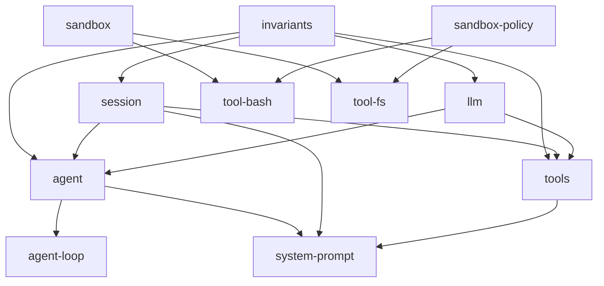

# LLM Benchmark Harness — Roadmap Backlog

This file is the forward-looking backlog for the LLM benchmark harness on
benebsworth.com (`/lab/llm-benchmark/`). It records **features, not bug fixes**
— hardening that already shipped lives in the git log (see "Already shipped"
at the bottom). Items are ordered by priority within each tier.

## How to use this file

- Pick an item, implement it, then mark it `[x]` and move the "Design sketch"
  notes into the skill (`lib/lab/llm-benchmark/../.claude/skills/llm-benchmark/SKILL.md`)
  so the runbook stays current.
- Each item references the code it touches and the external example it was
  inspired by (primarily the DeepSeek Harness, `dsh`).
- Effort is rough relative sizing: S (< 1 session), M (1-3 sessions),
  L (multi-session project).

## Deep-dive provenance

Items marked "dsh code study" were pulled from a local clone of
deepseek-ai/deepseek-harness (`git clone --depth 1
https://github.com/deepseek-ai/deepseek-harness /tmp/dsh`, 2026-08-13):
`docs/defensive-patterns.md`, `docs/subsystems/sandbox.md`,
`packages/feedback/`, `packages/runtime-diagnostics/invariants/`,
`packages/session/session-persistence-jsonl/`,
`packages/session/session-stats/`, `packages/code-runtime/`,
`packages/spill/`, `docs/postmortem/`. When implementing, refresh the clone
first (`cd /tmp/dsh && git pull`) since the repo is in active developer
preview and its API churns.

Both reference clones are graphified (graphify, code-only, zero API cost)
for exploration — query with `graphify explain|path|query` from the repo
root (graphs may go stale after `git pull`; refresh with
`graphify update . --code-only`):

| Repo | Clone | Graph | Stats |
| --- | --- | --- | --- |
| deepseek-harness | `/tmp/dsh` | `/tmp/dsh/graphify-out/` | 38,262 nodes / 83,865 edges / 1,243 communities. God nodes: `Context` (1,281 edges), `SessionId` (740), `SessionEvent` (345), `Session` (268), `dsh-invariants` (434) — confirms the log-as-truth + invariants-hub architecture |
| paperclip | `/tmp/paperclip` | `/tmp/paperclip/graphify-out/` | 38,308 nodes / 108,097 edges / 974 communities (built 2026-08-15, commit b38d6ddb) |

## Reference: DeepSeek Harness (dsh)

**Repo:** https://github.com/deepseek-ai/deepseek-harness (MIT, 103k stars,
"Everything is a Plugin", built on the Cordis plugin framework:
https://github.com/cordiverse/cordis).

The single most valuable ideas for this benchmark:

1. **Session log as source of truth.** An append-only `SessionEvent` log with a
   runtime invariant: *"model-visible means logged"* — anything that reached a
   model request must be reconstructable from the log. Fork, resume,
   transcripts, telemetry, and persistence all derive from this one stream.
   (https://github.com/deepseek-ai/deepseek-harness/blob/master/docs/architecture.md,
   https://github.com/deepseek-ai/deepseek-harness/blob/master/docs/subsystems/session.md)
2. **Profiles + bundles + patchable config.** A running harness is a layered,
   named composition; `dsh --dump-config` prints the booted tree and any row
   is replaceable via a config patch. There is no privileged core.
   (architecture.md § "Profiles and bundles")
3. **Capability seams.** A seam = Service Definition + Service Provider +
   Consumer. Filesystem, subprocess, sandbox, shell, subagent are all seams,
   so one provider swap moves every consumer with it (e.g. pointing fs+shell
   at a remote sandbox). (architecture.md § "Capability seams")
4. **Telemetry is a first-class plugin**, not an afterthought.
   (architecture.md § "Events" / dsh-base bundle description)
5. **Benchmarks are just isolated invocations of the real harness.** Separate
   workspace + session ID per task; the same tool that does real work runs the
   eval. (https://github.com/deepseek-ai/deepseek-harness/blob/master/BENCHMARK.md,
   https://github.com/deepseek-ai/deepseek-harness/blob/master/docs/user/guide/python-sdk.md)
6. **Retries are durable, loop-level events.** `packages/llm/llm-retry` never
   wraps the adapter call: every provider attempt stays one call, and each
   retry opens a fresh turn over the same durable history, appending
   `llm/retry` + `llm/retry-started` events with a canonical policy key
   (provider + every behavior-affecting field). Honoring
   `providerRetryAfterMs` replaces local backoff. The invariant companion
   checks every retry event pairs with a started event and names the right
   turn/step. (packages/llm/llm-retry/README.md)
7. **Per-session composition ("presets").** An agent preset is a directory
   holding an `agent.cordis.yml` that gives one session its own tools and
   prompt sections while other sessions keep theirs; a preset naming a
   process-global service is rejected at mount rather than colliding.
   (packages/preset/README.md)
 8. **Projection is one pure function with an incremental cache.** Session
    history is derived by folding `deriveEventMessage` over the log's surface
    (O(new nodes), cached per generation, deep-frozen shared messages) — the
    same function drives live history, external reconstruction, and pure
    projections, so they can never disagree.
    (packages/core/session/src/{index.ts,surface.ts})
 9. **Authorized session retrieval + log export** (`packages/session/
    session-query/` family): trusted reads, relationship queries, SQLite
    FTS search, bounded reads with result pages — independent of compaction;
    `session-log-export/` adds a Web `/export` command (ZIP of the session
    log via a Host endpoint). The read/tool surface is consumed separately
    from persistence internals. (Inspires #30.)
 10. **Content-addressed attachment storage** (`packages/attachment/` +
    `attachment-local/`): immutable, content-addressed bytes under
    `DSH_HOME`; image limits; "bytes enter durable storage only when a user
    prompt is submitted". (Inspires #31.)
 11. **Storage domain with typed forms** (`packages/storage/` +
    `storage-domain/`): consumers use validated data forms over swappable
    backends (json/sqlite) — `DomainSpec`/`Domain`, `domain/changed` events.
    The model for our feedback sidecar (#14) and any future local state.
 12. **Session references** (`packages/context/session-reference/`): bounded,
    read-only snapshots of OTHER sessions injected as sourced model-facing
    context — `dsh-session:<base64url>` URI scheme, `@[label](uri)` mentions,
    candidate ranking (same-cwd first), snapshot metadata recording capture
    seq + omitted counts. (Inspires #32.)
 13. **Skills, jobs, plan-mode** (`packages/skill/`, `packages/jobs/`,
    `packages/plan/`): provider-neutral skill catalog with discovery
    priority; owner-isolated background jobs (observation/cancellation/
    waiting); plan mode as logged per-agent collaboration state.

---

# Deep-dive #2: graph analysis (2026-08-13)

Processed the full package tree with a standalone graph script
(`/tmp/dsh-graph.cjs`; edges = in-repo `peerDependencies`, the canonical
runtime-dependency signal — same semantics as dsh's own
`scripts/gen-module-graph.ts`).

Topology facts:

- **219 packages, 1089 edges, ZERO cycles.** The tree is a strict DAG —
  the load-bearing claim behind "no privileged core": effects unwind on
  unload only because dependencies never point upward. `collectPackageGraph`
  enforces dependency-safe ordering structurally.
- **`invariants` is the universal hub: 218/218 packages depend on it, and it
  depends on nothing in-repo** (a leaf). Every package registers package-owned
  runtime checks — the invariant registry is the connective tissue, not a
  domain package.
- **The core is tiny.** Five packages anchor the tree: `invariants` (218
  consumers), `session` (80), `llm` (78), `agent` (58), `tools` (43).
  Everything hangs off the session log + the LLM adapter seam — consistent
  with "the log is the source of truth".
- **The client/web group is 39 packages (18% of the tree)** — the UI surface
  is as engineered as the runtime.
- **Leaf composition packages consume the most** (`agent-spine-demo` 22 deps,
  `client-ui-conversation` 19, `api-remotes` 15, `subagent` 15) — the heavy
  consumers are compositions, not libraries.
- **Every model-facing tool pulls the same pipeline stack** (`tool-bash`,
  `tool-pwsh`, `tool-fs` each depend on `sandbox` + `sandbox-policy` +
  `user-approval` + `system-prompt` + `tools`) — the tool pipeline is a
  repeated composition, which is why the seam pattern pays off.

Lessons for this benchmark:

- Keep our own dependency direction strict (`types.ts` → `scorers`/`runners`
  → `scripts`) and make it TESTED — see #17.
- The "projection is one pure function" rule (#8 above) is the implementation
  note for the run-trace UI (#9): one `projectIteration(log)` pure fold, never
  ad-hoc per-page logic.
- Retry-as-durable-event (#6 above) hardens the event-log design (#1) and the
  invariants suite (#5).

---

# Reference: Graphify (Graphify-Labs/graphify)

**Repo:** https://github.com/Graphify-Labs/graphify ("Turn any codebase into
a queryable knowledge graph", v8 branch, 106k stars, Apache-2.0/MIT).

The tool this roadmap's deep-dives were processed with:

- **Install:** `uv tool install graphifyy` (PyPI package is `graphifyy`,
  command is `graphify`).
- **Build a graph:** `graphify extract <dir> --code-only` (tree-sitter AST,
  deterministic, zero LLM calls, nothing leaves the machine) then
  `graphify cluster-only <dir>` for communities + `GRAPH_REPORT.md`.
  Output: `graphify-out/{graph.json, GRAPH_REPORT.md, graph.html}`.
- **Query it instead of grepping:** `graphify explain "Node"` (neighbors +
  degree + community), `graphify path A B` (shortest path, hop by hop),
  `graphify query "<question>"` (BFS subgraph), `graphify export
  callflow-html` (Mermaid call-flow).
- **Every edge is tagged** `EXTRACTED` (explicit in source) vs `INFERRED`
  (resolved) — you always know what was read vs guessed.
- **Report contents:** god nodes (most-connected concepts), communities
  (Leiden clustering), surprising cross-file connections, `# NOTE:` /
  `# WHY:` comments and doc refs as first-class nodes, suggested questions.
- **Team workflow:** `graphify-out/` is meant to be committed to git; a
  git hook auto-rebuilds on commit (AST only, no cost); a merge driver
  union-merges `graph.json` on parallel commits; MCP server
  (`python -m graphify.serve graphify-out/graph.json`) exposes
  `query_graph` / `get_node` / `get_neighbors` / `shortest_path`.
- **Their own benchmarks** (`BENCHMARKS.md`): LOCOMO recall@10 0.497 vs
  mem0 0.048 / supermemory 0.149; LongMemEval-S QA 76%; blind-validated
  judge agreement 90.6% (Cohen's kappa 0.81) — the code graph beats vector
  memory for code-answer tasks, and their evaluation methodology (same
  harness, same model, same budgets; blind judge + kappa) is a template
  for ours (see #26).

---

# Reference: Paperclip (paperclipai)

**Repo:** https://github.com/paperclipai/paperclip ("The open-source app
everyone uses to manage agents at work", MIT, TypeScript monorepo; 78k
stars). Processed with graphify v0.9.43 (tree-sitter, code-only, fully
local): **38,308 nodes / 108,097 edges / 974 communities** from 3,927
source files in ~2 min. Clone at `/tmp/paperclip`, graph at
`/tmp/paperclip/graphify-out/`.

Key ideas for this benchmark:

1. **Eval framework with a two-stage maturity plan** (`evals/` +
   `doc/plans/2026-03-13-agent-evals-framework.md`). Stage 1: promptfoo
   bootstrap — narrow behavior evals (categories: `core`, `governance`,
   `mcp_gateway`, `phase5_memory`, `release_gates`) with deterministic
   assertions (contains / not-contains / inline JS + named metrics) run
   across multiple models via OpenRouter. Stage 2: first-party TS harness
   running real scenarios against seeded state. Scoring model: deterministic
   checks + structured rubrics + pairwise judging + efficiency metrics from
   telemetry. **"Compare bundles, not just models"** — model + prompt +
   skills + policy together.
2. **Release-gate evals.** `tests/release-gates.yaml` — prompt-level policy
   regressions that must hold before a release (alongside server/API and
   QA gates): no spurious wake work, no duplicate checkout, scoped wake
   payloads honored. Evals are a release gate, not an afterthought.
3. **Adapter layer, industrialized** (`packages/adapters/` — 12 adapters:
   claude-local, codex-local, gemini-local, grok-local, opencode-local,
   pi-local, cursor-*, openclaw-gateway, hermes; `packages/adapter-utils/`).
   Every local agent CLI runs behind an **execution-target abstraction**
   (`execution-target.ts`): resolve + verify the command exists, resolve
   timeout from policy, session identity + managed home dir, local vs remote
   vs sandbox target, command-install checks, billing inference. ACP
   (Agent Client Protocol) where available (`acpx-engine/`), raw spawn
   otherwise — the same opencode/agy/codex runner pattern we hand-rolled in
   `runners/`, but with a shared, tested substrate (`execution-target.test.ts`,
   `command-managed-runtime.test.ts`, `local-process-sandbox.test.ts`, …).
4. **Redaction as a first-class utility** (`command-redaction.ts`,
   `log-redaction.ts`): regex-based secret scrubbing applied to command
   lines AND logs (`SECRET_NAME_PATTERN` matches
   `api_key|token|authorization|bearer|secret|passwd|password|credential|jwt|private_key|cookie|connectionstring`).
   Confirms and enriches backlog #4 — scrub at THREE points (env passed to
   the CLI, command lines we log, and captured output).
5. **Sandbox managed runtimes + workspace sync** (`sandbox-managed-runtime.ts`,
   `sandbox-file-sync.ts`, `git-workspace-sync.ts`, `workspace-restore-merge.ts`):
   agents run inside sandboxes with file-sync back to the workspace — the
   grown-up version of our scratch-dir + printed-path artifact handoff
   (TODO #3). `session-compaction.ts` adds a compaction policy
   (maxSessionRuns / maxRawInputTokens / maxSessionAgeHours) + native
   context-management detection — the model for any future long-horizon task.
6. **Tool gateway with access policy** (`server/src/services/tool-gateway.ts`,
   a 154-degree graph hub; `tool-access-policy.ts`, secrets, activity logs,
   approval paths; `mcp_gateway` eval category covers fail-closed, rate-limit
   backoff, credential repair, approval drift). Their artifact-running
   environment is mediated; ours is an opaque-origin iframe (effectively
   fail-closed). The `mcp_gateway` eval cases are the checklist for any
   future benchmark task that requires network/tool interactions.
 7. **Billing inference** (`adapter-utils/src/billing.ts`,
    `inferOpenAiCompatibleBiller`): per-adapter usage + cost inference — a
    sharper model than our crude `estimateCost` (tokens × rate).
 8. **Budget + cost governance** (`server/src/services/{budgets,costs}.ts`,
    schema `budget_policies` / `budget_incidents` / `cost_events`): per-agent
    budget policies, a cost-event row per run, incidents raised when a
    policy trips. (Inspires #28.)
 9. **Quota-monitor auto-recovery** (`server/src/services/heartbeat.ts`
    `PROVIDER_QUOTA_MONITOR_SERVICE_NAME`; runs persist
    `providerQuotaRetryNotBefore`, heartbeat.ts:679): a monitor resumes
    paused work once the quota wait elapses ("The previous reviewer run
    reached provider quota. Resume this execution-review stage now").
    (Inspires #29.)
 10. **Agent action audit** (`server/src/services/agent-action-audit.ts` +
    `createActivityDetailsRedactor`, schema `activity_log`): every agent
    action audited with redacted details, full-context provenance
    (company/agent/issue/run refs) — the pattern behind our #25 provenance
    and #1 event log.
 11. **Secrets lifecycle** (schema `company_secrets` + `*_versions` +
    `*_proposals` + `*_bindings` + `secret_access_events`;
    `run-secret-redaction.ts`): propose → version → bind → audited access,
    with redaction at run boundaries. The grown-up version of our #4/#20
    credential hygiene.
 12. **Plugin platform** (schema `plugin_*`: `plugin_state`, `plugin_config`,
    `plugin_database`, `plugin_jobs`, `plugin_logs`, `plugin_webhooks`,
    `plugin_entities`, `plugin_managed_resources`): third-party plugins with
    per-plugin DB + webhooks + managed resources — a possible long-term
    direction for #10's task/check registry.
 13. **Decision pipeline with training examples** (schema `decision_queues`
    / `decisions` / `decision_training_examples`): decisions logged; real
    decisions become training examples — the eval-framework analogue of our
    failure corpus (#25) feeding check design.
 14. **Export fidelity** (`server/src/services/export-fidelity.ts`): exports
    must round-trip the source data. (Pairs with #30.)
 15. **Telemetry client** (`server/src/telemetry.ts`, shared
    `TelemetryClient`): opt-in, config-resolved, state-file persisted —
    the shape for any opt-in usage telemetry on the benchmark site.

**Graphify meta-finding:** the graphify workflow itself is a tooling win for
our OWN repos — code-only extraction is local, deterministic, ~2 min for
3.9k files, and produces a queryable graph (`graphify query/path/explain`)
plus god nodes + communities. Worth committing `graphify-out/` for the
benchmark module tree and the OMEGA harness repo so future sessions
traverse with queries instead of greps. (Their LOCOMO benchmark claims
0.497 recall@10 vs mem0's 0.048 — code graph beats vector memory for
code-answer tasks.)

---

# P1 — Core integrity

## [x] 1. Per-iteration event log ("model-visible means logged")

**Shipped.** `lib/lab/llm-benchmark/runlog.ts` is an append-only JSONL log, one
file per (model, task) per sweep at `sweeps/<run-id>/<model>-<task>.jsonl` —
the SAME root `setSweepRoot` retains scratch and artifacts under, wired from
`scripts/run-benchmark.mjs` via `setRunLogDir()` (module-level, the
`setSweepRoot` precedent). Line 0 is an immutable header
(`version`, `runId`, `modelId`, `taskId`, `createdAt`, `configSnapshot` =
iterations/timeoutMs/maxRetries/bustCache); every later line is one event with
a contiguous writer-owned `seq`. Events: `request` (prompt sha256 + length),
`response` (raw output, tokens, runtimeMs, `cacheHit`), `retry`
(`kind: transient | empty_body`, attempt, delayMs), `clean` (the artifact
actually scored), `failure` (error + failureReason + timedOut), `check` (one
per check per iteration, stamped with the TRUE iteration index), `aggregate`
(the BenchmarkResult, artifact always spilled). Appends coalesce into 200ms
batches (one write + one fsync, serialized); `runTask` flushes at every
iteration boundary and closes before returning, so a killed sweep loses at
most the in-flight iteration. Strings over 8 KB spill to
`spill/<sha256[:16]>.txt` (content-addressed — identical artifacts across
`response`/`clean`/`aggregate` cost one file) leaving a 2 KB preview + byte
count inline. Readers keep the complete prefix and stop at the first
unparsable line; only a missing header throws. The log instance is threaded
EXPLICITLY through `generateOne`/`aggregateRuns` — concurrent (model, task)
jobs would corrupt a shared module-level "current log". `BenchmarkResult`
gains `runLogRef?: { runId, file }`, stamped on every record produced while
logging is on. Replay with `npx tsx scripts/retrace.mjs --run <run-id>
[--model x] [--task y] [--iteration n] [--full]`. With no run-log dir set
(unit tests, library use) behaviour is byte-for-byte unchanged.

## [x] 2. Sweep profiles with effective-config dump

**Shipped.** Recipes are DATA in `lib/lab/llm-benchmark/sweep-profiles.json`
(`smoke`, `fast-refresh`, `slow-model`, `agy-quota` — each a one-line
description plus any of models/tasks/iterations/concurrency/timeoutMs/
maxRetries/bustCache). `sweep-profiles.ts` validates the file at import
(unknown key, wrong type, or missing description throws — `retries` instead of
`maxRetries` must not silently pass) and holds the pure, unit-tested
`resolveSweepConfig()`/`parseSweepArgs()`/`estimateSweepDuration()`.
`scripts/run-benchmark.mjs` is a thin shell over them and takes `--profile`,
`--model`/`--task` (repeatable or comma list), `--iterations`,
`--concurrency`, `--timeout-ms`, `--max-retries`, `--bust-cache`,
`--list-profiles`, `--dump-config`. **Precedence: CLI flag > env var > profile
> built-in default**; with no profile and no flags the env-only behaviour is
byte-identical (including `RUN_MAX_RETRIES=""` reading as 0), so the Taskfile
wrappers and the runbook are untouched. Every run first prints the effective
config with the PROVENANCE of each value (`flag`/`env`/`profile:<name>`/
`default`) plus sweep root, results path, quota-lock status, and a ROUGH
duration estimate (sum of historical mean `runtimeMs` per (model, task) ×
iterations ÷ concurrency; pairs with no history count 0 and are reported).
`--dump-config` prints that and exits without spending; an unknown profile
lists the available ones and exits 1. Taskfile: `task bench:profiles` (list),
`task bench:profile -- <name> [flags]` (run/dump).

## [x] 3. Forensic session retention (don't rm the scratch dir)

**Shipped.** `scripts/run-benchmark.mjs` computes one sweep root at startup
(`SWEEP_ROOT` env, default `sweeps/<run-id>/` where the id is a
filesystem-safe ISO timestamp from `sweepRunId()`), logs it, and calls
`setSweepRoot()` — module-level state exported from `runners/cli.ts`, the
`setBustCache` precedent, so no provider config signature changed. Under a
sweep root `generateFromCli` puts its scratch at
`<root>/scratch/<model>-<task>-<n>/` (reused on a retry) and NEVER deletes it
— on success or failure: forensic value peaks when the iteration failed.
Whichever of the three file-handoff paths wins also copies the bytes to
`<root>/artifacts/artifact-<model>-<task>-<n>.html` with `{ flag: 'wx', mode:
0o600 }` (the hardening carried over from #4), best-effort so it can never
fail a run. With no sweep root (unit tests, library use) the original
mkdtemp + delete-in-finally behaviour is byte-for-byte unchanged.
`npx tsx scripts/sweep-clean.mjs [--keep 5] [--older-than 14] [--dry-run]`
prunes whole run trees; the policy lives in the unit-tested pure
`selectPrunable()` (`lib/lab/llm-benchmark/sweep.ts`) and deletes a run only
when it is BOTH beyond the keep-count AND older than the age floor. `sweeps/`
is gitignored; layout + rationale are in the skill.

---

# P1 — Security and integrity

## [x] 4. Credential scrub for CLI spawns

**Shipped.** `scrubEnv()` (exported from `runners/cli.ts`) drops every
credential-shaped key (`/(key|secret|token|password|auth|credential|private)/i`)
from the inherited environment; `runCli` spawns with
`{ ...scrubEnv(process.env), ...options.env }`, so a provider that ever needs a
credential re-adds it by name (opt-in, never ambient). No allowlist: nothing a
child needs (PATH, HOME, TMPDIR, SHELL, TERM, LANG/LC_*, USER) matches. Unit
tests plus a real-spawn test asserting the child cannot see a poisoned parent
`*_API_KEY` are in `cli.test.ts`. Verified live: `agy` replies "OK" under the
scrubbed env, and `codex` reaches its authenticated usage-limit response
identically with and without the scrub. The `{ flag: 'wx', mode: 0o600 }`
artifact-write hardening stays with #3.

## [x] 5. Results invariants verification (anti-regression)

**Shipped.** `lib/lab/llm-benchmark/verify-results.ts` holds the pure checksuite
(dsh's `packages/runtime-diagnostics/invariants`): `verifyResults(results,
{ runLogs, readLog })` returns one `Verdict { check, level: pass|warn|fail|skip,
recordKey, detail, why }` per check per record, and `summarizeVerdicts()` the
counts. Each of the eight checks in `RESULT_CHECKS` carries the WHY it exists —
the bug it would have caught — and the report prints it on failure; a check
nobody can justify is synthetic and gets muted rather than fixed. The checks:
score is EXACTLY `aggregateRuns`' `Math.round(Math.min(100, Math.max(1,
mean(iterationScores))) * 10) / 10`; `iterationCheckResults` index-aligned with
`iterationScores`; succeeded <= ran with one score per success; `status` derived
from the same counts; `taskId`/`modelId` resolve in the registry;
`failureReason` in the taxonomy (a `Record<BenchmarkFailureReason, true>`, so a
new reason is a compile error here) and consistent with `status`; **runLogRef ⇄
run log** both ways (a log on disk whose record has no ref FAILS — "no record
without a trace"; a ref must name a log whose header matches the record and that
holds an `aggregate` event; a ref to a pruned log is a skip); and run-log `seq`
strictly increasing — a GAP is dropped-batch evidence (WARN, per the runlog.ts
contract), a duplicate or decrease is a FAILURE. Records predating a field skip
the checks that need it; seeded records are exempt from the run-log checks only;
the single-entry `iterationCheckResults` written by
`scripts/backfill-iteration-checks.mjs` (one breakdown for the one published
artifact) is a documented skip, not a failure. `scripts/verify-results.mjs` is a
thin shell — loads results (`RESULTS_OUT_PATH`), scans `sweeps/` (`SWEEPS_DIR`),
prints failures-with-WHY then warnings then `N checks, N records, N failures, N
warnings, N skipped`, exits 1 on any failure (`--strict` also on warnings,
`--quiet` for the summary alone). `task bench:verify-results`, and first in the
pre-push gate (seconds, and the log half skips with no `sweeps/`). Green on the
current 183 records: 0 failures, 0 warnings, 512 skipped.

---

# P1 — Reliability and signal quality

## [x] 6. Distinct failure reason for CLI timeouts (`cli_timeout`)

**Shipped.** `'cli_timeout'` is a first-class `BenchmarkFailureReason`:
`classifyFailureReason(err, output, { cliProvider })` returns it for a timeout
on a CLI-backed provider (`isCliProvider()` — `Agy`, `Codex`, `OpenCode`) or on
the raw `runCli` message shape, so slow generation reads as capability rather
than the network story `endpoint_hung` tells. It stays transient (retried), and
counts as a MODEL failure in `analytics.ts`. The four deepseek timeout rows were
reclassified via `scripts/backfill-failure-reasons.mjs --cli-timeouts-only`.
Runbook detail lives in the skill (Operational Gotchas). No UI change was
needed: nothing under `components/`/`app/` renders failure reasons yet — the
model page shows `status` only (see #8/#9 for surfacing them).

## [x] 7. Quota-reset estimator

**Shipped.** `lib/lab/llm-benchmark/quota.ts` holds the pure pieces:
`parseQuotaResetMs()` (agy's `Resets in 57h27m`, plus `resets in 2h`,
`Reset in 45m`, arbitrary whitespace, case-insensitive; a digitless
`resets in` returns undefined, never 0), `formatQuotaWindow()`, and
`quotaLockedModels(results, modelIds, now)`. At the breaker trip site in
`runTask` the runner logs `[harness] next window for <model>: ~2h (resets ~Fri
02:04)` and post-stamps `quotaNextResetAt` (ISO) onto the aggregate —
post-stamp deliberately, so `aggregateRuns`'s signature didn't grow a seventh
parameter. `mergeResults` carries that stamp from a dropped 0-success record
onto the good record it kept (account metadata, not measurement data — every
scored field is untouched); without it the stamp would only ever survive for
(model, task) pairs with no prior success, i.e. never for the models worth
pre-flighting. `scripts/run-benchmark.mjs` re-reads results.json fresh, and
aborts with exit 1 BEFORE building the runner when a targeted model is still
locked; `RUN_IGNORE_QUOTA_LOCK=1` proceeds with a warning. No UI change: still
nothing under `components/`/`app/` renders failure/quota fields (see #8/#9).

**Effort.** S.

---

# P2 — Presentation and composability

## [x] 8. Completion + value stats on the UI

**Shipped.** `modelCompletion()` in `analytics.ts` — pure, seeded-excluded
(hand-authored sample data can never inflate completion; a seeded-only model
reads `attempted: 0`), `tasksTotal` defaulting to `BENCHMARK_TASKS.length` so
plugin tasks count. Done = success|partial; timeouts counted separately;
`meanScore`/`meanRuntimeMs` average over COMPLETED tasks only (a timeout burns
the whole per-call cap and would measure the sweep's patience, not the model);
`costPerPoint = totalCostUsd / max(meanScore, 0.1)` — total spend, so tasks
that were paid for and then failed still count, and the clamp keeps a
0-scoring model finite. `components/lab/llm-benchmark/stat-strip.tsx` renders
it as font-mono muted chips (`3/8 done · 4 timeouts`, zero segments omitted,
"no runs yet" with no live records, flex-wrap so it reflows on mobile) on the
landing-page model cards, the models index cards, and the model page header.
10 helper tests in `analytics.test.ts`.

## [x] 9. Run-trace UI (render the event log)

**Shipped.** The run log is readable on the site. The blocker was publication,
not rendering: `sweeps/` is gitignored and pruned, so on a static-export site
with no server the trace has to be COPIED INTO THE REPO to exist for a reader.
`scripts/publish-traces.mjs` (`task bench:publish-traces`) copies each log a
`runLogRef` names, plus only the spill files that log references, into
`public/lab-data/traces/<runId>/` — carved out of the otherwise-generated
`public/lab-data/` in `.gitignore` because these ARE the committed evidence —
prunes traces no record claims any more, and writes `index.json` from the log
HEADERS. That index is the authority: the task page reads it at build time and
mounts a disclosure only for a record in it, so nothing ever 404-probes. The
parser moved to a browser-safe `runlog-format.ts` (records + `parseRunLog`,
re-exported by `runlog.ts` so reader and writer can't drift);
`components/lab/llm-benchmark/run-trace.tsx` fetches the JSONL on expand and
renders retrace.mjs's hierarchy — request, retries, responses with TTFT/tok-s
and cache badges, the scored artifact as a bounded preview linking to the full
spill file, the `IterationChecks` pills, failure/quota lines, then the
aggregate. Untraced records get no per-row noise: one muted count, and the
section is absent entirely when a task has none — which is every task today.
**Nothing is published in this commit** (no existing record carries a
`runLogRef`); the committed index is `[]` and the first real trace lands with
the next sweep. Verified end-to-end against a local, uncommitted fixture rather
than by back-stamping a ref onto a real record — fabricated provenance is the
one thing this benchmark cannot ship.

**Effort.** L. **Dependencies.** #1.

## [x] 10. Check/scorer registry formalization

**Shipped.** The task row declares its evaluator: `BenchmarkTask.scorer`
(`'behavioral' | 'html' | 'text'`, optional) is read FIRST by `selectScorer()`
against a `SCORERS` name→implementation map in
`lib/lab/llm-benchmark/scorers/index.ts`; the five-HTML-category heuristic
survives only as the fallback for an unstamped row, so behaviour is
byte-identical for pre-existing rows (a test replays the old heuristic over the
full registry and asserts every task resolves the same). All seven shipped
tasks are stamped explicitly — including the two text tasks, so the registry is
the single place you read to learn how a task is scored; `html` is registered
but deliberately unclaimed (vocabulary for a future structural-only task).
`behavioralTaskIds(tasks)` derives the behavioural id set from the registry,
and both `scripts/rescore-behavioral.mjs` and
`scripts/backfill-iteration-checks.mjs` now call it instead of each keeping a
copy (candidate sets over the 183-record results.json verified identical:
130 rescore / 3 backfill, before and after). `registry.test.ts` fails a task in
an HTML-runnable category that doesn't declare `scorer: 'behavioral'`, and
fails any behavioural task with zero entries in `CHECKS_BY_TASK` — there is no
generic default check set, so empty means the artifact quietly falls back to
the structural score that hands 100 to a game that ignores input.

**Effort.** S–M.

---

# P3 — Board completion and experiments

## [x] 11. Board completion (codex -pro variants remain opt-in — paid, awaiting go-ahead)

- **gemini-3.6-flash** — registered, ZERO results (OpenRouter 402, $0
  credits). Needs an OpenRouter top-up ($5-10) then a normal sweep
  (`gemini-3.6-flash`, all 7 tasks, 5 iters). The only model with no board
  presence.
- **codex `-pro` variants** — never run. `OPENAI_API_KEY` IS present in .env
  (found 2026-08-17); adding the variants is a registry change + sweep,
  awaiting an explicit go-ahead (paid).
- **[x] deepseek-v4-flash-free retry** — DONE 2026-08-17, slow-model profile,
  1 iteration each: equation-solver 100, physics-pendulum-wave 100,
  circuit-builder-teaser 91 (all in-window at 3-5 min); landing-page-morph
  "succeeded" at score 3 — 10.3-min TTFT, 0.6 tok/s, and the artifact is the
  model's planning narration, never the page (run
  2026-08-17T05-41-46, trace published; `npx tsx scripts/retrace.mjs --run
  2026-08-17T05-41-46 --task landing-page-morph` shows the whole story).
  First sweep to exercise bundles + run logs + published traces end to end.
- **[x] gemini-3.6-flash** — DONE 2026-08-17: full board 8/8, 40/40 calls,
  zero retries, four 100s, $0.0029 total. First model swept on the
  plugin-contributed tic-tac-toe task.
- **[x] nemotron-nano-12b-vl** — DONE 2026-08-17: the endpoint no longer
  hangs (exclusion reason obsolete). Full board 8/8 via smoke + fast-refresh
  + a `--resume` after an external stop (the #18 boundary rules skipped the
  completed pair, zero waste); 38/40 iterations, 2 empty-body blips
  recovered, $0. Scores 26-100 — a real (weak-but-present) board.

## [ ] 12. Sandbox backend seam (longer term)

**Problem.** Playwright is the only sandbox backend; `getBrowser()`
(`lib/lab/llm-benchmark/scorers/sandbox.ts`) hardcodes Chromium args, and the
scorer has no way to run against a remote browser or a fallback (jsdom)
without code changes. Also the sandbox policy actually applied per run is
never logged.

**Scorer/display parity (deferred here on purpose).** The behavioural scorer
loads the RAW artifact (`page.setContent(html)`), while the live frame and the
published `.html` load `withPrelude(html)` — so checks run in a different
environment from the one readers see, and `promptBundle` names the DISPLAY
environment, not the scoring one. Injecting the prelude into scoring would
silently shift every stored behavioural score and destroy history
comparability, so the divergence is documented (prompt-bundle.ts, types.ts) and
the decision belongs to this item.

**Inspiration.** dsh `ctx.sandbox` seam (docs/subsystems/sandbox.md):
- One interface, swappable backends; consumers wrap argv before spawning.
- **Modes are a small closed vocabulary**: `read-only | workspace-write |
  danger-full-access` — file effects only; network/process visibility is
  outside the vocabulary.
- **Enforcement is a reported fact**: `full | partial` — a consumer that
  requires the absolute promise must reject or surface `partial` (older
  Landlock ABIs, `--no-sandbox` Chromium).
- **Per-call policy resolution**: the complete policy (mode + workspaceRoot
  + session identity) is resolved once per call and logged.

**Design sketch.**

- `SandboxBackend` interface: `launch() → { newContext() }`, `close()`.
  Implementations: `localChromium` (today's), `remotePlaywright` (via
  `PLAYWRIGHT_WS_ENDPOINT`), `jsdomFallback` (structural checks only, tagged
  `behaviouralFallback` — the `scoreBehavioral` catch path already has this
  concept).
- The artifact sandbox reports its **enforcement level** (`full`/`partial` —
  `--no-sandbox` Chromium = partial) into the run log (#1) as a
  `sandboxPolicy` event; `partial` is surfaced wherever a behavioral score
  is shown (e.g. a footnote "checks ran with partial enforcement").
- `run-benchmark.mjs`/runner log the active backend + policy into the event
  log (#1) as a `sandboxPolicy` event.

**Acceptance criteria.** A CI/container run can use the fallback without code
changes; the applied sandbox policy + enforcement level are in the run log;
existing behavior unchanged by default.

**Effort.** M. **Dependencies.** #1 (for the policy log).

## [x] 13. Per-call telemetry (TTFT, tokens/s, cache, retries)

**Shipped.** `runtimeMs` is no longer the only timing signal. Instrumented:
**streaming API providers** (moonshot, openrouter — first non-empty
`delta.content` = a true first-token boundary) and **CLI providers** (agy,
codex, opencode — `runCli` stamps the first stdout chunk, a first-OUTPUT proxy
that reads LOW because agent banners precede decoding). Deliberately NOT
instrumented: **openai, anthropic, google** — single-shot non-streaming
`fetch`es expose exactly one timestamp, so TTFT is unobservable there and the
record is absence, not a faked response-arrival time. Making them observable
means switching them to streaming first.

`GenerationResponse.ttftMs?` carries the measurement; the run log's `response`
event gains `ttftMs?` / `tokensPerSec?` / `rateKind?`; `BenchmarkResult.telemetry`
= `{ meanTtftMs?, meanTokensPerSec?, rateKind?, cacheHits, retries }` folded by
`foldTelemetry()` in `aggregateRuns`. Fold rules (dsh `session-stats` parity):
the FIRST attempt's TTFT survives an in-step retry (`CallTelemetry` sink, so
the retry count also survives a THROW); the rate is `decode` (tokensOut /
(runtime − ttft)) where both timestamps exist and the labelled `wall-clock`
fallback otherwise, `mixed` when a record has both; cache replays are counted
in `cacheHits` and excluded from BOTH means (nothing was generated). Counters
are 0-when-none (read the value); the two means are ABSENT-when-unmeasured
(a 0ms TTFT is physically impossible, so 0 would be a lie). `verify-results`
gains a `telemetry-sanity` check; `retrace` prints ttft/tok-s per response.
No UI — the model-page surface stays deferred to #9's trace UI.

---

# P2 — Site features (dsh study additions)

## [ ] 14. Reader feedback on artifacts (ratings + notes)

**Problem.** The behavioral scorer answers "does Space jump?" but not "is
this artifact actually good?" — human judgment is the one signal the board
lacks, and it's exactly what dsh's `feedback/` family formalizes.

**Inspiration.** dsh `packages/feedback/`:
- `message-feedback`: per-message `rating: 'positive' | 'negative'` +
  optional note, versioned sidecar, immutable timestamps, list/put/delete
  Remote contract; feedback NEVER enters model context.
- `command-feedback`: log-only `feedback/record` remark for telemetry.

**Design sketch.**

- On each model's artifact (task page side-by-side view), a compact
  up/down + optional note control.
- `BenchmarkResult`/sidecar storage: `lib/lab/llm-benchmark/feedback.json`
  keyed `(modelId, taskId, iterationIndex?)` with
  `{ rating, note?, createdAt, updatedAt, version }` — same shape as dsh's
  `MessageFeedbackItem` (rating, optional note ≤ N bytes, opaque equality-only
  version, monotonic timestamps).
- Aggregate per model/task on the page: `positive: N, negative: M` strip.
- Feedback is never written into results.json and never reaches the model;
  keep it a strict sidecar (dsh's two-contract separation).

**Acceptance criteria.** Rated artifacts persist across deploys; ratings
aggregate per model; version bumps replace rather than accumulate; no
feedback data in results.json or the run log.

**Effort.** M.

## [ ] 15. Executable scoring for code tasks (code-runtime)

**Problem.** Text tasks (crypto-hash-race, equation-solver) are scored
structurally only — the model's code is never RUN. dsh's `code-runtime`
family executes one model-written program against host bindings and captures
what it printed/returned, with a failure taxonomy.

**Inspiration.** dsh `packages/code-runtime/` (service definition +
worker-thread backend + Code Mode consumer) and its failure taxonomy
(docs/subsystems/code-runtime.md).

**Design sketch.**

- New scorer family `scorers/executable.ts` for tasks that emit runnable
  code: extract the model's program from the artifact, run it in a worker
  thread (or `node -e` sandboxed), assert on stdout/return value.
- First candidate: `crypto-hash-race` — run the generated solver against
  the task's test vectors and check the hashes; `equation-solver` — evaluate
  the returned solution against the system.
- Composite stays honest: behavioral-style 70/30 with a `codeFallback`
  reason when the program can't be executed (same pattern as
  `behaviouralFallback` in `scorers/behavioral.ts`).
- Execution budget: per-call timeout + output cap (dsh worker-thread
  isolation + execution-budget discipline).

**Acceptance criteria.** crypto/equation scores now reflect executed
behavior; a program that fails at runtime scores low with the failure
reason surfaced; existing structural score is the documented fallback.

**Effort.** L.

---

# P3 — Process (dsh study additions)

## [x] 16. Postmortem practice for harness incidents

**Shipped.** `docs/postmortem/README.md` — the three-way criterion (subtle +
systemic + costly to rediscover), the template (Executive summary / Timeline /
Root cause / Guardrails), the rules (every cited guardrail verified to exist;
mechanism not blame; dates from `git log -S`, "date unrecovered" over invention;
60-line ceiling) and an index. Four founding write-ups, researched from history
rather than memory: **0001** sweep hang (`ecd8703` browser → `fb30017`
`closeSandbox` → `abece55` hard exit + process-group kill), **0002**
timeout-config miswire (`9566605` fixed opencode ONLY; the class survived in
agy/codex until `bdd8d49`/I2 — the argument for `fe95b14`'s effective-config
dump; open gap recorded: nothing tests the forwarding itself), **0003** bearer
blip (`5bcaf6c`, transient + `rate_limited`, on a measured distribution — 0/5
sequential, every parallel batch), **0004** `results.json` race (`b124072`
re-read + incremental writes, `e3debcb` `mergeResults` 0-success protection).
CLAUDE.md gains the one-line rule under "Things that will bite you"; SKILL.md's
sweep-operations runbook links the directory, and its stale "forwarded into the
opencode CLI config" knob line is corrected to agy/codex/opencode.

**Effort.** S.

---

# P3 — Architecture guards (graph-analysis additions)

## [x] 17. Dependency-layering guard test

**Shipped.** `lib/lab/llm-benchmark/layering.test.ts` parses the real import
graph — every non-test `.ts` under `lib/lab/llm-benchmark/**` plus the
`scripts/*.mjs` that reach into it — with a text scan for
`from '…'` / `import('…')` / bare `import '…'`, resolves relative specifiers
(`./x` → `x.ts`, `x/index.ts`, explicit `.ts`/`.mjs`) and asserts four rules:
zero cycles (Tarjan SCC, every component size 1, self-imports included),
`types.ts` imports nothing in-tree (it is the bottom layer), no lib module
imports upward into `scripts/`, and no `scorers/**` file imports `runners/**`
(the forward edge `runners/provider.ts` → `scorers/` is asserted to still
exist, so that rule can't go vacuous). A fifth test guards the guard: a rename
that empties the scan fails instead of passing vacuously, and unresolvable
relative imports fail loudly. Failures name the cycle path
(`provider.ts → scorers/index.ts → scorers/html.ts → provider.ts`) or the
offending edge with file:line and specifier. Checker is small pure functions
in the test file — deliberately not a lib module. No lint config, no new deps.

**Effort.** S.

## [x] 18. Sweep resume from event-log checkpoints

**Shipped.** `--resume <run-id>` / `RUN_RESUME` (flag > env; deliberately NO
profile layer — a resume names one dead run, not a reusable recipe, and
`parseSweepProfiles` rejects the key). `lib/lab/llm-benchmark/resume.ts` holds
the whole rule: `readSweepCheckpoints()` reads every `sweeps/<run-id>/*.jsonl`
and classifies it by HEADER ids (the filename is ambiguous — both ids contain
hyphens); `planResume()` is pure and returns skip / rerun / recover sets.
**Boundary = the `aggregate` event** (dsh's `OPEN_TURN`): the reader's
corrupted-tail truncation means a mid-iteration kill yields a log with no
aggregate, so that pair re-runs FROM SCRATCH, loudly, never stitched. Typed
rejections exit 1 with the code printed: `RESUME_TARGET_NOT_FOUND`,
`RESUME_NO_CHECKPOINTS` (missing dir / zero readable headers),
`RESUME_SWEEP_ROOT_CONFLICT` (explicit `SWEEP_ROOT` + `--resume` name two
destinations). The sweep root IS the target dir — `uniqueSweepRoot()` suffixing
is bypassed, so skipped pairs' logs and artifacts survive untouched while
`openRunLog` truncates only the pairs re-run. Skipping is a job-list filter
(`RunBenchmarkOptions.skipPairs`, a pair set because a dead sweep's completed
set is not a rectangle), so a skip costs no call and produces no fresh record.
**Recovery** closes the real crash window: the aggregate is fsynced BEFORE
`writeResults` merges the record, so a kill in that gap leaves a pair complete
on disk and absent from results.json — `recoverResultFromAggregate()` re-derives
it, un-spills `output`, and merges through the same `mergeResults` path (0-success
protection intact). `--bust-cache` overrides every skip with one line saying so.
`--dump-config` gains a `resume` row (N complete, M to run, K recovered) and the
duration estimate drops skipped pairs. Tests: `resume.test.ts` (17, real
`openRunLog` fixtures in temp dirs — complete / no-aggregate / truncated-mid-
aggregate / unreadable-header / recovery round-trip / missing-spill fallback),
plus the knob's precedence in `sweep-profiles.test.ts` and the job filter in
`harness.test.ts`.

**Effort.** M. **Dependencies.** #1 (event log), #3 (sweep retention).

---

# P2 — Adapter and eval hardening (paperclip study additions)

## [x] 19. Execution-target abstraction for CLI providers

**Shipped.** `lib/lab/llm-benchmark/runners/execution-target.ts` makes the seam
that already half-existed (`CliRunnerConfig`) explicit, without a parallel
abstraction. `resolveExecutionTarget(config, model, task, i, { sweepRoot })` is
PURE and assembles everything `generateFromCli` used to derive inline: argv
(prompt + the inline-print vs write-to-file suffix), env, cwd, the
`config.timeoutMs ?? DEFAULT_CLI_TIMEOUT_MS` resolution (now single-source), the
per-iteration `artifactName`, the retained-vs-ephemeral scratch decision, and
the session label `<model.id>-<task.id>-<n>` (which the retained artifact copy
is now named from too). `generateFromCli` performs the target; behaviour is
byte-identical and `cli.test.ts` passed untouched.

`resolveCommand()` answers `command -v` in-process (PATH scan + `stat().isFile()`
+ `access(X_OK)`, no shell — a fork per check would inherit the operator's shell
semantics and answer a different question from the one `spawn`/execvp asks; the
isFile check stops a directory named `opencode/` on PATH resolving as the
binary), returning `{ path }` or `{ missing, hint }` with a per-command install
route. `CLI_COMMANDS` (provider → binary) is the single source: the three runner
files set `command:` from it, `provider.ts` derives `CLI_PROVIDERS`/`isCliProvider`
from its keys, and the sweep pre-flight reads the same entries.

`scripts/run-benchmark.mjs` resolves every targeted CLI provider's binary after
model resolution + plugin gating and FAILS FAST before the sweep root, run-log
dir or runner exist — every missing command at once
(`[harness] opencode CLI not found on PATH — needed by deepseek-v4-flash-free.
Install: …`), exit 1, no override (unlike a quota lock, "not on PATH" is a local
fact). `--dump-config` gains a `cli` row when CLI models are targeted:
`agy ✓ /path · opencode ✗ not found`.

18 tests in `execution-target.test.ts` (real + synthetic PATH, directory
shadowing, non-executable file, path-bearing command, label/timeout/suffix
assembly, `CLI_COMMANDS` locked against `isCliProvider`, `missingCliCommands`
with a fake resolver).

**Effort.** M.

## [x] 20. Redaction at three points (command lines, logs, config snapshots)

**Shipped.** `lib/lab/llm-benchmark/redact.ts` (pure, dependency-free) ports
paperclip's `command-redaction.ts` name set as one exported
`SECRET_NAME_PATTERN`, plus `redactText` (four linear regex passes behind a
single name probe: authorization/bearer headers keep the scheme and lose the
value; `NAME=`/`NAME:`/`"NAME": "…"` assignments keep the name and the
quotes; `--flag value` / `--flag=value` lose the value), `redactArgs`
(flag-aware over an argv array, so the prompt element survives intact) and
`redactValue` (deep, for records). Applied at the three surfaces: `runCli`'s
timeout and non-zero-exit errors (which flow onward into results.json `output`
and the run log's `failure` event), the run log's `append`/header encode
(BEFORE spilling, so spill files are redacted too — redaction is
deterministic, so content addressing still dedupes), and the `--dump-config`
`row()` choke point. Deliberate divergences from paperclip, all because our
strings are model-authored HTML: no high-entropy-literal rules (name-adjacent
redaction ONLY — a bare `sk-…`/hash/JWT survives, an explicit non-goal), no
bare `key` in the name set and a required word-boundary end so `data-key`,
`@keyframes`, `keydown`, `--max-tokens` and `"tokensIn"` are untouched, `<`/`>`
terminate a value so a match can't eat the rest of an artifact, and a `(?<!--)`
guard so a `--token: #333` CSS custom property survives. Idempotent (tested).
30 unit tests in `redact.test.ts` plus seam tests in `cli.test.ts` (real spawn,
secret-bearing stderr + a `--api-key` timeout) and `runlog.test.ts` (inline
field, spill file, benign-markup/`promptHash` passthrough).

**Effort.** S–M.

## [x] 21. Bundle comparison + release-gate evals

**Shipped.** `lib/lab/llm-benchmark/prompt-bundle.ts` (pure, node-only):
`promptBundleHash(task)` = 16-hex sha256 over the AMENDED prompt
(`withSandboxConstraints(task).prompt`) + a separator + `framePreludeFingerprint()`
(a digest of the `FRAME_PRELUDE` source constant, not a hand-bumped version).
The rule: anything that changes what the model SEES or the environment its
artifact is SCORED IN. The task id deliberately does NOT participate — the hash
answers "same conditions?", so a rename cannot invalidate history and two
identical prompts really are one bundle (locked by a test). `aggregateRuns`
stamps `BenchmarkResult.promptBundle` (the only moment it is computable) and the
run-log header carries `configSnapshot.promptBundle` so a trace reads alone.
`scripts/prompt-bundle-audit.mjs [--model x] [--task y] [--all]` groups records
per (model, task) by bundle and prints per-bundle mean + delta;
`compareBundles`/`summarizePromptBundles` hold the arithmetic, the script is a
shell. Tenth verify-results check `stale-prompt`: WARN (never fail — a stale
result is an honest old result), `--strict` promotes it, which IS the release
gate; unstamped records SKIP and surface as one `N pre-bundle` count on the
summary line rather than 183 warnings. Task page shows a muted
`· bundle <hash8> (stale)` marker beside the model name for stale records only.
Ground state today: all 183 records are `pre-bundle`, 0 warnings.

**Effort.** M. **Dependencies.** #5.

## [ ] 22. Gateway-behavior task archetype (fail-closed/backoff/no-fabrication)

**Problem.** All seven tasks are single-shot artifact generations. The
interesting agentic failure modes — fail-closed on denied tools, backoff
on rate limits, refusing to fabricate missing credentials, honoring
approval — are untested because no task exercises them.

**Inspiration.** paperclip's `mcp_gateway` eval category: 12 behavioral
cases (denied tool → fail closed without retry/bypass; rate limit → back
off without busy-looping; missing credential → block on repair without
inventing secrets; approval drift → treat changed snapshots as stale).

**Design sketch.** New task archetype `governance-interaction`: the artifact
is a small HTML console wired to a fake gateway (in-page JS gateway with a
stubbed auth/tool surface). New checks in `scorers/checks.ts`:
`gateway-fail-closed` (denied action does not retry/bypass),
`gateway-rate-backoff` (rate-limited action waits, no busy loop),
`gateway-no-fabrication` (missing credential renders repair UI, no fake
token). Category + registry row + demo component + pre/post MDX.

**Acceptance criteria.** At least 3 of the paperclip `mcp_gateway` cases
have a runnable artifact task; behavioral checks discriminate broken vs
working gateways; the task appears on the board like any other.

**Effort.** L.

## [x] 23. Billing inference per provider

**Shipped.** `lib/lab/llm-benchmark/billing.ts` (pure, types-only imports) is
the one place token counts become dollars. `summarizeUsage(runs)` folds a
record's iterations into a `UsageSummary`
(`{ inputTokens, outputTokens, cachedReadTokens?, cachedWriteTokens?, source }`)
and `costFromUsage(usage, model)` prices it. `source` is the honesty field:
`'reported'` = the provider stated the counts, `'estimated'` = our heuristic (or
a zero fallback we invented), `'mixed'` = both in one record. Unstamped
contributions read as `'estimated'` (unknown provenance is never a provider
statement), and only token-bearing contributions vote, so a failed 0/0 iteration
can't drag a reported record to `'mixed'`.

Producers stamp `GenerationResponse.usageSource`: moonshot/openrouter
`'reported'` iff the SSE stream carried a `usage` block; openai/anthropic/google
`'reported'` iff `usage`/`usageMetadata` was present; `cli.ts` always
`'estimated'` — INCLUDING the codex `parseTokens` path, because codex reports a
real TOTAL but the 25/75 input/output split is ours, and a split we invented
must not borrow the provider's authority.

`aggregateRuns` totals through `summarizeUsage`, stores `BenchmarkResult.usage`
(tokensIn/tokensOut stay for back-compat and are the same totals) and computes
`costUsd` via `costFromUsage`. Numbers are unchanged on every existing path —
locked by fixture tests comparing `costFromUsage` to the old flat math and a
hard-coded pre-change cost in `aggregateRuns`. `estimateCost` survives as a
deprecated thin wrapper. Cached tokens are additive to `inputTokens` and bill at
the NORMAL input rate (no cached-rate fields on `BenchmarkModel` yet) —
deliberately the over-stating direction; nothing produces them today.

Also a `usage-sanity` verify check (11 now): `usage` totals must equal the flat
fields beside them and `source` must be in the vocabulary; the 183 stored
records skip as legacy. UI untouched — the stat strips already read `costUsd`.

Tests: `billing.test.ts` (roll-up, mixed/unstamped/zero rules, cached billing,
old-vs-new cost lock), `runners/usage-provenance.test.ts` (all five API
providers, reported vs fallback), `cli.test.ts` (char fallback + the codex
parseTokens path stays estimated), `harness.test.ts` (usage on the record,
source roll-up, cost lock), `verify-results.test.ts`.

**Effort.** S–M.

---

## [x] 24. Prompt-regression probe layer (cheap narrow evals before sweeps)

**Shipped.** Probes are inert DATA (`lib/lab/llm-benchmark/probes/probes.json`,
like `sweep-profiles.json`) validated by `probes.ts`:
`{ id, description, prompt, appendGlobalContract, asserts }` over five assert
kinds — `starts-with` / `contains` / `not-contains` / `matches` / `not-matches`,
the regex pair compiled at LOAD so a typo'd pattern fails before any call.
**No inline JS** (the deviation from paperclip's promptfoo asserts): this repo
publishes its harness, so a probe file must be auditable at a glance and must
never execute. Contract text is never copied into the JSON —
`appendGlobalContract: true` makes `probePrompt()` append the REAL
`SANDBOX_CONSTRAINTS` at run time, and a derivation-lock test asserts a
distinctive contract line survives into the composed prompt.

Six probes, half the asserts NEGATIVE: `doctype-first` (tolerates a leading
code fence, not a prose preamble), `no-cdn`, `css-sized-canvas` (bans the
attribute on the tag only — `canvas.width` from JS is contract-REQUIRED and
still passes), `try-catch-alert` (`role="alert"` + no
`window.alert|confirm|prompt(`), `fills-viewport`, `scoped-context` (three
inline facts + "use ONLY these" → no `fetch(`/`XMLHttpRequest`/`import(`, the
paperclip wake-payload lesson). `evaluateProbe(reply, probe)` is pure, runs on
the RAW reply (cleaning would hide "narrated before the DOCTYPE") and returns
EVERY failure, not the first.

`scripts/prompt-probe.mjs` (`task bench:probe`) runs one generation per
(probe × model) through `generateForProbe` — the real provider seam with no
cache, no retries, no scoring, no run log, nothing written to results.json.
Default model is the cheapest registered FREE model read from the registry
(`deepseek-v4-flash-free`, local opencode CLI), `--dry-run` prints the probes +
asserts for zero calls, `--yes` is required past 20 calls, exit 1 on any
failure. Skill runbook: **prompt/contract changed → `task bench:probe` →
sweep**. Live check: `doctype-first` on the free tier passes in ~47s (thin
against the 60s default — `--timeout-ms 120000` for slow CLI models).

**Effort.** M. **Dependencies.** none (uses existing runners; feeds #21's
bundle tracking).

## [x] 25. Failure regression corpus (production-case ingestion)

**Shipped 2026-08-17.** Broken artifacts now outlive their sweep.
`lib/lab/llm-benchmark/failure-corpus.ts` is the pure half:
`selectFailureCases` pulls the FAILING iterations out of a parsed run log
(score < `CORPUS_FAIL_SCORE` 40 **or** any named tripped check), `mergeProvenance`
folds them into the committed metadata, `compareCase` grades a re-probe
(`still-broken` / `now-passing` / `changed`). Two shells: `ingest-failures.mjs`
(`task bench:corpus:ingest`) writes `failure-corpus/cases/<addr>.html`
(gitignored, content-addressed → dedupe and re-ingest are free) +
`provenance.json` (committed: artifact, model, task, iteration, score,
failedChecks, promptBundle, sweepRunId, ingestedAt), and `probe-corpus.mjs`
(`task bench:corpus:probe`) re-runs the CURRENT scorer — real Playwright for
behavioural tasks — and reports fixed-vs-still-broken. It is a REPORT: exit 0
whatever the verdicts, because still-broken is a corpus's steady state;
`--strict` exits 1 only on `changed`, the "broke in a way its provenance does
not describe" case. New verify check `corpus-provenance` (14 now) is the cheap
half: every row's ids resolve in the registry and its `artifact` is a bare
content address (`isContentAddress`).

Three alignment traps the real data exposed, all locked by tests:
`iterationScores` is aligned with the `clean` EVENTS, not with `iterationIndex`
(the nemotron pendulum run skipped iteration 3, so `iterationScores[3]` is
iteration FOUR); a count mismatch skips the log as `unalignable` rather than
half-guessing; and UNNAMED failed checks are dropped — the same pendulum run
recorded two `{name:'', maxPoints:0, detail:'threw: Attempt to access memory
outside buffer bounds'}` rows, which is a scorer crash, not a regression a
future probe could match on. Zero-point checks are kept, and earn their keep:
nemotron tic-tac-toe iteration 2 scored **100** while tripping
`no-runtime-errors` (`board.children.forEach is not a function`) — a case a
score-only filter would have thrown away.

Real ingestion (the demo): 39 cases from 22 logs across today's five sweep
trees — deepseek landing-page-morph @3, nemotron mini-platformer ×5 (11-30),
n-body ×5 @30, tic-tac-toe ×5, pendulum ×4, circuit-builder ×4,
landing-page-morph ×5, plus gemini tic-tac-toe ×5 @68 (`ttt-win-detected`) and
n-body ×4 @68. Re-ingest reports `0 new, 0 updated, 39 unchanged`. No text-task
case exists: every equation-solver / crypto-hash-race iteration scored above the
floor and text scorers trip no checks.

**Effort.** M-L. **Dependencies.** #1 (event log) + #10 (check registry).

## [x] 26. Eval methodology rigor for reports (blind judging + agreement)

**Shipped.** `docs/lab/llm-benchmark/eval-methodology.md` (80 lines) is the
standing bar for any new scoring component or published comparison, and every
requirement names the machinery that satisfies it: (1) same sweep profile +
`--dump-config` provenance + one `promptBundle` across compared systems, with
`verify-results -- --strict` (`stale-prompt`) as the release gate; (2) no scorer
is a JUDGE today (behavioural checks, deterministic probe asserts, no inline JS)
— if one is added it must be blind, double-scored over ≥30 items by a second
judge, and report Cohen's kappa alongside raw agreement (below κ=0.6 the rubric
is the finding), with per-item results in the existing `iterationCheckResults`
shape this bar formalises; (3) a `benchRepro` frontmatter block naming the
commit + sweep run ids (+ optional bundle hashes); (4) a named guardrail per
claim (test / `RESULT_CHECKS` invariant / postmortem). Ends in a report skeleton
that spells the kappa sentence out.

`task bench:methodology-check` (`scripts/methodology-check.mjs`) is the
mechanical half: a post counts as a benchmark claim if it links
`/lab/llm-benchmark` or carries the `benchmarking` label (deliberately NOT
"mentions a model and a number" — that fires on the K3 architecture teardown,
which claims nothing of its own), and must then declare a parseable
`benchRepro`. Frontmatter, not an MDX comment: gray-matter already carries
unknown keys end to end (`content.ts` ignores them, `gen-md-siblings` republishes
them, prose-lint only reads title/description/takeaways) whereas MDX 3 parses
`<!-- -->` as JSX and errors. Exit 1 only on a post dated on/after the stamped
**2026-08-17** cutoff with no block, or a MALFORMED block at any date — absence
is "predates the convention", malformation is claimed provenance that doesn't
parse. The three shipped benchmark posts (agy-frontier, kimi-k3,
openrouter-free-tier) warn and are listed by name every run rather than silently
exempted; back-stamping them would invent sweep ids they never had. Detection,
parse and cutoff logic are pure in `lib/lab/llm-benchmark/methodology.ts`
(24 unit tests, incl. one that classifies the real content tree and one that
locks the cutoff after every shipped bench post).

**Effort.** S.

## [x] 27. Committed code graph for this repo (graphify-out)

**Shipped 2026-08-17.** Graph was already committed (graphify 0.9.43,
`graphify-out/{graph.json,GRAPH_REPORT.md,manifest.json}`, regenerables
gitignored); this pass refreshed it to the current tree (6797 nodes / 11489
edges / 517 communities), added `.githooks/post-commit` (AST-only rebuild on
source commits, one-commit lag documented in the hook), and CLAUDE.md's
"query the graph first" section. `graphify explain/path/query` verified
against the refreshed graph. The OMEGA-harness-repo half of the sketch is
out of scope for this repo. **Effort.** S.

## [x] 28. Sweep budget governance (policies, incidents, cost events)

**Shipped.** `budgetMaxUsd` joins `resolveSweepConfig` (profile key /
`RUN_BUDGET_MAX_USD` / `--budget-max-usd`, flag > env > profile > default;
0/negative/NaN rejected loudly at whichever layer set them). The cap is **per
model for the whole sweep** — the breaker's scoping, so a cheap model is never
stopped by an expensive one. `createProviderRunner` accrues each response's
`costFromUsage` price into a per-`model.id` total and checks it at the
ITERATION BOUNDARY (never mid-call): crossing it appends a `budget` run-log
event (`modelId`/`spentUsd`/`capUsd` — paperclip's `budget_incidents`), trips a
`budgetTrippedModels` set separate from `trippedModels`, ends the remaining
iterations, and makes every later task for that model throw a "budget cap" skip
(no record written). The in-flight record aggregates honestly from what
completed and carries `BenchmarkResult.budgetExceeded`, which `mergeResults`
carries through its protection path like `quotaNextResetAt`. Cost events are
folded into the existing `response` event as `costUsd` (paperclip's
`cost_events`, no second stream) so spend is auditable from a trace alone;
cache replays are priced identically to keep the log's sum equal to the
published `costUsd`. `--dump-config` prints a `budget` row when set;
verify-results gains a `budget-sanity` check.

A budget stop is deliberately NOT a `BenchmarkFailureReason`: the model did not
fail, the operator said stop. `aggregateRuns` now derives `success` against the
REQUESTED iterations, since a cap can stop a run with nothing failed at all.

Not done: `resume.ts` re-attaches a killed run's `quota` event but not its
`budget` event, and the model page shows no spend-vs-cap panel.

## [x] 29. Quota-monitor with auto-resume (recovery service)

**Shipped.** `recovery.ts` classifies every `sweeps/<run-id>/` tree as
`complete` / `resume` / `wait` by composing the existing machinery —
`readSweepCheckpoints` + `planResume` (#18) for what is pending,
`quotaLockedModels` (#7) for what is locked — plus a pid lockfile with
stale-pid detection. `scripts/sweep-recovery.mjs` / `task bench:monitor` is
the shell: one-shot plan by default, `--go` spawns
`run-benchmark --resume <id> --model … --task …` (shape read from the run-log
headers, newest first, one at a time, stop on nonzero), `--watch
[--interval]` polls until every tree is complete. Decisions log to stdout and
`sweeps/recovery.log`.

One locked pending model makes the WHOLE run wait: a resume re-runs every
pending pair, so a partial resume would burn the locked model. Honest
limitation, documented in SKILL.md + the taskfile: the lockfile sees other
MONITORS, not hand-started sweeps — never run both.

## [x] 30. Run-trace export on the site (session-log-export)

**Shipped.** A published trace is now DOWNLOADABLE and re-verifiable offline,
and publication refuses to ship one that disagrees with the row it backs.

`lib/lab/llm-benchmark/zip.ts` — a STORE-only ZIP writer (~200 lines, inline
CRC-32 table, local headers + central directory + EOCD, no zip64, no
dependency), browser-safe like `runlog-format.ts`. STORE because the payload
already crossed a compressed HTTP response, and because it makes the archive
byte-reproducible; names are checked for zip-slip. `trace-export.ts` assembles
one: the JSONL verbatim, every spill file the LOG references (`collectSpillRefs`
∪ the index's list — the log is the authority), and a generated `README.txt`
carrying the aggregate READ FROM THE LOG'S OWN BYTES plus the two offline
re-verification recipes. IO is injected, so the same function drives the UI's
`fetch` and a node demo. A spill file that 404s does not abort the export; it is
named as INCOMPLETE in the README and in the UI.

`run-trace.tsx` grows an "Export trace (ZIP)" button inside the disclosure, with
one line of disclosure that the ZIP holds the check-level evidence. Assembly is
100% client-side — a static export has no route that could zip anything.

`retrace.mjs --dir <path>` replays ANY run-shaped directory, which is exactly
the shape of an extracted export: no run id, no `sweeps/` tree, no network.
`--run` and `--dir` are mutually exclusive.

**Export fidelity is a PUBLISH-TIME GATE**, not a verify-results check, because
publication is the copy and a copy is where divergence enters. `export-fidelity.ts`
re-reads the tree `publish-traces.mjs` just wrote and fails the publish (exit 1)
when a published JSONL does not parse, its aggregate disagrees with the
results.json record on score/status/iterationsSucceeded/costUsd (float slack on
cost only), a referenced spill file is missing, or a published blob no longer
hashes to its own content address. `iterations` is deliberately not compared — a
budget/quota stop legitimately leaves requested ≠ completed (#28).

Verified against the real tree: 20 published traces, 75 spill files, zero
divergence. End-to-end demo (served `out/` → browser-safe assembly → `unzip -t`
→ `retrace --dir` → `shasum` re-check) round-trips.

## [x] 31. Content-addressed artifact store

**Shipped.** `content-address.ts` is now the ONE definition of "what is this
blob called?" (`contentAddress` = sha256[:16], `parseContentAddress`,
`verifyContentAddress`), shared by both stores so a re-hash is a valid check of
a filename. The run log's `spill/<hash>.txt` already used that naming; the
retained CLI copies now do too — `retainArtifact` writes
`sweeps/<run>/artifacts/<hash>.html` (`wx`, 0600, EEXIST = the dedupe hit, not a
collision) plus `artifacts/index.json` mapping `artifact-<model>-<task>-<n>` →
that file, written tmp-then-rename through a promise chain so concurrent jobs
cannot lose an entry. Identical artifacts across iterations now cost one file
and two index entries; a retry that produced different bytes stores a second
blob and repoints the index, keeping the superseded evidence.

Verification came in two halves, deliberately split by cost. CHEAP and always
on: the `artifact-integrity` check in `verify-results.ts` re-hashes every
locally-present blob a run log's `clean`/`aggregate` events point at, plus every
`artifacts/<hash>.html` on disk, and fails the one whose bytes no longer match
its own name. Absent blobs skip (`sweeps/` is pruned) and legacy run-scoped
names skip (they never promised anything). EXPENSIVE and opt-in:
`scripts/rescore-artifact.mjs --run --model --task` (`task bench:rescore`) loads
the published artifact, runs TODAY's scorer and prints recorded-vs-current, so a
drifted scorer or a hand-edited artifact reads as DRIFT. It is never wired into
pre-push: text tasks are milliseconds, but behavioural ones launch headless
Chromium per artifact. `locateScoredArtifact` ties the published artifact back
to the iteration that produced it BY CONTENT ADDRESS (the payoff — same bytes,
same file, no index to drift), so the baseline is that iteration's own score
rather than the aggregate mean.

Two deviations from the sketch above, both deliberate. **No `artifactRef` field
on `BenchmarkResult`**: the record already carries `runLogRef`, whose log's
`clean`/`aggregate` events carry the content address — adding a third copy of
the same fact would be one more thing that can disagree, for no new capability.
**Nothing was built for "serve by hash"**: it is already true — the trace
publication (#9) copies the referenced `spill/<hash>.txt` files into
`public/lab-data/traces/` and the site serves them raw, so the published
artifact URL is already content-derived, immutable and cache-friendly.

Verified against the real sweeps on disk: 46 blobs across 5 run trees re-hashed
clean, 3 legacy copies skipped.

## [x] 32. Cross-run references (`bench://` URIs + related-run snapshots) (SHIPPED)

**Shipped.** `lib/lab/llm-benchmark/bench-ref.ts` (pure, browser-safe):
`bench://<modelId>/<taskId>[/<iterationIndex>][?run=<runId>]` with
`formatBenchRef` / `parseBenchRef` (never throws — typed codes for bad scheme,
shape, ids, iteration, run id, query) / `resolveBenchRef` (typed misses:
`unknown-model`, `unknown-task`, `no-result`, `run-mismatch`,
`iteration-out-of-range`), plus `failureSignature` (checks failed in ANY
iteration, unnamed ones dropped) and `relatedRuns` (dsh `listCandidates`
ranking: same task > same model > elsewhere, then intersection size, then
recency; target + seeded records excluded). `related-runs.tsx` renders the
server-only "Related runs" panel on the task page (6 of 8 task pages gained
one), linking to `#trace-<modelId>` (`traceAnchorId` / `benchRefPath` in
`nav.ts`, anchor added to the run-trace disclosure); `run-trace.tsx` linkifies
any `bench://` string in an event's error text via `tokenizeBenchRefs` —
nothing in the harness emits one yet, and the code says so.

**Deviation from the sketch.** The URI is PLAIN TEXT, not
`base64url(json)` like dsh's `dsh-session:`: dsh needed an envelope for
arbitrary payload (cwd, capture seq, message window); ours is three ids that
are already URL-safe slugs, and a citation a reader can eyeball in a log line
beats encodable arbitrariness. For the same reason there is no capture-seq /
omitted-count metadata: on a static export the honest snapshot statement is the
panel's own caption ("computed from the current board (results.json) at build
time, not a live query"), and the run-pin (`?run=`) — which `resolveBenchRef`
refuses once a later sweep replaces the record — carries the staleness
semantics dsh got from a sequence number.

---

# P2 — Plugin system (implemented 2026-08-16, future work)

The plugin system shipped: see the "Already shipped" entry. This section
captures the future work the system enables. All items reference the
implementation files (`lib/lab/llm-benchmark/plugins/`).

## [x] 33. Plugin system core (SHIPPED)

`lib/lab/llm-benchmark/plugins/{registry,index}.ts` + example
`plugins/community-tasks/`: tasks, named behavioral checks, scorers, demo
components, and task-page cards registered without touching core files;
roster = static imports in `plugins/index.ts`; `unregisterPlugin()` unwinds;
pluginId stamped on contributed tasks (attribution chip on the task page);
client-bundle rule (checks use `import type` only). 656 tests green, build
generates the tic-tac-toe page. Design intent: dsh's "no privileged core",
sized for a static-export site (load-time registration, not runtime install).

## [x] 34. Plugin authoring guide + template generator (SHIPPED)

**Shipped.** `docs/lab/llm-benchmark/plugins-authoring.md` — extension-point
catalogue (tasks/checks/scorers/demos/taskCards) with a file:symbol reference
each, the client-bundle rule, manifest fields (and the honest note that
`manifest.json` is descriptive metadata nothing loads), the point-budget +
threshold-rationale convention for checks, roster registration and
collision ordering, sweep bundle selection (`--plugins` / `none`), and the
`pluginId` attribution chip. `task bench:plugin-scaffold -- <id> "<Name>"`
→ `scripts/plugin-scaffold.mjs` renders `scripts/templates/plugin/*.tmpl`
into `plugins/<id>/`; pure validation/naming/render helpers live in
`plugins/scaffold.ts` with tests in `plugins/scaffold.test.ts`.

Templates are `.tmpl` files, not string literals in a `.ts` module, because
`layering.test.ts` text-scans in-tree `.ts` imports and would read a template's
`from './checks'` as an unresolvable import.

The scaffold deliberately does NOT edit the roster: an unrostered plugin is
typechecked and linted but imported by nothing, so `task verify` stays green
(verified both ways, plus `task build` with a throwaway rostered). One core
coupling was found and removed: `scorers.test.ts` pinned the behavioural task
list including plugin ids, making every contribution a core edit — the
built-in half stays pinned, the plugin half is now derived from the roster.

## [x] 35. Plugin-provided runners (new providers as plugins)

**Shipped.** A plugin can ship a provider: `BenchmarkPlugin.generators`
(keyed by the `model.provider` string) + `BenchmarkPlugin.models`, with zero
`provider.ts` cases. **The seam is generation, not the run loop** — the
sketch's `runners: Record<string, BenchmarkRunnerFactory>` was dropped for
`generators: Record<string, () => Promise<PluginGenerate>>`, one level lower:
a generator returns the same `GenerationResponse` the built-in runners do
(now in `types.ts`, the leaf), so a plugin provider inherits retries, the
cache, empty-body recovery, run-log events, the quota breaker and scoring
rather than forking them into a second code path whose numbers only claim to
be comparable. The factory is **lazy** because it must be: the implementation
is node-only and `plugins/registry.ts` is in the client-bundle graph, so the
plugin's `index.ts` references it as `() => import('./generate')` and
`runners/provider.ts` (node-only) awaits it once and caches per provider.
`configForModel`'s default case consults the plugin map instead of throwing
immediately; the throw remains for a genuinely unknown provider and now lists
both sets. `registry.ts` merges `pluginModels()` into `BENCHMARK_MODELS`
(stamped `pluginId`) exactly like tasks, and throws at merge on a duplicate
built-in model id — silent shadowing there would misattribute results.
Registration rejects a generator key that shadows a built-in provider
(`providers.ts:BUILTIN_PROVIDERS`, a leaf both layers can import) or another
plugin's, and a model whose provider nothing can generate. Worked example +
proof: `plugins/echo-provider/` (unrostered) and the "plugin-provided
generators" block in `runners/provider.test.ts` — registers a model/generator
pair, runs `runTask`, asserts the aggregate scores and counts like any
provider, and that the lazy factory is awaited once across two iterations.

## [x] 36. Plugin prompt overrides (per-task sandbox contract)

**Shipped.** A task can now carry its own sandbox contract instead of an
edit to `prompts.ts`. `BenchmarkTask.sandboxConstraints?: string` has three
states, explicit-beats-heuristic like `scorer` (#10): absent = the global
`SANDBOX_CONSTRAINTS` iff the category is HTML-runnable (unchanged
behaviour), `''` = no contract even for an HTML category, non-empty = that
text appended blank-line separated whatever the category, REPLACING the
global one. `appliedSandboxConstraints(task)` is the single source of the
appended text (`''` for none) — `withSandboxConstraints` composes it, and
the task page renders it in a collapsed "Sandbox contract" `
`
under the prompt (`components/lab/llm-benchmark/sandbox-contract.tsx`,
labelled global / task-specific / none) so a reader sees what the model
actually received, never a copy of the text. The amended prompt is still
the cache key and `promptHash`, so an override edit re-runs the task rather
than replaying — locked by a test. Worked example: the `community-tasks`
tic-tac-toe task ships a DOM-board contract (cells' own text content is the
mark, empty at start, winner announced in visible text) in place of the
canvas-oriented global one — which changes its cache key by design.
*systemPrompt half deferred — no runner consumes a system prompt today, so
plugin-provided system prompts would be dead plumbing.*

## [x] 37. Plugin bundle selection in sweep profiles

**Shipped.** A sweep now selects which plugin bundles it mounts, and
therefore which contributed tasks participate. `sweep-profiles.json` takes
`plugins?: string[]` (absent = every registered plugin, `[]` = builtins only)
and ships a `builtins-only` recipe; the CLI takes `--plugins a,b` (repeatable
or comma list) and the env layer `RUN_PLUGINS`, with `none` as the
command-line spelling of "builtins only" (empty env var = unset, as with
every other list knob). `resolveSweepConfig()` validates ids against the live
roster and throws with the roster listed — reject at mount, not on collision.
Filtering is two pure exported helpers (`filterTasksByPlugins` /
`isTaskEnabled`: a built-in task always passes, a plugin task passes iff its
plugin is active) plus `excludedPluginTaskConflicts`, so `--task tic-tac-toe
--plugins none` is FATAL rather than a silently smaller run. `--dump-config`
gains a `plugins` row with provenance, and the `tasks` row says how many the
bundle set excluded. Audit trail: the resolved set rides
`ProviderRunnerConfig.plugins` (documented audit-only, no behavioural effect)
into every run log's `configSnapshot.plugins`.

## [ ] 38. Community plugin hosting + validation

**Problem.** Third-party plugins need a trust story: manifest validation,
capability whitelisting (a plugin could register a task whose demo runs
arbitrary JS in the browser), and a place to publish.

**Inspiration.** dsh bundles (out-of-tree plugins installed into a profile,
patchable) + paperclip's plugin platform (schema `plugin_*`: per-plugin DB,
webhooks, managed resources).

**Design sketch.**

- `plugins/validate-plugin.ts`: manifest schema checks (id/name/version
  required, task ids unique, check names resolve at load — the registry
  already throws; a `validate` mode collects ALL errors instead of the
  first).
- Capability declaration: `BenchmarkPlugin.capabilities?: ('tasks' |
  'checks' | 'scorers' | 'demos' | 'runners' | 'prompts')[]` — a reviewer
  can see at a glance what a plugin can touch; a `.graphifyignore`-style
  policy can deny demo registration for untrusted plugins.
- `scripts/plugin-fetch.mjs <git-url>`: clone a plugin repo into
  `plugins/third-party/<id>/` + registry in `plugins/index.ts` (manual
  review step required — never auto-register).

**Acceptance criteria.** `validate` reports all manifest problems at once;
a plugin declaring no demos cannot be reviewed as one that can; the fetch
script leaves a clear review checklist.

**Effort.** M-L.

## [ ] 39. Benchmark data as an MCP server (plugin)

**Problem.** Agents (opencode sessions, the OMEGA harness) can't query the
benchmark programmatically; a `bench://` URI (#32) is the reference syntax,
but the read side needs a transport.

**Inspiration.** graphify's MCP server (`python -m graphify.serve
graphify-out/graph.json` exposing query_graph/get_node/get_neighbors/
shortest_path) — a read-only MCP stdio server over static data.

**Design sketch.**

- `plugins/bench-mcp/` (a plugin with no tasks — a server contribution):
  `tools/bench-mcp.ts` implements an MCP stdio server over results.json +
  the run-log store: `bench.list_models`, `bench.get_result`, `bench.get_trace`,
  `bench.related_runs` (the #32 ranking), `bench.checks_used`.
- Registered via a `server` contribution on BenchmarkPlugin; the MCP server
  loads the same registries (read-only).
- Wire into the skill's agent instructions ("query the benchmark via MCP
  when the answer lives in results").

**Acceptance criteria.** An agent session can answer "what did deepseek
score on the platformer and which check tripped?" through the MCP server
without reading results.json; the server is read-only.

**Effort.** M. **Dependencies.** #32 (related-runs ranking), #30 (traces).

---

# Already shipped (do not re-propose)

- Model-scoped circuit breaker + per-model quota errors
  (`trippedModels` keyed by model.id, provider.ts).
- `BenchmarkFailureReason` taxonomy + `classifyFailureReason` (extend, don't
  replace), including `cli_timeout` for CLI-provider timeouts (#6).
- Behavioral scorer (Playwright, 70/30 composite) + `iterationCheckResults`
  + `IterationChecks` UI pills + backfill script.
- Parallel CLI file-handoff (unique `artifact-<model>-<task>-<n>.html` per
  iteration) + process-group timeout kill + hard exit on sweep completion.
- opencode provider (deepseek-v4-flash-free) + bearer-blip transient
  classification.
- Credential scrub on CLI spawns (`scrubEnv()` in `runners/cli.ts`, #4) —
  the model child never inherits an ambient key/token/secret.
- Forensic sweep retention (#3): `sweeps/<run-id>/{scratch,artifacts}/` kept
  on success AND failure, artifact copied out of wherever the model wrote it,
  `scripts/sweep-clean.mjs` prunes (keep-count AND age floor).
- Quota-reset estimator (#7): `quota.ts` parses the provider's stated window,
  the breaker stamps `BenchmarkResult.quotaNextResetAt` (carried through
  `mergeResults`' protection path), and the sweep script pre-flight-aborts on a
  still-locked model unless `RUN_IGNORE_QUOTA_LOCK=1`.
- Per-iteration run log (#1): append-only `sweeps/<run-id>/<model>-<task>.jsonl`
  (header + request/response/retry/clean/failure/check/aggregate events,
  content-addressed `spill/`), `BenchmarkResult.runLogRef`, replayed by
  `scripts/retrace.mjs`.
- Run-trace publication + UI (#9): `task bench:publish-traces` copies the logs
  results.json references (and only their referenced spill files) into the
  committed `public/lab-data/traces/`, prunes stale ones, and writes the
  `index.json` the task page reads at build time; `runlog-format.ts` holds the
  records + `parseRunLog` browser-safe, and `run-trace.tsx` renders
  retrace.mjs's transcript in a lazy disclosure. Committed index is empty until
  a real sweep is published — no back-stamped `runLogRef`s.
- Downloadable trace exports + publish-time fidelity gate (#30): `zip.ts` (a
  browser-safe, dependency-free STORE-only ZIP writer) + `trace-export.ts`
  assemble a published trace CLIENT-SIDE into `<model>-<task>.jsonl` +
  `spill/<hash>.txt` + a generated `README.txt` (the aggregate read from the
  log's own bytes, and the offline re-verification recipes); an "Export trace
  (ZIP)" button in the run-trace disclosure; `retrace.mjs --dir <path>` replays
  an extracted export; `export-fidelity.ts` re-reads the just-published tree and
  FAILS `publish-traces.mjs` (exit 1) on an unparsable log, an aggregate that
  disagrees with its results.json row, a missing spill file, or a blob that no
  longer hashes to its own content address.
- Sweep profiles + effective-config dump (#2): recipes as data in
  `sweep-profiles.json`, pure `resolveSweepConfig()` with per-knob provenance
  (flag > env > profile > default), `--dump-config` / `--list-profiles`, rough
  duration estimate from historical `runtimeMs`, `task bench:profile`.
- Plugin bundle selection (#37): profile `plugins: []` / `--plugins a,b` /
  `RUN_PLUGINS`, `none` = builtins only, unknown id fatal with the roster
  listed, task filtering + explicit-task-vs-unmounted-plugin conflict fatal,
  `plugins` row in `--dump-config`, resolved set in `configSnapshot.plugins`.
- Per-task sandbox contract (#36): `BenchmarkTask.sandboxConstraints`
  (absent = global-iff-HTML-category, `''` = none, non-empty = replaces the
  global), `appliedSandboxConstraints()` as the single source, collapsed
  "Sandbox contract" disclosure on the task page, tic-tac-toe as the worked
  override. systemPrompt contributions deliberately NOT built (no consumer).
- Plugin-provided providers (#35): `BenchmarkPlugin.generators` (lazy
  `() => import()` factories keyed by provider name) + `models` merged into
  `BENCHMARK_MODELS`; the seam is the GENERATION call (`PluginGenerate` in
  types.ts), not `runTask`, so a plugin provider inherits retries/cache/run
  log/quota breaker/scoring. Shadowing a built-in provider or another
  plugin's generator is rejected at registration; `plugins/echo-provider/` is
  the unrostered worked example.
- Results invariant verification (#5): `verify-results.ts` (thirteen checks, each
  with a stated WHY), `scripts/verify-results.mjs` / `task bench:verify-results`,
  run first in the pre-push gate.
- Content-addressed artifact store (#31): `content-address.ts` single-sources
  the sha256[:16] naming for BOTH stores; `retainArtifact` writes
  `artifacts/<hash>.html` + `index.json` (dedupe, `wx`, 0600); the always-on
  `artifact-integrity` check re-hashes every stored blob; opt-in
  `task bench:rescore` re-scores one artifact with today's scorer. No
  `artifactRef` field (the `runLogRef` chain already carries the address) and no
  new serving path (publish-traces already serves by hash).
- Prompt-bundle provenance (#21): `prompt-bundle.ts` (`promptBundleHash` over
  the amended prompt + `framePreludeFingerprint()`; task id excluded by
  design), `BenchmarkResult.promptBundle` + `configSnapshot.promptBundle`
  stamped by `aggregateRuns`, `scripts/prompt-bundle-audit.mjs` (per-bundle
  means + deltas per model/task), the `stale-prompt` WARN check
  (`--strict` = release gate; unstamped records skip into one `N pre-bundle`
  summary count), and a muted stale marker on the task page.
- Cross-run references (#32): `bench-ref.ts` — a PLAIN-TEXT
  `bench://<model>/<task>[/<iteration>][?run=<id>]` scheme (never-throwing
  parse with typed codes, `resolveBenchRef` with typed misses incl.
  `run-mismatch` when a later sweep replaced the cited record),
  `failureSignature` + `relatedRuns` (same task > same model > elsewhere,
  intersection size, then recency; self + seeded excluded); a server-only
  "Related runs" panel on the task page linking `#trace-<model>` anchors, and
  `bench://` linkification in the run-trace event text (nothing emits one yet).
- Prompt-regression probes (#24): declarative probes in
  `probes/probes.json` + `probes.ts` (five assert kinds, regexes compiled at
  load, no inline JS), the real contract appended at run time via
  `appendGlobalContract`, pure `evaluateProbe` returning all failures, and
  `task bench:probe` (`scripts/prompt-probe.mjs` → `generateForProbe`: no
  cache/retries/scoring/run log, free-tier default model, `--dry-run`,
  20-call `--yes` guard, exit 1 gates the sweep).
- Eval methodology bar (#26): `docs/lab/llm-benchmark/eval-methodology.md`
  (same profile + bundle, blind/double-scored/kappa if a judge is ever added,
  `benchRepro` citation, a guardrail per claim, report skeleton) plus the
  mechanical `task bench:methodology-check` (`methodology.ts` pure helpers,
  `benchRepro: {commit, sweeps, bundles?}` frontmatter, 2026-08-17 grandfather
  cutoff, malformed-fails-at-any-date).
- Registry coverage test (auto-excludes unswept models, per-task board
  floor ≥ 20) + process hygiene (gitignored strays, closeSandbox).
- Task-declared scorers (#10): `BenchmarkTask.scorer` beats the category
  heuristic (now fallback only), `behavioralTaskIds()` feeds the rescore and
  backfill scripts, and `registry.test.ts` fails an HTML-runnable task that
  declares no scorer or defines no checks.
- Sweep resume (#18): `--resume <run-id>` / `RUN_RESUME` (flag > env, no
  profile layer), `resume.ts` (`readSweepCheckpoints` / pure `planResume` /
  `recoverResultFromAggregate`), boundary = the `aggregate` event, typed
  rejections `RESUME_TARGET_NOT_FOUND` / `RESUME_NO_CHECKPOINTS` /
  `RESUME_SWEEP_ROOT_CONFLICT`, `runBenchmark({ skipPairs })` job filter, and
  log-derived recovery for the aggregate-flushed-but-unmerged crash window.
- Quota-recovery monitor (#29): `recovery.ts` (`listSweepRunDirs`,
  `recoveryPlan` → `complete`/`resume`/`wait` per sweep tree, composed from
  `planResume` + `quotaLockedModels`; a pid lockfile with stale-pid detection)
  and `scripts/sweep-recovery.mjs` / `task bench:monitor` (one-shot plan,
  `--go` spawns `--resume` with the header-derived model/task shape one run at
  a time, `--watch --interval`, `sweeps/recovery.log`). One locked pending
  model makes the whole run wait; the lock sees other monitors, NOT
  hand-started sweeps.
- Dependency-layering guard (#17): `layering.test.ts` parses the benchmark
  import graph and enforces the DAG — zero cycles (Tarjan SCC), `types.ts` a
  leaf, no lib module importing upward into `scripts/`, no `scorers/` →
  `runners/` reverse edge.
- Value-based redaction (#20): `redact.ts` (`SECRET_NAME_PATTERN`,
  `redactText`/`redactArgs`/`redactValue`) applied to `runCli`'s error
  messages, every run-log record before spilling, and the `--dump-config`
  rows. Name-adjacent only — bare high-entropy literals are an explicit
  non-goal, and artifact HTML (`data-key`, `@keyframes`, `--token:`) is
  untouched.
- Completion + value stat strips (#8): `modelCompletion()` in `analytics.ts`
  (live-only, `x/{BENCHMARK_TASKS.length} done`, timeout count, total cost,
  cost-per-point `totalCost / max(meanScore, 0.1)`) rendered by
  `components/lab/llm-benchmark/stat-strip.tsx` on the model cards and model
  page header.
- Frame-prelude hardening + sandbox prompt contract + per-iteration
  retry/empty-body recovery + `RUN_MAX_RETRIES`/`RUN_TIMEOUT_MS` env knobs.
- **Plugin system** (dsh-inspired, 2026-08-16): `lib/lab/llm-benchmark/plugins/`
  — plugins contribute tasks, named behavioral checks, scorers, demo
  components, and task-page cards to the shared registries; roster in
  `plugins/index.ts`; `unregisterPlugin()` unwinds; tasks stamped `pluginId`
  with attribution chip on the task page; client-bundle rule (checks use
  `import type` only). Ships `community-tasks` as the worked example
  (tic-tac-toe task + `ttt-grid-interacts`/`ttt-win-detected` DOM checks +
  demo + manifest.json). Tests in `plugins/registry.test.ts`.
- Plugin authoring guide + scaffold generator (#34):
  `docs/lab/llm-benchmark/plugins-authoring.md` (every extension point with a
  file:symbol reference, client-bundle rule, point-budget convention, roster
  ordering, sweep bundle selection, attribution chip) +
  `task bench:plugin-scaffold -- <id> "<Name>"` (`scripts/plugin-scaffold.mjs`,
  templates in `scripts/templates/plugin/*.tmpl`, pure helpers + tests in
  `plugins/scaffold.ts`). Scaffold does not touch the roster; an unrostered
  plugin is dead code and stays green.
- Per-call telemetry (#13): `GenerationResponse.ttftMs` (streaming APIs =
  first `delta.content`; CLIs = first stdout chunk, a first-OUTPUT proxy;
  openai/anthropic/google unobservable while non-streaming — absent, never
  faked), `response` event `ttftMs`/`tokensPerSec`/`rateKind`, and
  `BenchmarkResult.telemetry` folded by `foldTelemetry()` — TTFT survives an
  in-step retry, retries survive a throw (`CallTelemetry` sink), cache
  replays counted but excluded from the means, counters 0-when-none and
  means absent-when-unmeasured, plus a `telemetry-sanity` verify check.
- Postmortem practice (#16): `docs/postmortem/` — criteria (subtle + systemic +
  costly to rediscover), template, verify-every-guardrail rule, and the four
  founding write-ups (sweep hang, timeout-config miswire, bearer blip,
  results.json race). CLAUDE.md carries the ship-a-postmortem rule; the skill's
  sweep-operations runbook links the directory.
- Execution target + CLI pre-flight (#19): `runners/execution-target.ts` —
  pure `resolveExecutionTarget()` (argv, env, cwd, single-source timeout
  default, artifact name/suffix, scratch decision, `<model>-<task>-<n>` label)
  consumed by `generateFromCli`; `resolveCommand()` PATH resolution with
  per-command install hints; `CLI_COMMANDS` single-sources provider → binary
  for the runners, `isCliProvider` and the sweep; `run-benchmark.mjs` aborts
  before the sweep starts listing EVERY missing CLI, and `--dump-config` shows
  the `cli` row.
- Billing inference per provider (#23): `billing.ts` — `summarizeUsage()` folds
  iterations into one `UsageSummary` carrying PROVENANCE (`source`:
  reported/estimated/mixed; unstamped = estimated; zero-token runs don't vote),
  `costFromUsage()` is the only pricing math (cached tokens additive, billed at
  the input rate until cached-rate fields exist). Producers stamp
  `GenerationResponse.usageSource` — API providers reported-iff-usage-block,
  CLI always estimated including codex (real total, invented 25/75 split).
  `BenchmarkResult.usage` + `costUsd` from the summary, numbers unchanged
  (locked by fixtures); `estimateCost` deprecated wrapper; `usage-sanity`
  verify check.
- Sweep budget governance (#28): `budgetMaxUsd` knob (profile /
  `RUN_BUDGET_MAX_USD` / `--budget-max-usd`, positive-USD-or-fatal) capping
  spend PER MODEL for a sweep; `createProviderRunner` accrues `costFromUsage`
  per response, checks at the iteration boundary, appends a `budget` incident
  event and trips `budgetTrippedModels` (separate from the quota breaker, and
  NOT a `BenchmarkFailureReason`); `BenchmarkResult.budgetExceeded` carried
  through `mergeResults`' protection path; per-response `costUsd` on the
  run-log `response` event; `budget` row in `--dump-config`; `budget-sanity`
  verify check.
- Failure regression corpus (#25): `failure-corpus.ts` (pure
  `selectFailureCases` / `mergeProvenance` / `compareCase`) +
  `scripts/ingest-failures.mjs` and `scripts/probe-corpus.mjs`
  (`task bench:corpus:ingest` / `:probe`). Failing iterations (score < 40 or a
  named tripped check) are filed as content-addressed
  `failure-corpus/cases/<addr>.html` (gitignored) plus a committed
  `provenance.json`; probing re-runs the CURRENT scorer and grades each case
  still-broken / now-passing / changed (report by default, `--strict` fails on
  `changed`). `corpus-provenance` verify check. Seeded with 39 real cases from
  the 2026-08-17 sweeps.
- Blog posts: free-tier sweep, agy frontier (behavioral scorer headline).

## Skill sync

Every shipped item above is documented in
`.claude/skills/llm-benchmark/SKILL.md` (file map, sweep operations runbook,
provider quirks). When implementing an item from this backlog, update the
skill in the same commit.
