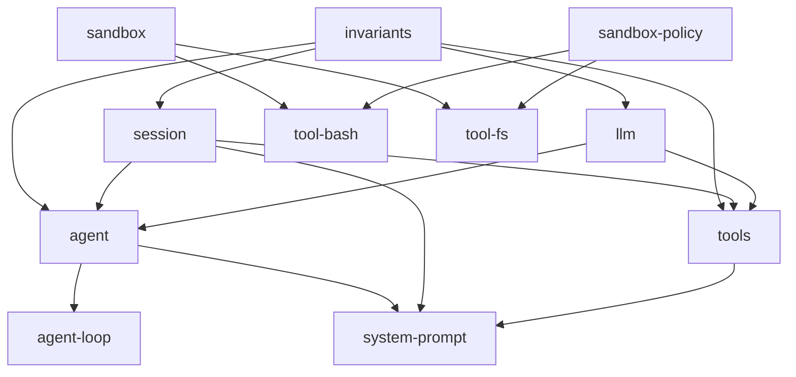

# LLM Benchmark Harness — Roadmap Backlog

This file is the forward-looking backlog for the LLM benchmark harness on
benebsworth.com (`/lab/llm-benchmark/`). It records **features, not bug fixes**
— hardening that already shipped lives in the git log (see "Already shipped"
at the bottom). Items are ordered by priority within each tier.

## How to use this file

- Pick an item, implement it, then mark it `[x]` and move the "Design sketch"
  notes into the skill (`lib/lab/llm-benchmark/../.claude/skills/llm-benchmark/SKILL.md`)
  so the runbook stays current.
- Each item references the code it touches and the external example it was
  inspired by (primarily the DeepSeek Harness, `dsh`).
- Effort is rough relative sizing: S (< 1 session), M (1-3 sessions),
  L (multi-session project).

## Deep-dive provenance

Items marked "dsh code study" were pulled from a local clone of
deepseek-ai/deepseek-harness (`git clone --depth 1
https://github.com/deepseek-ai/deepseek-harness /tmp/dsh`, 2026-08-13):
`docs/defensive-patterns.md`, `docs/subsystems/sandbox.md`,
`packages/feedback/`, `packages/runtime-diagnostics/invariants/`,
`packages/session/session-persistence-jsonl/`,
`packages/session/session-stats/`, `packages/code-runtime/`,
`packages/spill/`, `docs/postmortem/`. When implementing, refresh the clone
first (`cd /tmp/dsh && git pull`) since the repo is in active developer
preview and its API churns.

Both reference clones are graphified (graphify, code-only, zero API cost)
for exploration — query with `graphify explain|path|query` from the repo
root (graphs may go stale after `git pull`; refresh with
`graphify update . --code-only`):

| Repo | Clone | Graph | Stats |
| --- | --- | --- | --- |
| deepseek-harness | `/tmp/dsh` | `/tmp/dsh/graphify-out/` | 38,262 nodes / 83,865 edges / 1,243 communities. God nodes: `Context` (1,281 edges), `SessionId` (740), `SessionEvent` (345), `Session` (268), `dsh-invariants` (434) — confirms the log-as-truth + invariants-hub architecture |
| paperclip | `/tmp/paperclip` | `/tmp/paperclip/graphify-out/` | 38,308 nodes / 108,097 edges / 974 communities (built 2026-08-15, commit b38d6ddb) |

## Reference: DeepSeek Harness (dsh)

**Repo:** https://github.com/deepseek-ai/deepseek-harness (MIT, 103k stars,
"Everything is a Plugin", built on the Cordis plugin framework:
https://github.com/cordiverse/cordis).

The single most valuable ideas for this benchmark:

1. **Session log as source of truth.** An append-only `SessionEvent` log with a
   runtime invariant: *"model-visible means logged"* — anything that reached a
   model request must be reconstructable from the log. Fork, resume,
   transcripts, telemetry, and persistence all derive from this one stream.
   (https://github.com/deepseek-ai/deepseek-harness/blob/master/docs/architecture.md,
   https://github.com/deepseek-ai/deepseek-harness/blob/master/docs/subsystems/session.md)
2. **Profiles + bundles + patchable config.** A running harness is a layered,
   named composition; `dsh --dump-config` prints the booted tree and any row
   is replaceable via a config patch. There is no privileged core.
   (architecture.md § "Profiles and bundles")
3. **Capability seams.** A seam = Service Definition + Service Provider +
   Consumer. Filesystem, subprocess, sandbox, shell, subagent are all seams,
   so one provider swap moves every consumer with it (e.g. pointing fs+shell
   at a remote sandbox). (architecture.md § "Capability seams")
4. **Telemetry is a first-class plugin**, not an afterthought.
   (architecture.md § "Events" / dsh-base bundle description)
5. **Benchmarks are just isolated invocations of the real harness.** Separate
   workspace + session ID per task; the same tool that does real work runs the
   eval. (https://github.com/deepseek-ai/deepseek-harness/blob/master/BENCHMARK.md,
   https://github.com/deepseek-ai/deepseek-harness/blob/master/docs/user/guide/python-sdk.md)
6. **Retries are durable, loop-level events.** `packages/llm/llm-retry` never
   wraps the adapter call: every provider attempt stays one call, and each
   retry opens a fresh turn over the same durable history, appending
   `llm/retry` + `llm/retry-started` events with a canonical policy key
   (provider + every behavior-affecting field). Honoring
   `providerRetryAfterMs` replaces local backoff. The invariant companion
   checks every retry event pairs with a started event and names the right
   turn/step. (packages/llm/llm-retry/README.md)
7. **Per-session composition ("presets").** An agent preset is a directory
   holding an `agent.cordis.yml` that gives one session its own tools and
   prompt sections while other sessions keep theirs; a preset naming a
   process-global service is rejected at mount rather than colliding.
   (packages/preset/README.md)
 8. **Projection is one pure function with an incremental cache.** Session
    history is derived by folding `deriveEventMessage` over the log's surface
    (O(new nodes), cached per generation, deep-frozen shared messages) — the
    same function drives live history, external reconstruction, and pure
    projections, so they can never disagree.
    (packages/core/session/src/{index.ts,surface.ts})
 9. **Authorized session retrieval + log export** (`packages/session/
    session-query/` family): trusted reads, relationship queries, SQLite
    FTS search, bounded reads with result pages — independent of compaction;
    `session-log-export/` adds a Web `/export` command (ZIP of the session
    log via a Host endpoint). The read/tool surface is consumed separately
    from persistence internals. (Inspires #30.)
 10. **Content-addressed attachment storage** (`packages/attachment/` +
    `attachment-local/`): immutable, content-addressed bytes under
    `DSH_HOME`; image limits; "bytes enter durable storage only when a user
    prompt is submitted". (Inspires #31.)
 11. **Storage domain with typed forms** (`packages/storage/` +
    `storage-domain/`): consumers use validated data forms over swappable
    backends (json/sqlite) — `DomainSpec`/`Domain`, `domain/changed` events.
    The model for our feedback sidecar (#14) and any future local state.
 12. **Session references** (`packages/context/session-reference/`): bounded,
    read-only snapshots of OTHER sessions injected as sourced model-facing
    context — `dsh-session:<base64url>` URI scheme, `@[label](uri)` mentions,
    candidate ranking (same-cwd first), snapshot metadata recording capture
    seq + omitted counts. (Inspires #32.)
 13. **Skills, jobs, plan-mode** (`packages/skill/`, `packages/jobs/`,
    `packages/plan/`): provider-neutral skill catalog with discovery
    priority; owner-isolated background jobs (observation/cancellation/
    waiting); plan mode as logged per-agent collaboration state.

---

# Deep-dive #2: graph analysis (2026-08-13)

Processed the full package tree with a standalone graph script
(`/tmp/dsh-graph.cjs`; edges = in-repo `peerDependencies`, the canonical
runtime-dependency signal — same semantics as dsh's own
`scripts/gen-module-graph.ts`).

Topology facts:

- **219 packages, 1089 edges, ZERO cycles.** The tree is a strict DAG —
  the load-bearing claim behind "no privileged core": effects unwind on
  unload only because dependencies never point upward. `collectPackageGraph`
  enforces dependency-safe ordering structurally.
- **`invariants` is the universal hub: 218/218 packages depend on it, and it
  depends on nothing in-repo** (a leaf). Every package registers package-owned
  runtime checks — the invariant registry is the connective tissue, not a
  domain package.
- **The core is tiny.** Five packages anchor the tree: `invariants` (218
  consumers), `session` (80), `llm` (78), `agent` (58), `tools` (43).
  Everything hangs off the session log + the LLM adapter seam — consistent
  with "the log is the source of truth".
- **The client/web group is 39 packages (18% of the tree)** — the UI surface
  is as engineered as the runtime.
- **Leaf composition packages consume the most** (`agent-spine-demo` 22 deps,
  `client-ui-conversation` 19, `api-remotes` 15, `subagent` 15) — the heavy
  consumers are compositions, not libraries.
- **Every model-facing tool pulls the same pipeline stack** (`tool-bash`,
  `tool-pwsh`, `tool-fs` each depend on `sandbox` + `sandbox-policy` +
  `user-approval` + `system-prompt` + `tools`) — the tool pipeline is a
  repeated composition, which is why the seam pattern pays off.

Lessons for this benchmark:

- Keep our own dependency direction strict (`types.ts` → `scorers`/`runners`
  → `scripts`) and make it TESTED — see #17.
- The "projection is one pure function" rule (#8 above) is the implementation
  note for the run-trace UI (#9): one `projectIteration(log)` pure fold, never
  ad-hoc per-page logic.
- Retry-as-durable-event (#6 above) hardens the event-log design (#1) and the
  invariants suite (#5).

---

# Reference: Graphify (Graphify-Labs/graphify)

**Repo:** https://github.com/Graphify-Labs/graphify ("Turn any codebase into
a queryable knowledge graph", v8 branch, 106k stars, Apache-2.0/MIT).

The tool this roadmap's deep-dives were processed with:

- **Install:** `uv tool install graphifyy` (PyPI package is `graphifyy`,
  command is `graphify`).
- **Build a graph:** `graphify extract <dir> --code-only` (tree-sitter AST,
  deterministic, zero LLM calls, nothing leaves the machine) then
  `graphify cluster-only <dir>` for communities + `GRAPH_REPORT.md`.
  Output: `graphify-out/{graph.json, GRAPH_REPORT.md, graph.html}`.
- **Query it instead of grepping:** `graphify explain "Node"` (neighbors +
  degree + community), `graphify path A B` (shortest path, hop by hop),
  `graphify query "<question>"` (BFS subgraph), `graphify export
  callflow-html` (Mermaid call-flow).
- **Every edge is tagged** `EXTRACTED` (explicit in source) vs `INFERRED`
  (resolved) — you always know what was read vs guessed.
- **Report contents:** god nodes (most-connected concepts), communities
  (Leiden clustering), surprising cross-file connections, `# NOTE:` /
  `# WHY:` comments and doc refs as first-class nodes, suggested questions.
- **Team workflow:** `graphify-out/` is meant to be committed to git; a
  git hook auto-rebuilds on commit (AST only, no cost); a merge driver
  union-merges `graph.json` on parallel commits; MCP server
  (`python -m graphify.serve graphify-out/graph.json`) exposes
  `query_graph` / `get_node` / `get_neighbors` / `shortest_path`.
- **Their own benchmarks** (`BENCHMARKS.md`): LOCOMO recall@10 0.497 vs
  mem0 0.048 / supermemory 0.149; LongMemEval-S QA 76%; blind-validated
  judge agreement 90.6% (Cohen's kappa 0.81) — the code graph beats vector
  memory for code-answer tasks, and their evaluation methodology (same
  harness, same model, same budgets; blind judge + kappa) is a template
  for ours (see #26).

---

# Reference: Paperclip (paperclipai)

**Repo:** https://github.com/paperclipai/paperclip ("The open-source app
everyone uses to manage agents at work", MIT, TypeScript monorepo; 78k
stars). Processed with graphify v0.9.43 (tree-sitter, code-only, fully
local): **38,308 nodes / 108,097 edges / 974 communities** from 3,927
source files in ~2 min. Clone at `/tmp/paperclip`, graph at
`/tmp/paperclip/graphify-out/`.

Key ideas for this benchmark:

1. **Eval framework with a two-stage maturity plan** (`evals/` +
   `doc/plans/2026-03-13-agent-evals-framework.md`). Stage 1: promptfoo
   bootstrap — narrow behavior evals (categories: `core`, `governance`,
   `mcp_gateway`, `phase5_memory`, `release_gates`) with deterministic
   assertions (contains / not-contains / inline JS + named metrics) run
   across multiple models via OpenRouter. Stage 2: first-party TS harness
   running real scenarios against seeded state. Scoring model: deterministic
   checks + structured rubrics + pairwise judging + efficiency metrics from
   telemetry. **"Compare bundles, not just models"** — model + prompt +
   skills + policy together.
2. **Release-gate evals.** `tests/release-gates.yaml` — prompt-level policy
   regressions that must hold before a release (alongside server/API and
   QA gates): no spurious wake work, no duplicate checkout, scoped wake
   payloads honored. Evals are a release gate, not an afterthought.
3. **Adapter layer, industrialized** (`packages/adapters/` — 12 adapters:
   claude-local, codex-local, gemini-local, grok-local, opencode-local,
   pi-local, cursor-*, openclaw-gateway, hermes; `packages/adapter-utils/`).
   Every local agent CLI runs behind an **execution-target abstraction**
   (`execution-target.ts`): resolve + verify the command exists, resolve
   timeout from policy, session identity + managed home dir, local vs remote
   vs sandbox target, command-install checks, billing inference. ACP
   (Agent Client Protocol) where available (`acpx-engine/`), raw spawn
   otherwise — the same opencode/agy/codex runner pattern we hand-rolled in
   `runners/`, but with a shared, tested substrate (`execution-target.test.ts`,
   `command-managed-runtime.test.ts`, `local-process-sandbox.test.ts`, …).
4. **Redaction as a first-class utility** (`command-redaction.ts`,
   `log-redaction.ts`): regex-based secret scrubbing applied to command
   lines AND logs (`SECRET_NAME_PATTERN` matches
   `api_key|token|authorization|bearer|secret|passwd|password|credential|jwt|private_key|cookie|connectionstring`).
   Confirms and enriches backlog #4 — scrub at THREE points (env passed to
   the CLI, command lines we log, and captured output).
5. **Sandbox managed runtimes + workspace sync** (`sandbox-managed-runtime.ts`,
   `sandbox-file-sync.ts`, `git-workspace-sync.ts`, `workspace-restore-merge.ts`):
   agents run inside sandboxes with file-sync back to the workspace — the
   grown-up version of our scratch-dir + printed-path artifact handoff
   (TODO #3). `session-compaction.ts` adds a compaction policy
   (maxSessionRuns / maxRawInputTokens / maxSessionAgeHours) + native
   context-management detection — the model for any future long-horizon task.
6. **Tool gateway with access policy** (`server/src/services/tool-gateway.ts`,
   a 154-degree graph hub; `tool-access-policy.ts`, secrets, activity logs,
   approval paths; `mcp_gateway` eval category covers fail-closed, rate-limit
   backoff, credential repair, approval drift). Their artifact-running
   environment is mediated; ours is an opaque-origin iframe (effectively
   fail-closed). The `mcp_gateway` eval cases are the checklist for any
   future benchmark task that requires network/tool interactions.
 7. **Billing inference** (`adapter-utils/src/billing.ts`,
    `inferOpenAiCompatibleBiller`): per-adapter usage + cost inference — a
    sharper model than our crude `estimateCost` (tokens × rate).
 8. **Budget + cost governance** (`server/src/services/{budgets,costs}.ts`,
    schema `budget_policies` / `budget_incidents` / `cost_events`): per-agent
    budget policies, a cost-event row per run, incidents raised when a
    policy trips. (Inspires #28.)
 9. **Quota-monitor auto-recovery** (`server/src/services/heartbeat.ts`
    `PROVIDER_QUOTA_MONITOR_SERVICE_NAME`; runs persist
    `providerQuotaRetryNotBefore`, heartbeat.ts:679): a monitor resumes
    paused work once the quota wait elapses ("The previous reviewer run
    reached provider quota. Resume this execution-review stage now").
    (Inspires #29.)
 10. **Agent action audit** (`server/src/services/agent-action-audit.ts` +
    `createActivityDetailsRedactor`, schema `activity_log`): every agent
    action audited with redacted details, full-context provenance
    (company/agent/issue/run refs) — the pattern behind our #25 provenance
    and #1 event log.
 11. **Secrets lifecycle** (schema `company_secrets` + `*_versions` +
    `*_proposals` + `*_bindings` + `secret_access_events`;
    `run-secret-redaction.ts`): propose → version → bind → audited access,
    with redaction at run boundaries. The grown-up version of our #4/#20
    credential hygiene.
 12. **Plugin platform** (schema `plugin_*`: `plugin_state`, `plugin_config`,
    `plugin_database`, `plugin_jobs`, `plugin_logs`, `plugin_webhooks`,
    `plugin_entities`, `plugin_managed_resources`): third-party plugins with
    per-plugin DB + webhooks + managed resources — a possible long-term
    direction for #10's task/check registry.
 13. **Decision pipeline with training examples** (schema `decision_queues`
    / `decisions` / `decision_training_examples`): decisions logged; real
    decisions become training examples — the eval-framework analogue of our
    failure corpus (#25) feeding check design.
 14. **Export fidelity** (`server/src/services/export-fidelity.ts`): exports
    must round-trip the source data. (Pairs with #30.)
 15. **Telemetry client** (`server/src/telemetry.ts`, shared
    `TelemetryClient`): opt-in, config-resolved, state-file persisted —
    the shape for any opt-in usage telemetry on the benchmark site.

**Graphify meta-finding:** the graphify workflow itself is a tooling win for
our OWN repos — code-only extraction is local, deterministic, ~2 min for
3.9k files, and produces a queryable graph (`graphify query/path/explain`)
plus god nodes + communities. Worth committing `graphify-out/` for the
benchmark module tree and the OMEGA harness repo so future sessions
traverse with queries instead of greps. (Their LOCOMO benchmark claims
0.497 recall@10 vs mem0's 0.048 — code graph beats vector memory for
code-answer tasks.)

---

# P1 — Core integrity

## [x] 1. Per-iteration event log ("model-visible means logged")

**Shipped.** `lib/lab/llm-benchmark/runlog.ts` is an append-only JSONL log, one
file per (model, task) per sweep at `sweeps/<run-id>/<model>-<task>.jsonl` —
the SAME root `setSweepRoot` retains scratch and artifacts under, wired from
`scripts/run-benchmark.mjs` via `setRunLogDir()` (module-level, the
`setSweepRoot` precedent). Line 0 is an immutable header
(`version`, `runId`, `modelId`, `taskId`, `createdAt`, `configSnapshot` =
iterations/timeoutMs/maxRetries/bustCache); every later line is one event with
a contiguous writer-owned `seq`. Events: `request` (prompt sha256 + length),
`response` (raw output, tokens, runtimeMs, `cacheHit`), `retry`
(`kind: transient | empty_body`, attempt, delayMs), `clean` (the artifact
actually scored), `failure` (error + failureReason + timedOut), `check` (one
per check per iteration, stamped with the TRUE iteration index), `aggregate`
(the BenchmarkResult, artifact always spilled). Appends coalesce into 200ms
batches (one write + one fsync, serialized); `runTask` flushes at every
iteration boundary and closes before returning, so a killed sweep loses at
most the in-flight iteration. Strings over 8 KB spill to
`spill/<sha256[:16]>.txt` (content-addressed — identical artifacts across
`response`/`clean`/`aggregate` cost one file) leaving a 2 KB preview + byte
count inline. Readers keep the complete prefix and stop at the first
unparsable line; only a missing header throws. The log instance is threaded
EXPLICITLY through `generateOne`/`aggregateRuns` — concurrent (model, task)
jobs would corrupt a shared module-level "current log". `BenchmarkResult`
gains `runLogRef?: { runId, file }`, stamped on every record produced while
logging is on. Replay with `npx tsx scripts/retrace.mjs --run <run-id>
[--model x] [--task y] [--iteration n] [--full]`. With no run-log dir set
(unit tests, library use) behaviour is byte-for-byte unchanged.

## [x] 2. Sweep profiles with effective-config dump

**Shipped.** Recipes are DATA in `lib/lab/llm-benchmark/sweep-profiles.json`
(`smoke`, `fast-refresh`, `slow-model`, `agy-quota` — each a one-line
description plus any of models/tasks/iterations/concurrency/timeoutMs/
maxRetries/bustCache). `sweep-profiles.ts` validates the file at import
(unknown key, wrong type, or missing description throws — `retries` instead of
`maxRetries` must not silently pass) and holds the pure, unit-tested
`resolveSweepConfig()`/`parseSweepArgs()`/`estimateSweepDuration()`.
`scripts/run-benchmark.mjs` is a thin shell over them and takes `--profile`,
`--model`/`--task` (repeatable or comma list), `--iterations`,
`--concurrency`, `--timeout-ms`, `--max-retries`, `--bust-cache`,
`--list-profiles`, `--dump-config`. **Precedence: CLI flag > env var > profile
> built-in default**; with no profile and no flags the env-only behaviour is
byte-identical (including `RUN_MAX_RETRIES=""` reading as 0), so the Taskfile
wrappers and the runbook are untouched. Every run first prints the effective
config with the PROVENANCE of each value (`flag`/`env`/`profile:<name>`/
`default`) plus sweep root, results path, quota-lock status, and a ROUGH
duration estimate (sum of historical mean `runtimeMs` per (model, task) ×
iterations ÷ concurrency; pairs with no history count 0 and are reported).
`--dump-config` prints that and exits without spending; an unknown profile
lists the available ones and exits 1. Taskfile: `task bench:profiles` (list),
`task bench:profile -- <name> [flags]` (run/dump).

## [x] 3. Forensic session retention (don't rm the scratch dir)

**Shipped.** `scripts/run-benchmark.mjs` computes one sweep root at startup
(`SWEEP_ROOT` env, default `sweeps/<run-id>/` where the id is a
filesystem-safe ISO timestamp from `sweepRunId()`), logs it, and calls
`setSweepRoot()` — module-level state exported from `runners/cli.ts`, the
`setBustCache` precedent, so no provider config signature changed. Under a
sweep root `generateFromCli` puts its scratch at
`<root>/scratch/<model>-<task>-<n>/` (reused on a retry) and NEVER deletes it
— on success or failure: forensic value peaks when the iteration failed.
Whichever of the three file-handoff paths wins also copies the bytes to
`<root>/artifacts/artifact-<model>-<task>-<n>.html` with `{ flag: 'wx', mode:
0o600 }` (the hardening carried over from #4), best-effort so it can never
fail a run. With no sweep root (unit tests, library use) the original
mkdtemp + delete-in-finally behaviour is byte-for-byte unchanged.
`npx tsx scripts/sweep-clean.mjs [--keep 5] [--older-than 14] [--dry-run]`
prunes whole run trees; the policy lives in the unit-tested pure
`selectPrunable()` (`lib/lab/llm-benchmark/sweep.ts`) and deletes a run only
when it is BOTH beyond the keep-count AND older than the age floor. `sweeps/`
is gitignored; layout + rationale are in the skill.

---

# P1 — Security and integrity

## [x] 4. Credential scrub for CLI spawns

**Shipped.** `scrubEnv()` (exported from `runners/cli.ts`) drops every
credential-shaped key (`/(key|secret|token|password|auth|credential|private)/i`)
from the inherited environment; `runCli` spawns with
`{ ...scrubEnv(process.env), ...options.env }`, so a provider that ever needs a
credential re-adds it by name (opt-in, never ambient). No allowlist: nothing a
child needs (PATH, HOME, TMPDIR, SHELL, TERM, LANG/LC_*, USER) matches. Unit
tests plus a real-spawn test asserting the child cannot see a poisoned parent
`*_API_KEY` are in `cli.test.ts`. Verified live: `agy` replies "OK" under the
scrubbed env, and `codex` reaches its authenticated usage-limit response
identically with and without the scrub. The `{ flag: 'wx', mode: 0o600 }`
artifact-write hardening stays with #3.

## [x] 5. Results invariants verification (anti-regression)

**Shipped.** `lib/lab/llm-benchmark/verify-results.ts` holds the pure checksuite
(dsh's `packages/runtime-diagnostics/invariants`): `verifyResults(results,
{ runLogs, readLog })` returns one `Verdict { check, level: pass|warn|fail|skip,
recordKey, detail, why }` per check per record, and `summarizeVerdicts()` the
counts. Each of the eight checks in `RESULT_CHECKS` carries the WHY it exists —
the bug it would have caught — and the report prints it on failure; a check
nobody can justify is synthetic and gets muted rather than fixed. The checks:
score is EXACTLY `aggregateRuns`' `Math.round(Math.min(100, Math.max(1,
mean(iterationScores))) * 10) / 10`; `iterationCheckResults` index-aligned with
`iterationScores`; succeeded <= ran with one score per success; `status` derived
from the same counts; `taskId`/`modelId` resolve in the registry;
`failureReason` in the taxonomy (a `Record<BenchmarkFailureReason, true>`, so a
new reason is a compile error here) and consistent with `status`; **runLogRef ⇄
run log** both ways (a log on disk whose record has no ref FAILS — "no record
without a trace"; a ref must name a log whose header matches the record and that
holds an `aggregate` event; a ref to a pruned log is a skip); and run-log `seq`
strictly increasing — a GAP is dropped-batch evidence (WARN, per the runlog.ts
contract), a duplicate or decrease is a FAILURE. Records predating a field skip
the checks that need it; seeded records are exempt from the run-log checks only;
the single-entry `iterationCheckResults` written by
`scripts/backfill-iteration-checks.mjs` (one breakdown for the one published
artifact) is a documented skip, not a failure. `scripts/verify-results.mjs` is a
thin shell — loads results (`RESULTS_OUT_PATH`), scans `sweeps/` (`SWEEPS_DIR`),
prints failures-with-WHY then warnings then `N checks, N records, N failures, N
warnings, N skipped`, exits 1 on any failure (`--strict` also on warnings,
`--quiet` for the summary alone). `task bench:verify-results`, and first in the
pre-push gate (seconds, and the log half skips with no `sweeps/`). Green on the
current 183 records: 0 failures, 0 warnings, 512 skipped.

---

# P1 — Reliability and signal quality

## [x] 6. Distinct failure reason for CLI timeouts (`cli_timeout`)

**Shipped.** `'cli_timeout'` is a first-class `BenchmarkFailureReason`:
`classifyFailureReason(err, output, { cliProvider })` returns it for a timeout
on a CLI-backed provider (`isCliProvider()` — `Agy`, `Codex`, `OpenCode`) or on
the raw `runCli` message shape, so slow generation reads as capability rather
than the network story `endpoint_hung` tells. It stays transient (retried), and
counts as a MODEL failure in `analytics.ts`. The four deepseek timeout rows were
reclassified via `scripts/backfill-failure-reasons.mjs --cli-timeouts-only`.
Runbook detail lives in the skill (Operational Gotchas). No UI change was
needed: nothing under `components/`/`app/` renders failure reasons yet — the
model page shows `status` only (see #8/#9 for surfacing them).

## [x] 7. Quota-reset estimator

**Shipped.** `lib/lab/llm-benchmark/quota.ts` holds the pure pieces:
`parseQuotaResetMs()` (agy's `Resets in 57h27m`, plus `resets in 2h`,
`Reset in 45m`, arbitrary whitespace, case-insensitive; a digitless
`resets in` returns undefined, never 0), `formatQuotaWindow()`, and
`quotaLockedModels(results, modelIds, now)`. At the breaker trip site in
`runTask` the runner logs `[harness] next window for <model>: ~2h (resets ~Fri
02:04)` and post-stamps `quotaNextResetAt` (ISO) onto the aggregate —
post-stamp deliberately, so `aggregateRuns`'s signature didn't grow a seventh
parameter. `mergeResults` carries that stamp from a dropped 0-success record
onto the good record it kept (account metadata, not measurement data — every
scored field is untouched); without it the stamp would only ever survive for
(model, task) pairs with no prior success, i.e. never for the models worth
pre-flighting. `scripts/run-benchmark.mjs` re-reads results.json fresh, and
aborts with exit 1 BEFORE building the runner when a targeted model is still
locked; `RUN_IGNORE_QUOTA_LOCK=1` proceeds with a warning. No UI change: still
nothing under `components/`/`app/` renders failure/quota fields (see #8/#9).

**Effort.** S.

---

# P2 — Presentation and composability

## [x] 8. Completion + value stats on the UI

**Shipped.** `modelCompletion()` in `analytics.ts` — pure, seeded-excluded
(hand-authored sample data can never inflate completion; a seeded-only model
reads `attempted: 0`), `tasksTotal` defaulting to `BENCHMARK_TASKS.length` so
plugin tasks count. Done = success|partial; timeouts counted separately;
`meanScore`/`meanRuntimeMs` average over COMPLETED tasks only (a timeout burns
the whole per-call cap and would measure the sweep's patience, not the model);
`costPerPoint = totalCostUsd / max(meanScore, 0.1)` — total spend, so tasks
that were paid for and then failed still count, and the clamp keeps a
0-scoring model finite. `components/lab/llm-benchmark/stat-strip.tsx` renders
it as font-mono muted chips (`3/8 done · 4 timeouts`, zero segments omitted,
"no runs yet" with no live records, flex-wrap so it reflows on mobile) on the
landing-page model cards, the models index cards, and the model page header.
10 helper tests in `analytics.test.ts`.

## [ ] 9. Run-trace UI (render the event log)

**Problem.** #1 produces the data but the benchmark pages only show
aggregates + the best artifact. The side-by-side comparison
(`components/lab/llm-benchmark/model-output-comparison.tsx`) compares final
artifacts; it can't show *why* an iteration failed.

**Inspiration.** dsh web app browses sessions and replays transcripts from
the session log (architecture.md "Session log"; `dsh web`).

**Design sketch.**

- On the task page's run section (per model), an expandable "iteration
  trace" panel fed by the run log JSONL (fetched like the on-demand output
  JSONs via `gen-benchmark-outputs.mjs`-style static publication, or only
  when `runLogRef` exists).
- Shows per iteration: prompt hash/length, raw vs cleaned output diff, each
  check (name/passed/points/detail — reuses `IterationChecks` pills), retry
  events, timings.
- Fall back to "no trace recorded (pre-event-log run)" on old records.

**Acceptance criteria.** Any iteration from a logged sweep is browsable in
the UI; old records degrade gracefully; demo remains snappy (lazy fetch).

**Effort.** L. **Dependencies.** #1.

## [x] 10. Check/scorer registry formalization

**Shipped.** The task row declares its evaluator: `BenchmarkTask.scorer`
(`'behavioral' | 'html' | 'text'`, optional) is read FIRST by `selectScorer()`
against a `SCORERS` name→implementation map in
`lib/lab/llm-benchmark/scorers/index.ts`; the five-HTML-category heuristic
survives only as the fallback for an unstamped row, so behaviour is
byte-identical for pre-existing rows (a test replays the old heuristic over the
full registry and asserts every task resolves the same). All seven shipped
tasks are stamped explicitly — including the two text tasks, so the registry is
the single place you read to learn how a task is scored; `html` is registered
but deliberately unclaimed (vocabulary for a future structural-only task).
`behavioralTaskIds(tasks)` derives the behavioural id set from the registry,
and both `scripts/rescore-behavioral.mjs` and
`scripts/backfill-iteration-checks.mjs` now call it instead of each keeping a
copy (candidate sets over the 183-record results.json verified identical:
130 rescore / 3 backfill, before and after). `registry.test.ts` fails a task in
an HTML-runnable category that doesn't declare `scorer: 'behavioral'`, and
fails any behavioural task with zero entries in `CHECKS_BY_TASK` — there is no
generic default check set, so empty means the artifact quietly falls back to
the structural score that hands 100 to a game that ignores input.

**Effort.** S–M.

---

# P3 — Board completion and experiments

## [ ] 11. Board completion

- **gemini-3.6-flash** — registered, ZERO results (OpenRouter 402, $0
  credits). Needs an OpenRouter top-up ($5-10) then a normal sweep
  (`gemini-3.6-flash`, all 7 tasks, 5 iters). The only model with no board
  presence.
- **codex `-pro` variants** — never run (no `OPENAI_API_KEY`; codex CLI uses
  ChatGPT auth for the base tiers). Requires OpenAI API key to add.
- **deepseek-v4-flash-free retry** — landing-page-morph, equation-solver,
  physics-pendulum-wave, circuit-builder-teaser all recorded `cli_timeout`
  (see #6) at 10-30 min caps. The free tier's latency is unstable (40s-15min
  observed for the same task), so a future window may land them. Retry with
  the slow-model profile; do NOT burn > 1 iteration each until one succeeds.
- **nemotron-nano-12b-vl** — excluded (free endpoint hangs). Re-test
  periodically; it is the only documented exclusion with no active plan.

## [ ] 12. Sandbox backend seam (longer term)

**Problem.** Playwright is the only sandbox backend; `getBrowser()`
(`lib/lab/llm-benchmark/scorers/sandbox.ts`) hardcodes Chromium args, and the
scorer has no way to run against a remote browser or a fallback (jsdom)
without code changes. Also the sandbox policy actually applied per run is
never logged.

**Inspiration.** dsh `ctx.sandbox` seam (docs/subsystems/sandbox.md):
- One interface, swappable backends; consumers wrap argv before spawning.
- **Modes are a small closed vocabulary**: `read-only | workspace-write |
  danger-full-access` — file effects only; network/process visibility is
  outside the vocabulary.
- **Enforcement is a reported fact**: `full | partial` — a consumer that
  requires the absolute promise must reject or surface `partial` (older
  Landlock ABIs, `--no-sandbox` Chromium).
- **Per-call policy resolution**: the complete policy (mode + workspaceRoot
  + session identity) is resolved once per call and logged.

**Design sketch.**

- `SandboxBackend` interface: `launch() → { newContext() }`, `close()`.
  Implementations: `localChromium` (today's), `remotePlaywright` (via
  `PLAYWRIGHT_WS_ENDPOINT`), `jsdomFallback` (structural checks only, tagged
  `behaviouralFallback` — the `scoreBehavioral` catch path already has this
  concept).
- The artifact sandbox reports its **enforcement level** (`full`/`partial` —
  `--no-sandbox` Chromium = partial) into the run log (#1) as a
  `sandboxPolicy` event; `partial` is surfaced wherever a behavioral score
  is shown (e.g. a footnote "checks ran with partial enforcement").
- `run-benchmark.mjs`/runner log the active backend + policy into the event
  log (#1) as a `sandboxPolicy` event.

**Acceptance criteria.** A CI/container run can use the fallback without code
changes; the applied sandbox policy + enforcement level are in the run log;
existing behavior unchanged by default.

**Effort.** M. **Dependencies.** #1 (for the policy log).

## [ ] 13. Per-call telemetry (TTFT, tokens/s, cache, retries)

**Problem.** `runtimeMs` is wall-clock only. We don't record time-to-first
token, tokens/sec, cache hits, or retry counts per iteration — the signals
that separate "model slow" from "network slow" (directly relevant to #6's
classification story).

**Design sketch.** Extend the event log (#1) `response`/`retry` events with
`ttftMs`, `tokensPerSec`, `cacheHit`, `attempt`. `BenchmarkResult` gains an
optional `telemetry?: { meanTtftMs, meanTokensPerSec, cacheHits, retries }`
rolled up in `aggregateRuns`. Surface on the model page's runtime cell
tooltip.

**Fold semantics reference.** dsh `packages/session/session-stats` folds the
same figures from its log with exact rules we should copy:
- `llmMs` = `step/start` → `assistant/message` per step (retry waits inside
  the step count as model time).
- `ttftMs` = `step/start` → first non-empty delta; the FIRST attempt's
  boundary survives an in-step retry (`resetForRetry` parity — don't reset
  TTFT on retry).
- `decodeMs`/`decodeTokens` = first token → assembled message, only over
  steps carrying both.
- Every field is 0 until its first contributing event; clients read the
  value, never key presence.

**Acceptance criteria.** Sweeps record telemetry; a retrace or page tooltip
shows TTFT/tokens-per-sec/cache/retries per iteration; the fold follows the
session-stats semantics above.

**Effort.** M. **Dependencies.** #1.

---

# P2 — Site features (dsh study additions)

## [ ] 14. Reader feedback on artifacts (ratings + notes)

**Problem.** The behavioral scorer answers "does Space jump?" but not "is
this artifact actually good?" — human judgment is the one signal the board
lacks, and it's exactly what dsh's `feedback/` family formalizes.

**Inspiration.** dsh `packages/feedback/`:
- `message-feedback`: per-message `rating: 'positive' | 'negative'` +
  optional note, versioned sidecar, immutable timestamps, list/put/delete
  Remote contract; feedback NEVER enters model context.
- `command-feedback`: log-only `feedback/record` remark for telemetry.

**Design sketch.**

- On each model's artifact (task page side-by-side view), a compact
  up/down + optional note control.
- `BenchmarkResult`/sidecar storage: `lib/lab/llm-benchmark/feedback.json`
  keyed `(modelId, taskId, iterationIndex?)` with
  `{ rating, note?, createdAt, updatedAt, version }` — same shape as dsh's
  `MessageFeedbackItem` (rating, optional note ≤ N bytes, opaque equality-only
  version, monotonic timestamps).
- Aggregate per model/task on the page: `positive: N, negative: M` strip.
- Feedback is never written into results.json and never reaches the model;
  keep it a strict sidecar (dsh's two-contract separation).

**Acceptance criteria.** Rated artifacts persist across deploys; ratings
aggregate per model; version bumps replace rather than accumulate; no
feedback data in results.json or the run log.

**Effort.** M.

## [ ] 15. Executable scoring for code tasks (code-runtime)

**Problem.** Text tasks (crypto-hash-race, equation-solver) are scored
structurally only — the model's code is never RUN. dsh's `code-runtime`
family executes one model-written program against host bindings and captures
what it printed/returned, with a failure taxonomy.

**Inspiration.** dsh `packages/code-runtime/` (service definition +
worker-thread backend + Code Mode consumer) and its failure taxonomy
(docs/subsystems/code-runtime.md).

**Design sketch.**

- New scorer family `scorers/executable.ts` for tasks that emit runnable
  code: extract the model's program from the artifact, run it in a worker
  thread (or `node -e` sandboxed), assert on stdout/return value.
- First candidate: `crypto-hash-race` — run the generated solver against
  the task's test vectors and check the hashes; `equation-solver` — evaluate
  the returned solution against the system.
- Composite stays honest: behavioral-style 70/30 with a `codeFallback`
  reason when the program can't be executed (same pattern as
  `behaviouralFallback` in `scorers/behavioral.ts`).
- Execution budget: per-call timeout + output cap (dsh worker-thread
  isolation + execution-budget discipline).

**Acceptance criteria.** crypto/equation scores now reflect executed
behavior; a program that fails at runtime scores low with the failure
reason surfaced; existing structural score is the documented fallback.

**Effort.** L.

---

# P3 — Process (dsh study additions)

## [ ] 16. Postmortem practice for harness incidents

**Inspiration.** dsh `docs/postmortem/README.md`: incident write-ups
"when a bug reached a place it shouldn't have" — executive summary (30
seconds), timeline, root cause, guardrails; written when the bug is
**subtle, systemic, and costly to rediscover**; every postmortem links the
guardrails (tests, rules) it motivated.

**Why now.** This session produced four textbook postmortems: the sweep
hang (closeSandbox), the timeout-config miswire (RUN_TIMEOUT_MS not
forwarded), the bearer-blip misclassification, and the mid-sweep
results.json race. Each escaped because the harness lacked a check that now
exists.

**Design sketch.**

- `docs/postmortem/README.md` with the dsh criteria + template (Executive
  summary / Timeline / Root cause / Guardrails).
- Write 0001-0004 for this session's four incidents, each linking the
  guardrail (test, Taskfile task, skill section) that now prevents the
  class.
- Rule in AGENTS.md/CLAUDE.md: a subtle+systemic+costly fix ships with a
  postmortem note or link.

**Acceptance criteria.** 4 postmortems written; template + criteria
documented; the skill's sweep-operations runbook links them.

**Effort.** S.

---

# P3 — Architecture guards (graph-analysis additions)

## [x] 17. Dependency-layering guard test

**Shipped.** `lib/lab/llm-benchmark/layering.test.ts` parses the real import
graph — every non-test `.ts` under `lib/lab/llm-benchmark/**` plus the
`scripts/*.mjs` that reach into it — with a text scan for
`from '…'` / `import('…')` / bare `import '…'`, resolves relative specifiers
(`./x` → `x.ts`, `x/index.ts`, explicit `.ts`/`.mjs`) and asserts four rules:
zero cycles (Tarjan SCC, every component size 1, self-imports included),
`types.ts` imports nothing in-tree (it is the bottom layer), no lib module
imports upward into `scripts/`, and no `scorers/**` file imports `runners/**`
(the forward edge `runners/provider.ts` → `scorers/` is asserted to still
exist, so that rule can't go vacuous). A fifth test guards the guard: a rename
that empties the scan fails instead of passing vacuously, and unresolvable
relative imports fail loudly. Failures name the cycle path
(`provider.ts → scorers/index.ts → scorers/html.ts → provider.ts`) or the
offending edge with file:line and specifier. Checker is small pure functions
in the test file — deliberately not a lib module. No lint config, no new deps.

**Effort.** S.

## [ ] 18. Sweep resume from event-log checkpoints

**Problem.** A killed sweep (quota trip, timeout, crash) re-runs completed
work from scratch on the next attempt. With the event log (#1) recording an
`aggregate` event per completed (model, task), a resume can skip finished
work — dsh's fork-with-boundary concept applied to sweep checkpoints.

**Inspiration.** dsh `Session.fork(source, boundary, childId)` with typed
rejection codes (`INVALID_BOUNDARY`, `OPEN_TURN`, `SESSION_NOT_FOUND`) and
contiguous-seq boundaries (packages/core/session/src/index.ts) — resuming
from a durable boundary is a first-class operation, not a heuristic.

**Design sketch.**

- `run-benchmark.mjs` gains `--resume <run-id>`: reads the target sweep's
  event log, collects (model, task) pairs with a complete `aggregate` event,
  and skips them (unless `RUN_BUST_CACHE=1` overrides).
- Boundary rule: resume is valid only at an `aggregate` event (a completed
  task), mirroring dsh's `OPEN_TURN` rejection — never resume mid-iteration.
- Invalid boundary (missing log, corrupted tail) fails loud with a typed
  error, not a silent partial run.
- Merge safety unchanged: `mergeResults` still protects 0-success records.

**Acceptance criteria.** Kill a sweep mid-run, resume with `--resume`, and
completed tasks are skipped (log shows "resume: skipping <model> <task> (from
run <id>)"); an invalid boundary errors; tests cover the boundary rule.

**Effort.** M. **Dependencies.** #1 (event log), #3 (sweep retention).

---

# P2 — Adapter and eval hardening (paperclip study additions)

## [ ] 19. Execution-target abstraction for CLI providers

**Problem.** Each CLI provider in `runners/` hand-rolls spawn, timeout, and
artifact handoff; there is no shared notion of "the execution target" —
local process vs remote host vs sandbox — and no pre-flight verification
that the CLI is installed (a missing `opencode` binary surfaces as a cryptic
`ENOENT` in the middle of a sweep).

**Inspiration.** paperclip `packages/adapter-utils/src/execution-target.ts`
(+ `command-managed-runtime.ts`, `sandbox-managed-runtime.ts`): one shared
substrate that resolves the command, verifies it exists, resolves the
timeout from policy, carries session identity + managed home dir, and
selects local/remote/sandbox execution — with per-mode tests.

**Design sketch.**

- `runners/execution-target.ts`: `resolveExecutionTarget(cfg, model, task)`
  returning `{ command, args, env, cwd, timeoutMs, sandbox? }` after
  pre-flight checks:
  - command resolvable (`command -v` or `which`) with a clear error naming
    the provider + install hint;
  - timeout resolved from the provider config with a documented default;
  - session identity (model/task/iteration) attached for logging.
- Refactor `generateFromCli` to consume the target (behavior unchanged).
- Pre-flight sweep check in `run-benchmark.mjs`: verify every targeted
  CLI provider's command exists BEFORE the sweep starts (fail fast, not
  mid-sweep).

**Acceptance criteria.** Missing CLI errors at sweep start with an install
hint; timeout resolution is single-source; existing sweeps behave
identically; tests for command resolution + error paths.

**Effort.** M.

## [x] 20. Redaction at three points (command lines, logs, config snapshots)

**Shipped.** `lib/lab/llm-benchmark/redact.ts` (pure, dependency-free) ports
paperclip's `command-redaction.ts` name set as one exported
`SECRET_NAME_PATTERN`, plus `redactText` (four linear regex passes behind a
single name probe: authorization/bearer headers keep the scheme and lose the
value; `NAME=`/`NAME:`/`"NAME": "…"` assignments keep the name and the
quotes; `--flag value` / `--flag=value` lose the value), `redactArgs`
(flag-aware over an argv array, so the prompt element survives intact) and
`redactValue` (deep, for records). Applied at the three surfaces: `runCli`'s
timeout and non-zero-exit errors (which flow onward into results.json `output`
and the run log's `failure` event), the run log's `append`/header encode
(BEFORE spilling, so spill files are redacted too — redaction is
deterministic, so content addressing still dedupes), and the `--dump-config`
`row()` choke point. Deliberate divergences from paperclip, all because our
strings are model-authored HTML: no high-entropy-literal rules (name-adjacent
redaction ONLY — a bare `sk-…`/hash/JWT survives, an explicit non-goal), no
bare `key` in the name set and a required word-boundary end so `data-key`,
`@keyframes`, `keydown`, `--max-tokens` and `"tokensIn"` are untouched, `<`/`>`
terminate a value so a match can't eat the rest of an artifact, and a `(?<!--)`
guard so a `--token: #333` CSS custom property survives. Idempotent (tested).
30 unit tests in `redact.test.ts` plus seam tests in `cli.test.ts` (real spawn,
secret-bearing stderr + a `--api-key` timeout) and `runlog.test.ts` (inline
field, spill file, benign-markup/`promptHash` passthrough).

**Effort.** S–M.

## [ ] 21. Bundle comparison + release-gate evals

**Problem.** The benchmark compares models, but the biggest real-world
lever is the prompt bundle (task prompt + sandbox constraints + system
persona). The deepseek/platformer swings showed prompt changes matter; we
have no way to track "results under prompt-bundle vN" or gate on prompt
regressions.

**Inspiration.** paperclip's "compare bundles, not just models" and the
`release_gates` eval category — prompt-level policy regressions gate
releases.

**Design sketch.**

- `BenchmarkResult` gains `promptBundle?: string` (a hash of the task
  prompt + sandbox constraints + prelude version, recorded at sweep time —
  `withSandboxConstraints` output is already hashed for the cache key).
- `scripts/prompt-bundle-audit.mjs`: for a given model/task, compare
  records under different `promptBundle` hashes and report score deltas —
  the "did the prompt change help" question, per model.
- `scripts/verify-results.mjs` (#5) gains a release-gate mode: records
  whose prompt bundle differs from the current default are flagged
  (`stale-prompt`) rather than silently displayed as current.
- UI: the model/task page shows the bundle hash with a tooltip when it
  differs from current.

**Acceptance criteria.** Sweeps stamp `promptBundle`; the audit script
reports per-bundle deltas; stale-prompt records are visibly flagged; tests
cover the hashing + flagging.

**Effort.** M. **Dependencies.** #5.

## [ ] 22. Gateway-behavior task archetype (fail-closed/backoff/no-fabrication)

**Problem.** All seven tasks are single-shot artifact generations. The
interesting agentic failure modes — fail-closed on denied tools, backoff
on rate limits, refusing to fabricate missing credentials, honoring
approval — are untested because no task exercises them.

**Inspiration.** paperclip's `mcp_gateway` eval category: 12 behavioral
cases (denied tool → fail closed without retry/bypass; rate limit → back
off without busy-looping; missing credential → block on repair without
inventing secrets; approval drift → treat changed snapshots as stale).

**Design sketch.** New task archetype `governance-interaction`: the artifact
is a small HTML console wired to a fake gateway (in-page JS gateway with a
stubbed auth/tool surface). New checks in `scorers/checks.ts`:
`gateway-fail-closed` (denied action does not retry/bypass),
`gateway-rate-backoff` (rate-limited action waits, no busy loop),
`gateway-no-fabrication` (missing credential renders repair UI, no fake
token). Category + registry row + demo component + pre/post MDX.

**Acceptance criteria.** At least 3 of the paperclip `mcp_gateway` cases
have a runnable artifact task; behavioral checks discriminate broken vs
working gateways; the task appears on the board like any other.

**Effort.** L.

## [ ] 23. Billing inference per provider

**Problem.** `estimateCost` (harness.ts) multiplies raw token counts by
flat per-1k rates; CLI providers estimate tokens from char counts, so
costs drift from reality (codex reports totals; opencode reports nothing).

**Inspiration.** paperclip `adapter-utils/src/billing.ts`
(`inferOpenAiCompatibleBiller`): per-adapter usage + cost inference with a
shared `UsageSummary` shape.

**Design sketch.** `CliRunnerConfig.parseTokens` already exists per
provider — standardize its output into a `UsageSummary`-like shape
(`{ inputTokens, outputTokens, cachedRead?, cachedWrite? }`) and let each
provider carry a `biller` fn (codex: parse totals + heuristic split, as
today; opencode/agy: char estimate, as today; api providers: pass through).
`aggregateRuns` stores the summary; cost math stays in one place.

**Acceptance criteria.** Token accounting is single-shape across all
providers; a provider with real usage data (codex) reports closer to
reality; tests for the summary normalization.

**Effort.** S–M.

---

## [ ] 24. Prompt-regression probe layer (cheap narrow evals before sweeps)

**Problem.** Full sweeps are expensive (hours). When the sandbox contract
(`prompts.ts`) or a task prompt changes, there is no cheap gate between
"prompt edit" and "spend a day re-sweeping" — the pre-commit suite tests
the prompt TEXT, not the model's behavior under it.

**Inspiration.** paperclip's two-stage eval plan stage 1 (`doc/plans/
2026-03-13-agent-evals-framework.md` + `evals/promptfoo/promptfooconfig.yaml`):
narrow behavior evals with deterministic assertions (contains /
not-contains / inline JS + named metrics) across several models, run
before the heavy path. Their release-gate cases show the probe style:
"uses inline wake context before inbox exploration" ->
`!output.includes('inbox-lite')`, i.e. assert what the model SHOULD NOT
do as much as what it should. Also the `scoped wake payload` prompt-design
pattern (embed state inline rather than make the model explore -
`evals/promptfoo/tests/release-gates.yaml`).

**Design sketch.**

- `scripts/prompt-probe.mjs`: a mini eval runner (promptfoo-style, but on
  our own runner substrate so it reuses opencode/agy/openrouter) with a
  `probes/` dir of YAML cases. Each probe: a short prompt derived from the
  sandbox contract + deterministic asserts on the reply.
  - Probe set: `doctype-first` (reply starts with `<!DOCTYPE html>`),
    `no-cdn` (no `script src`), `css-sized-canvas` (no attribute-sized
    canvas), `try-catch-alert` (error renders `
`),
    `no-alert-confirm` (doesn't call `window.alert`), `fills-viewport`
    (body margin 0), `scoped-context` (uses provided inline facts, does
    NOT explore/fetch - the paperclip wake-payload lesson).
  - Cheap: 1 iteration x 2-3 representative models (deepseek-v4-flash-free
    + one paid), 60s timeout, results table with per-probe pass/fail.
- Wire as `task bench:probe`; run BEFORE any sweep after a prompt change
  (skill runbook: "prompt changed -> `task bench:probe` -> sweep").
- Probe failures block the sweep (release-gate semantics).

**Acceptance criteria.** A sandbox-contract edit that breaks the DOCTYPE
rule is caught by the probe in < 5 min; probes use the same runner
substrate as sweeps; deterministic asserts only (no LLM judge).

**Effort.** M. **Dependencies.** none (uses existing runners; feeds #21's
bundle tracking).

## [ ] 25. Failure regression corpus (production-case ingestion)

**Problem.** Every broken artifact the benchmark discovers - the platformer
iterations with no `<canvas>`, the n-body that never animates, the
prompt-echoing free-tier outputs - is discarded after the sweep. They are
exactly the regression cases a prompt/scorer change should re-test, and
paperclip's Phase 4 is precisely "production-case ingestion".

**Inspiration.** paperclip `doc/plans/2026-03-13-agent-evals-framework.md`
Phase 4 ("Production-case ingestion" - grow the suite from real usage);
their `mcp-gateway-gap-memo.md` / `mcp-gateway-run-summary.md` pattern
(evals write gap memos from real failures). Graphify's
`# NOTE:`-as-node idea (rationale comments become queryable first-class
nodes) also applies: each corpus case should carry its provenance.

**Design sketch.**

- `scripts/ingest-failures.mjs`: after a sweep (or from the event log,
  #1), collect every failed iteration (score < 40 OR a tripped check OR
  `no <canvas>`-class findings) and write
  `lib/lab/llm-benchmark/failure-corpus/<model>-<task>-<n>.html` +
  `provenance.json` (`{ modelId, taskId, score, failedChecks, promptBundleHash, sweepRunId }`).
- `scripts/probe-corpus.mjs`: re-run the corpus through the CURRENT
  scorer/prompt and report "still broken" vs "now fixed" - the release-gate
  for prompt/scorer changes ("did the deepseek platformer iteration that
  emitted no canvas start emitting one?").
- Corpus is gitignored for artifacts, committed for provenance metadata;
  `verify-results.mjs` (#5) fails if a corpus case that used to be broken
  is broken in a NEW way not covered by existing checks (drives #10's
  check registry to grow).

**Acceptance criteria.** After the next sweep, corpus contains the broken
iterations with provenance; a prompt change re-probes them; the report
shows fixed-vs-still-broken counts.

**Effort.** M-L. **Dependencies.** #1 (event log) + #10 (check registry).

## [ ] 26. Eval methodology rigor for reports (blind judging + agreement)

**Problem.** The benchmark's published claims ("the behavioural scorer
caught a model lying") rest on our own scoring. Any future claim that
compares scoring approaches, or a model-vs-model verdict that hinges on
judgement, should meet a documented methodology bar - otherwise it's
anecdote.

**Inspiration.** graphify `BENCHMARKS.md` methodology: every system "ran
on the same harness with the same model and budgets", scored by "a judge
blind-validated against a second judge (90.6% agreement, Cohen's kappa
0.81)", with full per-system tables + reproduction commands. Paperclip's
plan cites OpenAI eval best practices and LangSmith/Braintrust scorer
docs for the same reason. Also dsh's postmortem discipline (#16): claims
link their guardrails.

**Design sketch.**

- `docs/lab/llm-benchmark/eval-methodology.md`: a short standing doc
  defining the bar for any NEW scoring component or comparison claim:
  (1) same harness + same budgets across systems; (2) if a human judge or
  LLM judge is used, blind + double-scored subset with Cohen's kappa
  reported; (3) reproduction commands (which sweeps, which commits);
  (4) per-claim guardrail links (test, invariant, or postmortem).
- Add a `task bench:methodology-check` that verifies any blog/report
  claiming a comparison cites its reproduction inputs (sweep ids from #1,
  commit SHA) - mechanical, not judgmental.
- The behavioral scorer's own audit trail (checks + iterationCheckResults)
  is the existing evidence layer this doc formalizes.

**Acceptance criteria.** The methodology doc exists and is linked from the
skill; a report template mentions kappa for any judged comparison; the
mechanical check passes on current posts.

**Effort.** S.

## [ ] 27. Committed code graph for this repo (graphify-out)

**Problem.** Future agent sessions (and the user) traverse this benchmark
module tree by grep. A committed, queryable graph makes "what connects the
scorer to the runner?" a 5-second query instead of a read-through - the
same tool this roadmap's reference studies were processed with.

**Inspiration.** graphify's team workflow (README: "graphify-out/ is meant
to be committed to git"; auto-rebuild hook; union merge driver) and the
paperclip/dsh explorations above that were completed in minutes with it.

**Design sketch.**

- Install graphify (`uv tool install graphifyy`), run
  `graphify extract . --code-only` on the repo (excluding `out/`,
  `node_modules/`, `.next/` via existing .gitignore - it honors
  `.gitignore` automatically), `graphify cluster-only .`, commit
  `graphify-out/` (graph.json + GRAPH_REPORT.md; skip graph.html at
  >5000-node limit or raise `GRAPHIFY_VIZ_NODE_LIMIT`).
- `.githooks/post-commit` (or the existing pre-push): `graphify update .`
  when tracked source changed - AST-only, ~seconds at this repo size.
- Document in AGENTS.md/CLAUDE.md: "codebase questions -> `graphify query/
  path/explain` before reading files" (mirrors graphify's own
  query-first guidance); optionally expose via MCP
  (`python -m graphify.serve graphify-out/graph.json`) for opencode.
- Consider the same for the OMEGA harness repo (larger, packages/* tree -
  the graph pays for itself there).

**Acceptance criteria.** `graphify-out/` committed; a fresh clone can
`graphify explain/query` without re-extraction; the post-commit hook
rebuilds on change; CLAUDE.md documents query-first.

**Effort.** S.

---

## [ ] 28. Sweep budget governance (policies, incidents, cost events)

**Problem.** Paid sweeps (codex, agy frontier models, OpenRouter top-up) can
spend real money; today the only guard is manual "did it blow the budget?"
review after the fact. A sweeps run of 7 tasks x 5 iterations on a paid
model has no cap.

**Inspiration.** paperclip's budget + cost governance: `server/src/services/
budgets.ts` + `costs.ts`, schema `budget_policies.ts` / `budget_incidents.ts`
/ `cost_events.ts` — per-agent/company budget policies, cost event rows per
run, incidents raised when a policy is exceeded; and heartbeat's
`providerQuotaRetryNotBefore` persistence. dsh's guard family
(`packages/guard/timeout-policy/`: per-call deadlines as deployment policy)
for the policy-shape.

**Design sketch.**

- `sweep-budget` section in run-benchmark env/profile (#2): `BUDGET_MAX_USD`
  per (model, sweep) with a default off; cost accrues from `estimateCost`
  per iteration (already computed; #23 sharpens it).
- When the budget trips: stop the model's remaining iterations (reuse the
  circuit-breaker skip path, `trippedModels`), log a `budget_incident`
  event (model, task, spent, cap), persist on the affected records.
- Event log (#1) records `cost_event` rows per iteration so spend is
  auditable after the fact.
- UI: model page shows total spend vs cap when a budget was set.

**Acceptance criteria.** A `BUDGET_MAX_USD=$0.01` smoke run on any provider
stops mid-sweep with an incident logged and no further calls; spent totals
reconstructable from cost events.

**Effort.** M. **Dependencies.** #2 (profiles), #23 (billing shape).

## [ ] 29. Quota-monitor with auto-resume (recovery service)

**Problem.** Agy/opencode quota lockouts killed sweeps repeatedly this
session; recovery was manual ("wait for reset, relaunch"). paperclip solves
exactly this with a quota review monitor that resumes work after the wait
elapses.

**Inspiration.** paperclip `server/src/services/heartbeat.ts`
(7861: "The previous reviewer run reached provider quota. Resume this
execution-review stage now that the quota wait has elapsed") +
`PROVIDER_QUOTA_MONITOR_SERVICE_NAME`; runs persist
`providerQuotaRetryNotBefore` (heartbeat.ts:679) and the dashboard buckets
failures by `provider_quota`. Pairs with our #5 (quota-reset estimator) and
#18 (sweep resume).

**Design sketch.**

- Persist `providerQuotaRetryNotBefore` on BenchmarkResult (from the breaker
  path in provider.ts, reusing the #5 regex parse of "Resets in X").
- `scripts/sweep-recovery.mjs`: a tiny monitor that reads the sweep root
  (#3) + results.json, lists models with `quotaNextResetAt` in the future,
  and when the clock passes the reset, relaunches the pending (model, task)
  pairs via `--resume` (#18). Meant to run under `cron`/launchd, logging to
  the sweep root.
- `task bench:monitor` wrapper + skill runbook entry ("quota-locked? start
  the monitor and walk away").

**Acceptance criteria.** A simulated quota-locked sweep is auto-resumed by
the monitor after the reset time; no duplicate runs (resume boundary rule);
logs show monitor decisions.

**Effort.** M. **Dependencies.** #3, #5, #18.

## [ ] 30. Run-trace export on the site (session-log-export)

**Problem.** The event log (#1) makes traces available locally; readers of
the site have no way to download or re-verify a published score. dsh ships
a Web `/export` command producing a ZIP of the session log; paperclip has
`export-fidelity.ts` (fidelity checks for exports).

**Inspiration.** dsh `packages/session/session-log-export/` (Web /export ->
ZIP via Host endpoint, shared browser download state, result modal) +
`docs/subsystems/session-query.md` (bounded reads, traces, filters, result
pages). paperclip `server/src/services/export-fidelity.ts` (exports must
round-trip the source data).

**Design sketch.**

- On the model/task pages, an "Export run trace" button per record with a
  `runLogRef` (#1): serves `sweeps/<run-id>/<model>-<task>.jsonl` (+ the
  artifact HTML) as a ZIP download via a route or static copy in
  `public/lab-data/`.
- `scripts/verify-results.mjs` (#5) gains an export-fidelity check: the
  published export (public/lab-data or the ZIP) must reproduce the record's
  score when re-projected (the "export round-trips" invariant).
- UI disclosure: exports include the check-level data behind the score.

**Acceptance criteria.** A reader can download a trace ZIP and re-verify the
score from it; fidelity check fails if the export diverges from results.json.

**Effort.** M. **Dependencies.** #1 (event log), #9 (trace UI).

## [ ] 31. Content-addressed artifact store

**Problem.** Artifacts are stored by run-scoped names
(`artifact-<model>-<task>-<n>.html`); identical outputs across iterations or
models (deepseek's repeated "no canvas" pages) duplicate storage, and
nothing verifies an artifact matches what was scored.

**Inspiration.** dsh `packages/attachment/` + `attachment-local`: content-
addressed private storage, immutable references, image limits; "bytes enter
durable storage only when a user prompt is submitted" (write-once
discipline). Also their `domain` storage family (storage-domain: validated
records over swappable json/sqlite backends).

**Design sketch.**

- `sweeps/<run-id>/artifacts/<sha256-prefix>.html`: write once, dedupe by
  hash; the event log (#1) references artifacts by their content hash, not
  by model/task name.
- `BenchmarkResult.output` keeps the current inline behavior, but
  `runLogRef`/trace records carry `artifactRef: sha256`.
- `verify-results.mjs` (#5) gains a check: the artifact at the recorded hash
  re-scores to the recorded iteration score (content-addressing makes this
  a cheap exact-match check).
- Site serves deduped artifacts via the hash (cache-friendly, stable URLs).

**Acceptance criteria.** Identical artifacts across iterations store once;
a tampered/regenerated artifact fails the hash check; the demo fetch path
still works (URL now hash-derived).

**Effort.** M. **Dependencies.** #1, #3.

## [ ] 32. Cross-run references (`bench://` URIs + related-run snapshots)

**Problem.** Run traces exist per record but nothing links them: a reader
on the deepseek platformer page cannot jump to the n-body page's failed
iterations that share a failure signature (no `<canvas>`), and an agent
session cannot cite another run's evidence.

**Inspiration.** dsh `packages/context/session-reference/`: bounded, read-
only snapshots of OTHER sessions injected as sourced context — a URI scheme
(`dsh-session:<base64url(json)>`), `@[label](uri)` mention syntax, candidate
ranking (same-cwd first), and snapshot semantics that record what was
omitted (capture seq, retained/omitted message counts). paperclip
`catalog-provenance.ts` for the provenance side.

**Design sketch.**

- A `bench://<model>/<task>/<iteration>` URI scheme + `formatBenchReference()`
  / `parseBenchReference()` helpers (mirroring the dsh encode/decode pair).
- "Related runs" panel on the task page: same failure signature
  (`failedChecks` intersection from `iterationCheckResults`), ranked like
  `listCandidates` (same task first, then same model, then others).
- Run-trace UI (#9) renders parsed `bench://` references as links; the
  event log records cross-references with capture seq + omitted counts
  (what the trace includes vs the full log) — dsh's snapshot semantics.
- Future: the OMEGA harness agent can cite `bench://` evidence in reports.

**Acceptance criteria.** `bench://` URIs round-trip; the related-runs panel
links iterations sharing a failed check; cross-references appear in traces
with their capture metadata.

**Effort.** M-L. **Dependencies.** #1, #9.

---

# P2 — Plugin system (implemented 2026-08-16, future work)

The plugin system shipped: see the "Already shipped" entry. This section
captures the future work the system enables. All items reference the
implementation files (`lib/lab/llm-benchmark/plugins/`).

## [x] 33. Plugin system core (SHIPPED)

`lib/lab/llm-benchmark/plugins/{registry,index}.ts` + example
`plugins/community-tasks/`: tasks, named behavioral checks, scorers, demo
components, and task-page cards registered without touching core files;
roster = static imports in `plugins/index.ts`; `unregisterPlugin()` unwinds;
pluginId stamped on contributed tasks (attribution chip on the task page);
client-bundle rule (checks use `import type` only). 656 tests green, build
generates the tic-tac-toe page. Design intent: dsh's "no privileged core",
sized for a static-export site (load-time registration, not runtime install).

## [x] 34. Plugin authoring guide + template generator (SHIPPED)

**Shipped.** `docs/lab/llm-benchmark/plugins-authoring.md` — extension-point
catalogue (tasks/checks/scorers/demos/taskCards) with a file:symbol reference
each, the client-bundle rule, manifest fields (and the honest note that
`manifest.json` is descriptive metadata nothing loads), the point-budget +
threshold-rationale convention for checks, roster registration and
collision ordering, sweep bundle selection (`--plugins` / `none`), and the
`pluginId` attribution chip. `task bench:plugin-scaffold -- <id> "<Name>"`
→ `scripts/plugin-scaffold.mjs` renders `scripts/templates/plugin/*.tmpl`
into `plugins/<id>/`; pure validation/naming/render helpers live in
`plugins/scaffold.ts` with tests in `plugins/scaffold.test.ts`.

Templates are `.tmpl` files, not string literals in a `.ts` module, because
`layering.test.ts` text-scans in-tree `.ts` imports and would read a template's
`from './checks'` as an unresolvable import.

The scaffold deliberately does NOT edit the roster: an unrostered plugin is
typechecked and linted but imported by nothing, so `task verify` stays green
(verified both ways, plus `task build` with a throwaway rostered). One core
coupling was found and removed: `scorers.test.ts` pinned the behavioural task
list including plugin ids, making every contribution a core edit — the
built-in half stays pinned, the plugin half is now derived from the roster.

## [x] 35. Plugin-provided runners (new providers as plugins)

**Shipped.** A plugin can ship a provider: `BenchmarkPlugin.generators`
(keyed by the `model.provider` string) + `BenchmarkPlugin.models`, with zero
`provider.ts` cases. **The seam is generation, not the run loop** — the
sketch's `runners: Record<string, BenchmarkRunnerFactory>` was dropped for
`generators: Record<string, () => Promise<PluginGenerate>>`, one level lower:
a generator returns the same `GenerationResponse` the built-in runners do
(now in `types.ts`, the leaf), so a plugin provider inherits retries, the
cache, empty-body recovery, run-log events, the quota breaker and scoring
rather than forking them into a second code path whose numbers only claim to
be comparable. The factory is **lazy** because it must be: the implementation
is node-only and `plugins/registry.ts` is in the client-bundle graph, so the
plugin's `index.ts` references it as `() => import('./generate')` and
`runners/provider.ts` (node-only) awaits it once and caches per provider.
`configForModel`'s default case consults the plugin map instead of throwing
immediately; the throw remains for a genuinely unknown provider and now lists
both sets. `registry.ts` merges `pluginModels()` into `BENCHMARK_MODELS`
(stamped `pluginId`) exactly like tasks, and throws at merge on a duplicate
built-in model id — silent shadowing there would misattribute results.
Registration rejects a generator key that shadows a built-in provider
(`providers.ts:BUILTIN_PROVIDERS`, a leaf both layers can import) or another
plugin's, and a model whose provider nothing can generate. Worked example +
proof: `plugins/echo-provider/` (unrostered) and the "plugin-provided
generators" block in `runners/provider.test.ts` — registers a model/generator
pair, runs `runTask`, asserts the aggregate scores and counts like any
provider, and that the lazy factory is awaited once across two iterations.

## [x] 36. Plugin prompt overrides (per-task sandbox contract)

**Shipped.** A task can now carry its own sandbox contract instead of an
edit to `prompts.ts`. `BenchmarkTask.sandboxConstraints?: string` has three
states, explicit-beats-heuristic like `scorer` (#10): absent = the global
`SANDBOX_CONSTRAINTS` iff the category is HTML-runnable (unchanged
behaviour), `''` = no contract even for an HTML category, non-empty = that
text appended blank-line separated whatever the category, REPLACING the
global one. `appliedSandboxConstraints(task)` is the single source of the
appended text (`''` for none) — `withSandboxConstraints` composes it, and
the task page renders it in a collapsed "Sandbox contract" `
`
under the prompt (`components/lab/llm-benchmark/sandbox-contract.tsx`,
labelled global / task-specific / none) so a reader sees what the model
actually received, never a copy of the text. The amended prompt is still
the cache key and `promptHash`, so an override edit re-runs the task rather
than replaying — locked by a test. Worked example: the `community-tasks`
tic-tac-toe task ships a DOM-board contract (cells' own text content is the
mark, empty at start, winner announced in visible text) in place of the
canvas-oriented global one — which changes its cache key by design.
*systemPrompt half deferred — no runner consumes a system prompt today, so
plugin-provided system prompts would be dead plumbing.*

## [x] 37. Plugin bundle selection in sweep profiles

**Shipped.** A sweep now selects which plugin bundles it mounts, and
therefore which contributed tasks participate. `sweep-profiles.json` takes
`plugins?: string[]` (absent = every registered plugin, `[]` = builtins only)
and ships a `builtins-only` recipe; the CLI takes `--plugins a,b` (repeatable
or comma list) and the env layer `RUN_PLUGINS`, with `none` as the
command-line spelling of "builtins only" (empty env var = unset, as with
every other list knob). `resolveSweepConfig()` validates ids against the live
roster and throws with the roster listed — reject at mount, not on collision.
Filtering is two pure exported helpers (`filterTasksByPlugins` /
`isTaskEnabled`: a built-in task always passes, a plugin task passes iff its
plugin is active) plus `excludedPluginTaskConflicts`, so `--task tic-tac-toe
--plugins none` is FATAL rather than a silently smaller run. `--dump-config`
gains a `plugins` row with provenance, and the `tasks` row says how many the
bundle set excluded. Audit trail: the resolved set rides
`ProviderRunnerConfig.plugins` (documented audit-only, no behavioural effect)
into every run log's `configSnapshot.plugins`.

## [ ] 38. Community plugin hosting + validation

**Problem.** Third-party plugins need a trust story: manifest validation,
capability whitelisting (a plugin could register a task whose demo runs
arbitrary JS in the browser), and a place to publish.

**Inspiration.** dsh bundles (out-of-tree plugins installed into a profile,
patchable) + paperclip's plugin platform (schema `plugin_*`: per-plugin DB,
webhooks, managed resources).

**Design sketch.**

- `plugins/validate-plugin.ts`: manifest schema checks (id/name/version
  required, task ids unique, check names resolve at load — the registry
  already throws; a `validate` mode collects ALL errors instead of the
  first).
- Capability declaration: `BenchmarkPlugin.capabilities?: ('tasks' |
  'checks' | 'scorers' | 'demos' | 'runners' | 'prompts')[]` — a reviewer
  can see at a glance what a plugin can touch; a `.graphifyignore`-style
  policy can deny demo registration for untrusted plugins.
- `scripts/plugin-fetch.mjs <git-url>`: clone a plugin repo into
  `plugins/third-party/<id>/` + registry in `plugins/index.ts` (manual
  review step required — never auto-register).

**Acceptance criteria.** `validate` reports all manifest problems at once;
a plugin declaring no demos cannot be reviewed as one that can; the fetch
script leaves a clear review checklist.

**Effort.** M-L.

## [ ] 39. Benchmark data as an MCP server (plugin)

**Problem.** Agents (opencode sessions, the OMEGA harness) can't query the
benchmark programmatically; a `bench://` URI (#32) is the reference syntax,
but the read side needs a transport.

**Inspiration.** graphify's MCP server (`python -m graphify.serve
graphify-out/graph.json` exposing query_graph/get_node/get_neighbors/
shortest_path) — a read-only MCP stdio server over static data.

**Design sketch.**

- `plugins/bench-mcp/` (a plugin with no tasks — a server contribution):
  `tools/bench-mcp.ts` implements an MCP stdio server over results.json +
  the run-log store: `bench.list_models`, `bench.get_result`, `bench.get_trace`,
  `bench.related_runs` (the #32 ranking), `bench.checks_used`.
- Registered via a `server` contribution on BenchmarkPlugin; the MCP server
  loads the same registries (read-only).
- Wire into the skill's agent instructions ("query the benchmark via MCP
  when the answer lives in results").

**Acceptance criteria.** An agent session can answer "what did deepseek
score on the platformer and which check tripped?" through the MCP server
without reading results.json; the server is read-only.

**Effort.** M. **Dependencies.** #32 (related-runs ranking), #30 (traces).

---

# Already shipped (do not re-propose)

- Model-scoped circuit breaker + per-model quota errors
  (`trippedModels` keyed by model.id, provider.ts).
- `BenchmarkFailureReason` taxonomy + `classifyFailureReason` (extend, don't
  replace), including `cli_timeout` for CLI-provider timeouts (#6).
- Behavioral scorer (Playwright, 70/30 composite) + `iterationCheckResults`
  + `IterationChecks` UI pills + backfill script.
- Parallel CLI file-handoff (unique `artifact-<model>-<task>-<n>.html` per
  iteration) + process-group timeout kill + hard exit on sweep completion.
- opencode provider (deepseek-v4-flash-free) + bearer-blip transient
  classification.
- Credential scrub on CLI spawns (`scrubEnv()` in `runners/cli.ts`, #4) —
  the model child never inherits an ambient key/token/secret.
- Forensic sweep retention (#3): `sweeps/<run-id>/{scratch,artifacts}/` kept
  on success AND failure, artifact copied out of wherever the model wrote it,
  `scripts/sweep-clean.mjs` prunes (keep-count AND age floor).
- Quota-reset estimator (#7): `quota.ts` parses the provider's stated window,
  the breaker stamps `BenchmarkResult.quotaNextResetAt` (carried through
  `mergeResults`' protection path), and the sweep script pre-flight-aborts on a
  still-locked model unless `RUN_IGNORE_QUOTA_LOCK=1`.
- Per-iteration run log (#1): append-only `sweeps/<run-id>/<model>-<task>.jsonl`
  (header + request/response/retry/clean/failure/check/aggregate events,
  content-addressed `spill/`), `BenchmarkResult.runLogRef`, replayed by
  `scripts/retrace.mjs`.
- Sweep profiles + effective-config dump (#2): recipes as data in
  `sweep-profiles.json`, pure `resolveSweepConfig()` with per-knob provenance
  (flag > env > profile > default), `--dump-config` / `--list-profiles`, rough
  duration estimate from historical `runtimeMs`, `task bench:profile`.
- Plugin bundle selection (#37): profile `plugins: []` / `--plugins a,b` /
  `RUN_PLUGINS`, `none` = builtins only, unknown id fatal with the roster
  listed, task filtering + explicit-task-vs-unmounted-plugin conflict fatal,
  `plugins` row in `--dump-config`, resolved set in `configSnapshot.plugins`.
- Per-task sandbox contract (#36): `BenchmarkTask.sandboxConstraints`
  (absent = global-iff-HTML-category, `''` = none, non-empty = replaces the
  global), `appliedSandboxConstraints()` as the single source, collapsed
  "Sandbox contract" disclosure on the task page, tic-tac-toe as the worked
  override. systemPrompt contributions deliberately NOT built (no consumer).
- Plugin-provided providers (#35): `BenchmarkPlugin.generators` (lazy
  `() => import()` factories keyed by provider name) + `models` merged into
  `BENCHMARK_MODELS`; the seam is the GENERATION call (`PluginGenerate` in
  types.ts), not `runTask`, so a plugin provider inherits retries/cache/run
  log/quota breaker/scoring. Shadowing a built-in provider or another
  plugin's generator is rejected at registration; `plugins/echo-provider/` is
  the unrostered worked example.
- Results invariant verification (#5): `verify-results.ts` (eight checks, each
  with a stated WHY), `scripts/verify-results.mjs` / `task bench:verify-results`,
  run first in the pre-push gate.
- Registry coverage test (auto-excludes unswept models, per-task board
  floor ≥ 20) + process hygiene (gitignored strays, closeSandbox).
- Task-declared scorers (#10): `BenchmarkTask.scorer` beats the category
  heuristic (now fallback only), `behavioralTaskIds()` feeds the rescore and
  backfill scripts, and `registry.test.ts` fails an HTML-runnable task that
  declares no scorer or defines no checks.
- Dependency-layering guard (#17): `layering.test.ts` parses the benchmark
  import graph and enforces the DAG — zero cycles (Tarjan SCC), `types.ts` a
  leaf, no lib module importing upward into `scripts/`, no `scorers/` →
  `runners/` reverse edge.
- Value-based redaction (#20): `redact.ts` (`SECRET_NAME_PATTERN`,
  `redactText`/`redactArgs`/`redactValue`) applied to `runCli`'s error
  messages, every run-log record before spilling, and the `--dump-config`
  rows. Name-adjacent only — bare high-entropy literals are an explicit
  non-goal, and artifact HTML (`data-key`, `@keyframes`, `--token:`) is
  untouched.
- Completion + value stat strips (#8): `modelCompletion()` in `analytics.ts`
  (live-only, `x/{BENCHMARK_TASKS.length} done`, timeout count, total cost,
  cost-per-point `totalCost / max(meanScore, 0.1)`) rendered by
  `components/lab/llm-benchmark/stat-strip.tsx` on the model cards and model
  page header.
- Frame-prelude hardening + sandbox prompt contract + per-iteration
  retry/empty-body recovery + `RUN_MAX_RETRIES`/`RUN_TIMEOUT_MS` env knobs.
- **Plugin system** (dsh-inspired, 2026-08-16): `lib/lab/llm-benchmark/plugins/`
  — plugins contribute tasks, named behavioral checks, scorers, demo
  components, and task-page cards to the shared registries; roster in
  `plugins/index.ts`; `unregisterPlugin()` unwinds; tasks stamped `pluginId`
  with attribution chip on the task page; client-bundle rule (checks use
  `import type` only). Ships `community-tasks` as the worked example
  (tic-tac-toe task + `ttt-grid-interacts`/`ttt-win-detected` DOM checks +
  demo + manifest.json). Tests in `plugins/registry.test.ts`.
- Plugin authoring guide + scaffold generator (#34):
  `docs/lab/llm-benchmark/plugins-authoring.md` (every extension point with a
  file:symbol reference, client-bundle rule, point-budget convention, roster
  ordering, sweep bundle selection, attribution chip) +
  `task bench:plugin-scaffold -- <id> "<Name>"` (`scripts/plugin-scaffold.mjs`,
  templates in `scripts/templates/plugin/*.tmpl`, pure helpers + tests in
  `plugins/scaffold.ts`). Scaffold does not touch the roster; an unrostered
  plugin is dead code and stays green.
- Blog posts: free-tier sweep, agy frontier (behavioral scorer headline).

## Skill sync

Every shipped item above is documented in
`.claude/skills/llm-benchmark/SKILL.md` (file map, sweep operations runbook,
provider quirks). When implementing an item from this backlog, update the
skill in the same commit.
