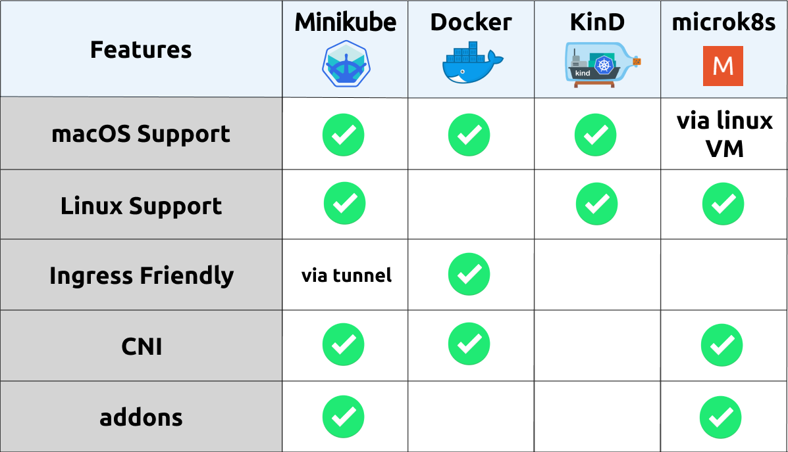
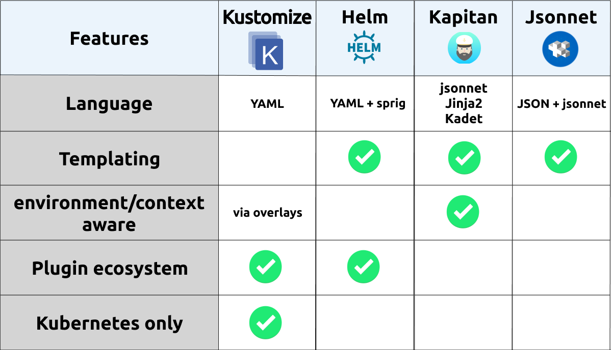
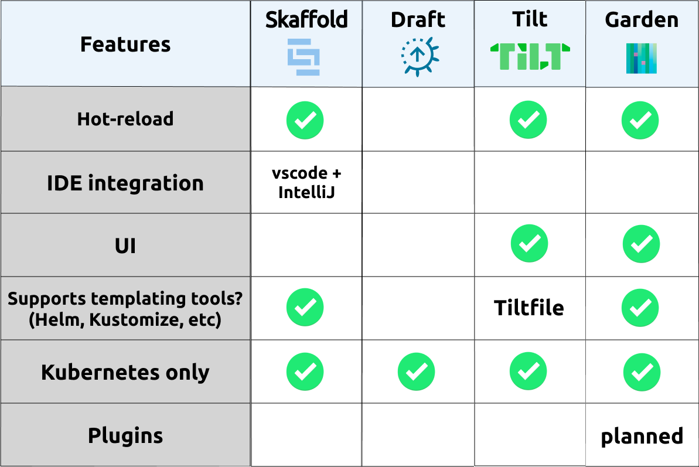
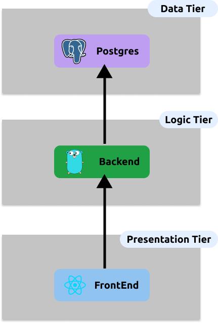
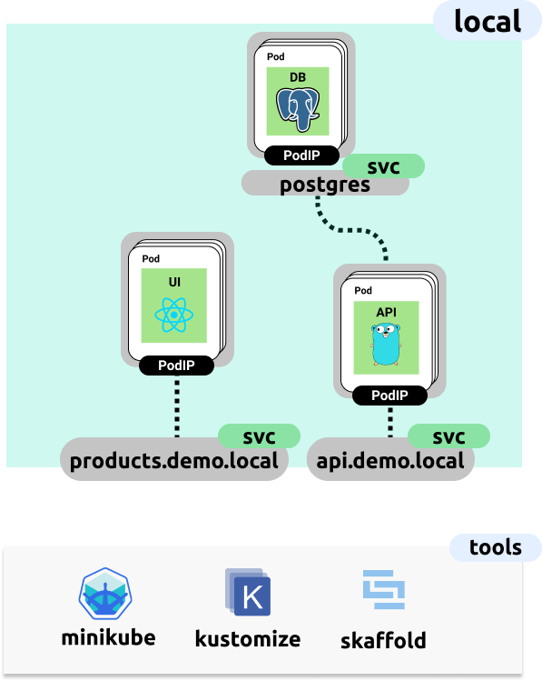
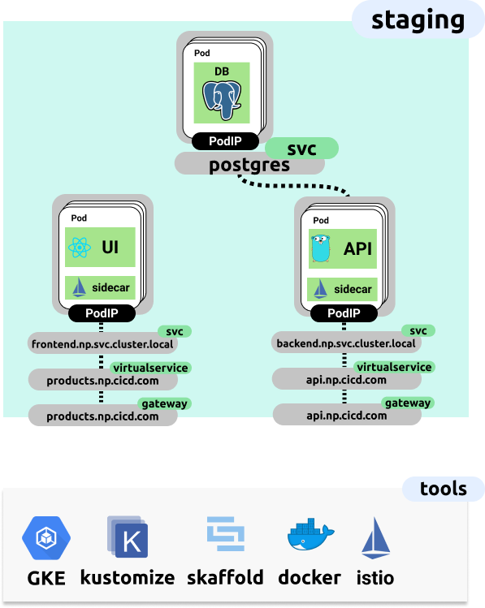

Developer experience is a challenging topic when it comes to Kubernetes. This is mainly associated with the complexity
 involving the understanding of the primitives in kubernetes, such as networking into the cluster, the `Pod` construct and getting configuration into an app. The theory and understanding of Kubernetes itself will be out of scope for this discussion; instead we'll focus on how we can reduce the burden of these complexities, and
 demonstrate how we can get closer to unifying the local developer environment with a kubernetes production run-time environment.

A common developer environment may consist of docker-compose, which will utilise the apps `Dockerfile` to stand up the app and its associated dependencies, perhaps a database etc. This can be an easy to setup and a coherent environment for most people familiar with Docker. However, this gives rise to a significant disconnect when it then comes to the approach of running the application in a Kubernetes environment. Where instead of a single `Dockerfile`, we will likely spawn a larger number of core resources. A common set of resources could be the following:

* `Deployment` - defining the applications `Pod` which will consist of the main applications container, and perhaps some sidecars for monitoring & logging, or potentially some initialisation steps.
* `Service` - Enabling the `Deployment` to be reachable by a singular DNS name, mapping to a `ClusterIP` - Reachable from the rest of the cluster.
* `ConfigMap` - Application configuration to be injecting into the `Deployment`
* `Secret` - More sensitive credentials and configuration to be injected into the `Deployment`

Additionally, for the resources mentioned, instead of talking to a Docker Daemon like in a common docker-compose scenario, they will be applied to the Kubernetes API server. Interacting with the Kubernetes based environment then requires gaining some familiarity with `kubectl` which is a CLI wrapper for interacting with the Kubernetes API server. It's this interface discrepancy or difference for local vs the remote runtime environment that gives rise to a disconnect to what developers will understand about their applications runtime environment. So the next question is; how can we make a case for entirely removing the need for Docker locally, instead shifting everything into a purely kubernetes based environment?

## Local Clusters

There are a number of tools available for us to run a Kubernetes cluster in our local development environment, some of these are as follows:

* **Minikube**  - I've written previously [here](https://benebsworth.com/install-minikube/) about setting up minikube on MacOS. Minikube operates by running the kubernetes control-plane components as containers on docker and exposing the Kubernetes API server to us for consumption by tools like `kubectl`. Typically, Minikube will run the containers inside a VirtualMachine, where inside a docker-daemon will be running to host all of the required containers for Kubernetes. However, newer versions of Minikube support `driver=None`, which will run containers directly on your locally running docker daemon, removing that virtualization layer.

* **Docker for Mac with Kubernetes** - Since the `18.06.0-ce` release of Docker, it has had the ability to run a Kubernetes cluster within the locally running docker agent. Similarly to how Minikube is operating, it will manage the creation of all of the required Kubernetes control-plane components, giving us a locally working Kubernetes cluster.

* **KinD** - An acronym for *Kubernetes in Docker*, Kind is a new comer to the local cluster tooling scene, but providing a very clean experience when it comes to provisioning a locally running cluster. It is used by the kubernetes project for carrying out conformance tests, and is likely to continually be developed to support more development use-cases. In it's current state it's probably best suited for running tests based of using `kubectl port-forward ...`, as the external ingress is fairly limited.

* **microk8s** - Worth investigating if you primarily using linux for your development environment. Doesn't natively support macOS, but you can virtualize a Ubuntu environment for example and then run *microk8s* inside.

These tools give us a local cluster that we can then deploy our application, and potentially its associated dependencies, such as databases, caches, and other microservices.

With our application running with its required dependencies, we can then run tests suites for validating conformance/integration and performance, where because we are running in a Kubernetes cluster, we are more accurately representing the reality of the applications runtime environment.



<center>
A Comparison of the different local cluster tools available
</center>

&nbsp;

Now that we have a locally running Kubernetes cluster, the next challenge is how can we effectively manage the configuration/resources which represent our application and its dependencies, inside the Kubernetes cluster. Another way this could be viewed, is how can we get a similar experience to a `docker-compose.yaml` file, but for all of our kubernetes resources?

## Configuration Management

Let's go through the available templating/configuration management options we have for our Kubernetes resources.

* **Helm** - Perhaps one of the most popular mechanisms for templating kubernetes resources. Providing a rich templating language for dynamically generating resources based of a top level `values.yaml` file. Helm utilises [sprig](http://masterminds.github.io/sprig/) as the templating language. The dynamic templating capabilities often give rise to fairly complex helm templates which may be more cognitively to understand and extend. Helm has a vibrant ecosystem of existing `charts` which is the packaged form of a helm template, which capture deployment patterns for a wide variety of tools. Additionally Helm has a plugin ecosystem for extending the capabilities of the helm CLI. More information on helm can be found [here](https://helm.sh/)

* **Kustomize** - A "template free" way of representing Kubernetes resources. This is achieved by explicitly defining all of the resources required for your application, and then providing a straightforward way of mutating and/or extended resources based off `overlays` - a way to contextualize a group of resources, such as local vs non-prod vs prod. Kustomize has been built into the `kubectl` CLI, this makes it more readily available for basic use-cases, however not all of Kustomize's features are available via `kubectl`. Overall Kustomize could be described as cognitively less complex, achieving a similar function to Helm and other tools. This makes it a great candidate for simple deployment scenarios where you don't need dynamic templating capability. *Most of the examples/demo apps we'll go through in this series will utilise Kustomize*. More information on kustomize can be found [here](https://github.com/kubernetes-sigs/kustomize)

* **Kapitan** - Coming out of Google's [DeepMind](https://deepmind.com/), Kapitan provides a more generic templating engine which utilises [jsonnet](https://jsonnet.org/) or their own templating engine [Kadet](https://github.com/deepmind/kapitan/pull/190) for templating out resources, for example those found in Kubernetes and Terraform. Kapitan provides some additional contextualized mapping and reusability through the construct of `inventory` and `components`, where we can provide parameters depending on the environment we're deploying to, and have components representing different applications we plan to deploy.

* **jsonnet** - A lower-level data templating language, providing effectively an extension on the JSON specification. [jsonnet](https://jsonnet.org/) is a very rich templating language, and can act as a base language to build higher level abstractions on-top of. However as a bespoke templating language, it does have the implications of learning another language, deriving from JSON - when most other resources will be YAML based - which adds extra complexity into your configuration management. There'd have to be a justification for utilising jsonnet as your primary templating mechanism, when you factor in the current Kubernetes ecosystem of tooling, jsonnet does feel to fork as a non-contiguous framework for configuration management.



<center>
A Comparison of the different configuration management tooling in the Kubernetes ecosystem
</center>

&nbsp;

Ok so now we've had a look at the options we have available to manage our applications deployment configuration, which may leave you still feeling unsure of how we can actually go about making this accessible in a developer context. This is where we'll take a look at some of the available tools specifically targeting the developer experience use-case.

## Developer Experience

The tools we're going to go through here are specially aiming at making the developer experience on a local and remote Kubernetes cluster better. This is achieved by providing things like hot-loading the application on config and source code changes, management of application logs, and profiling of configuration to represent different development environments. These tools get us really close to the experience of a docker-compose file that we mentioned earlier.

* **Skaffold** - One of the most fully featured and customizable options available. Skaffold provides a clean model for representing the different aspects of an applications life cycle - giving us a *build* --> *test* --> *deploy* pipeline locally. We can then plugin in what happens in each of these stages based on our own requirements and tooling choices. Skaffold has the ability to hot-reload our application when changes occur in the file system, both for configuration and application source-code. If the application is using a interpreted language like *JavaScript* or *Python*, skaffold is able to hot-copy source-code files directly into the running container in Kubernetes, dramatically shortening the feedback loop for changes occurring during development. *Throughout this blog series and demonstration applications we'll focus on using Skaffold*. More information of skaffold can be found [here](https://skaffold.dev/docs/).

* **Garden** - Taking a more opinionated way of stitching together application configuration and it's associated dependencies, Garden provides a very advanced orchestration framework for the deployment, test and management of an application for local and remote Kubernetes clusters. With a UI component, users can visualise the dependency of applications and the stage of build/test/deployment that Garden is managing for you. One of the interesting capabilities that Garden enables is the ability to set up a dependency tree that an application may have, allowing then integration tests-suites to be developed which can run against the application with the required dependencies order being controlled through Garden. This level of advanced orchestration could be useful when needing to set up complex testing workflows in a CI pipeline - which can also be executed locally. More information on Garden is available [here](https://docs.garden.io/)

* **Tilt** - Utilising [Starlark](https://github.com/bazelbuild/starlark#tour) (a subset of the Python language) for the configuration language, known as a `Tiltfile`, Tilt provides an abstracted way of representing an application and its associated dependencies. It has a similar capability as *Skaffold* and *Garden* for hot-loading, with a focus of cleaning managing all of the components of an application through the beautiful Tilt UI. This UI looks to allow a developer to quickly navigate the status of the locally running application, its logs, exposing endpoints, and any associated alerts/issue with your local development environment during real-time code/configuration changes. It probably provides one of the nicer end-to-end user experiences, however this takes a decent investment to get properly configured.

* **Draft** - Perhaps one of the first generation tools in making the local developer experience more manageable on Kubernetes, it was the continual evolution of Helm, where it tried to look at how applications could be package, and also then deployed in the cleanest way possible. The development of *Draft* seems to slow to a halt, where the last change was over *5 months* ago.



<center>
A Comparison of the different developer experience tools
</center>

&nbsp;

Now that we've got some awareness of the tooling available in the Kubernetes ecosystem. Let's take a look at a demo application and apply a selection of the above mentioned tools to bring and end-to-end workflow for the build, test, and deployment of our application to a locally running Kubernetes cluster.

## Example Application

We have an end-to-end example which captures the local developer workflow using a selection of tools, this is found within the `kubernetes-cicd` repository available here:

<github-link link="https://github.com/castlemilk/kubernetes-cicd"></github-link>

&nbsp;

*Clone this repository to run through the up-coming steps as we go*.Contained within this repository is a fullstack application which has the following topology



<center>
Fullstack architecture for example application
</center>

&nbsp;

In order to produce an example developer workflow, we've chosen the following selection of tooling, of which we've run through in detail at the beginning of this post. Some extra personal reasons for this specific selection is as follows:

* **Minikube** - Works reliably on Mac and has as vibrant community and information available online. Has some nice tooling for exposing services locally (via `minikube tunnel`)

* **Kustomize** - The light weight mechanism to represent all of our deployment configuration for our application and its dependencies (i.e postgres)

* **Skaffold** - Only developer experience tooling that works with *Kustomize*

Now if we look at translating the above top level topology, into a more specific set of Kubernetes resources, and the tools we'll use locally we have the following



<center>
Local development deployment representation and associated tools
</center>

&nbsp;

In order to manage all of these resources, we're using *Kustomize*, let's take a look at what this configuration and file-system layout looks like. Within the `kubernetes-cicd` repository, inside the `app/deploy` folder we have the following file structure:

```text
├── backend
│   ├── base
│   │   ├── deployment.yaml
│   │   ├── kustomization.yaml
│   │   └── service.yaml
│   ├── istio
│   │   ├── gateway.yaml
│   │   ├── kustomization.yaml
│   │   └── virtualservice.yaml
│   └── overlays
│       ├── local
│       │   └── kustomization.yaml
│       ├── ...
│       └── ...
├── frontend
│   ├── ...
│   └── overlays
│       ├── local
│       │   └── kustomization.yaml
│       ├── ...
│       └── ...
├── overlays
│   ├── local
│   │   ├── kustomization.yaml
│   │   ├── namespace.yaml
│   │   └── service_patch.yaml
│   ├── ...
│   └── ...
└── postgres
    ├── base
    │   ├── ...
    └── overlays
        ├── local
        │   ├── kustomization.yaml
        │   └── service_patch.yaml
        ├── ...
        └── ...
```

<center>
Kustomize configuration representing our fullstack application to run in our local development environment
</center>

&nbsp;

So now at this point you may be thinking "wow that escalated quickly", the intent here it just to give you a feel for how a *Kustomize* project may look. I'll leave it as an exercise for the reader to look at some of the files contain within [this repository](https://github.com/castlemilk/kubernetes-cicd/tree/master/app/deploy) and get a feel for how Kustomize works. Some things to note here:

* There is an `overlays` folder for each tier of our application which has a `local` folder. It's within this folder that we'll "customize" (get it) our resources for the target context or environment.

* There is a `kustomization.yaml` file in each folder. This allows us to define which resources to import, and how to mutate/extended our resources where required.

* There is a `base` folder, this represents the bare minimum or base resources we will need for the given deployment of that tier, and within this folder you see that there's the expected common Kubernetes resources used to deploy a given application.

* We have an `istio` folder, which is another base, but we will only be importing/using this base when we deploy to the remote environment running in the cloud. We'll go through this in more detail later in the post and future posts in the series.

At this point we have a full representation of our deployment resources and we can deploy to our local environment. Let's see how we can do that now.

### Local Deployment

Run the following commands to fetch the repository we'll be working out of for the remaining sections.

```bash
git clone https://github.com/castlemilk/kubernetes-cicd.git
cd kubernetes-cdcd
```

In order to run the following sections we're going to need to install a few dependencies, these are:

* **kubectl** - cli tool to interact with kubernetes run - `brew install kubernetes-cli`

* **kustomize** - kubernetes resource config management system - `brew install kustomize`

* **skaffold** - local developer experience  - `brew install skaffold`

* **minikube** - local kubernetes cluster provider - `brew install minikube`

With all of these dependencies install we can now begin the creation of our local development environment.

#### 1. create kubernetes cluster

Start your minikube cluster by running the following command:

```bash
make components.kubernetes.minikube.create
```

> check the status with `kubectl get nodes`, you should see that your kubectl context has been set and you have a node ready

#### 2. deploy demo application

Once your cluster is operational we can deploy our demo application. By using *Skaffold* as our local development "management" tool, we have all of the required steps to build, test and deploy our demo app in the one entrypoint. To kick off your deployment run the following (from the `kubernetes-cicd` repo):

```bash
make app.local-development
```

This `Makefile` entrypoint bundles a few commands together which give us a few nice things

* mapping of the allocated `ClusterIP` to a nicer DNS name, in this case we have:

  * **products.demo.local** - the frontend webapp

  * **api.demo.local** - backend API which serves our product information
  
  This is done by setting the entries in `/etc/hosts`, which will **required you to enter your local machines password**.

* runs `skaffold dev --profile local`, where the *local* profile maps to the local overlay in our *Kustomize* config. This will start a real-time event watching process, which will trigger re-deployments on config/source code changes. Additionally it will attach to the log output from our applications. This Skaffold command will also manage the building of our image so we have some artifact to deploy.

At this point Skaffold has deployed our *Kustomize* overlay to our local running minikube cluster. Skaffold will start a watcher/tail on the logs of our application once we've successfully allowed ingress to our demo application. **leave this window open and open a new one to run the next steps**

#### 3. allow ingress to application

One of the challenges with Kubernetes is enabling simple modes of ingress to your running application from a local machine. This mostly arises because we need some way of mapping typical ports like `80` and `443` to `NodePort`'s that then map to `ClusterIP`'s which represent a higher level address of our deployed application. Minikube solves this by providing "tunneling" capability. This enables native routing from your local machine to the `ClusterIP`'s in your local Kubernetes cluster.

To enable tunneling run the following command in a new terminal:

```bash
minikube tunnel
```

After some time - once skaffold has built and deployed your application -  you should see your other window where your ran `make local.dev` show some activity, eventually opening a browser to `products.demo.local` in your browser. The end-to-end experience should be as follows:


#### 4. troubleshooting

To get a feel whats happening behind the scenes of the `skaffold ...` command, we can look at a few thing to get a better feel what this is doing for us:

* view running pods by running `kubectl get pods -n dev`

* view the contents of the *Kustomize* files in `app/deploy/overlays/local`

* view the contents of the **Skaffold** config file - found in `app/skaffold.yaml`, get a feel for how the **build**, **test** and **deploy** steps work, as well as how we are creating a profile which corresponds to a **Kustomize** overlay

If all else fails try and re-run the steps described above, where in summary they would be:

> 1. remove the deployed cluster and any created routes- `minikube delete && minikube tunnel -c
> 2. recreate local cluster - `minikube start`
> 3. run `Makefile` entrypoint - `make app.local-development`
> 4. enable ingress to the local cluster with `minikube tunnel`

#### 5. hot-reloading

With **Skaffold** in `dev` mode, it will reactively re-deploy the application on source code or config changes. To see this in action we can checkout the `feature/products` branch. This branch contains the baselined `v1` of the products app. We'll then checkout the `v2` branch `feature/ratings` which contains a "new" feature - product ratings will be rendered, and can be updated by users - which skaffold will automatically "hot-reload" for us.

In order to see this in action, enure you've run steps 1-3 above, and you have the terminals still open from previously, this time open a 3rd window and run the following:

```bash
kubernetes-cicd git:(master) ✗ git checkout feature/products
kubernetes-cicd git:(feature/products) ✗
```

You'll see Skaffold trigger a re-deploy as the code is different on each branch. Switch to the other branch `feature/ratings` to see what happens in the browser at [http://products.demo.local](http://products.demo.local). Run the following:

```bash
kubernetes-cicd git:(master) ✗ git checkout feature/products
kubernetes-cicd git:(feature/products) ✗
```

Hopefully you see the following:


#### 6. Remote staging deployment

The end-to-end install steps for standing up the depicted remote architecture can be found in the `kubernetes-cicd` repo in the docs section [here](https://github.com/castlemilk/kubernetes-cicd/blob/master/docs/install.md)


<center>
Remote cluster architecture. We'll unpack the details in this diagram is much more detail in this blog series. Including the ins and outs of productionizing Istio and Knative on GKE.
</center>

&nbsp;

With a working local deployment of our application we need to gain confidence in our changes before rolling out to production. One way to do this would be to carry out the same deployment but to a "staging" environment. Some of the benefits and reasons we may want to deploy our application here first are as follows:  

* Within this staging environment we get to potentially interact with other microservices and other systems which may be only available in this remote context. We can then run our integration tests and other validations against this semi production-like environment.

* Our staging and production environments consist of an [Istio](https://istio.io/) *Service Mesh*, by deploying to staging we can run tests which more accurately represent the realities of the networking connectivity and service mesh interactions within a cluster.

* Enable external access by others, potentially facilitating communication of developed features and get feedback by internal teams/users.

A contrast to our local development environment is shown below. Note that we now have external DNS names and some Istio constructs introduced. All of this configuration is contained within the *Kustomize* overlay found in `app/deploy/overlays/staging`. You'll see that there's additional `bases` for the staging and production environments which contain the required Istio configuration to enable ingress to our application from outside the cluster



<center>
Staging environment and associated ingress access and tooling required to carry out end-to-end deployment
</center>

&nbsp;

We can kick-off this remote deployment by running the following (once you've stood up a remote environment, instructions for doing this via the `kubernetes-cicd` repo is [here](https://github.com/castlemilk/kubernetes-cicd/blob/master/docs/install.md):

```bash
make app.staging-development
```

This will start a live *Skaffold* session, which deploys our application to the remote cluster and tails the logs. The application would then be available at your configured domain which has been made externally available. In the default mode this would make the demo application available at `products.np.cicd.benebsworth.com`.

### Recap and Future Work

We've run through a range of tools available in the current Kubernetes landscape. Having selected a few options, and integration them together, hopefully we've demonstrated the capabilities available and a potential developer experience workflow. Specifically, the goal was to show how we can fairly easily represent our local development environment in such a way that it is mostly identical to the way in which we manage and deploy our app to a remote "staging" environment.

We can consider the future developments in the space which will continue to make the experience even better and more cognitively accessible. This example workflow we've shown is by no means complete, and should be continually evolved to further improve the workflow of deploying and developing applications on a kubernetes base interface.

Through the `kubernetes-cicd` repository, the plan is continue adding a number of working examples which cover usages the above mentioned tools available in the ecosystem. Where a nice comparison can be drawn between options, enabling easier selection of tools for the given environment and team/developer requirements.

The next part of the series will deal with the pipelining aspects of a given application, and how we can go about enabling CI and CD workflows, all within a Kubernetes cluster. Watch this space!
