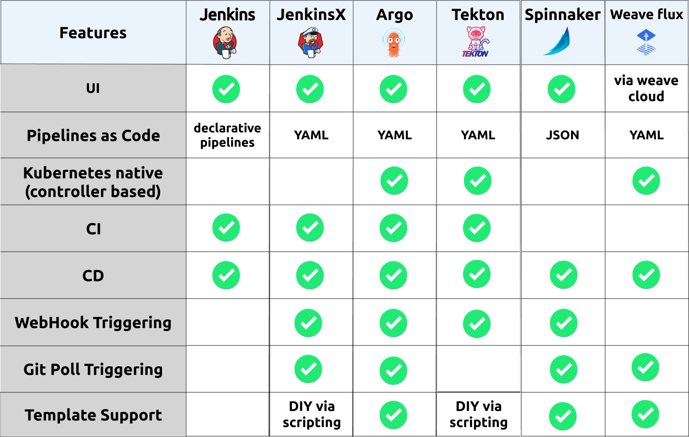
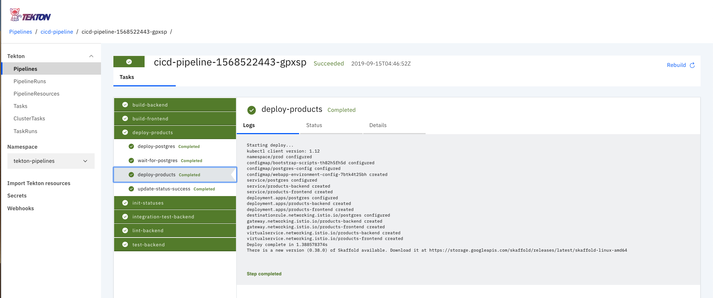
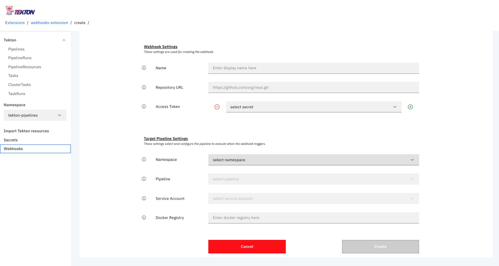
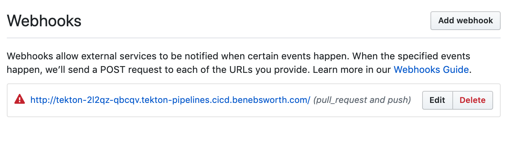
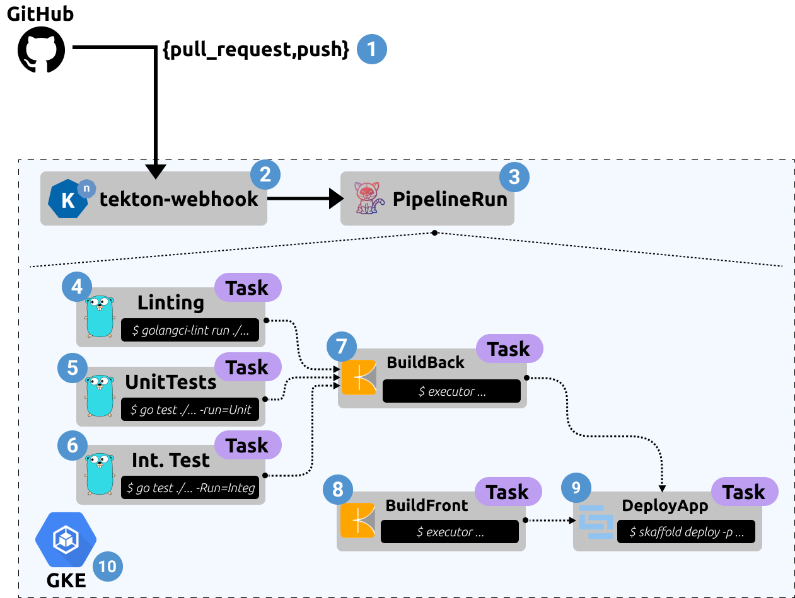
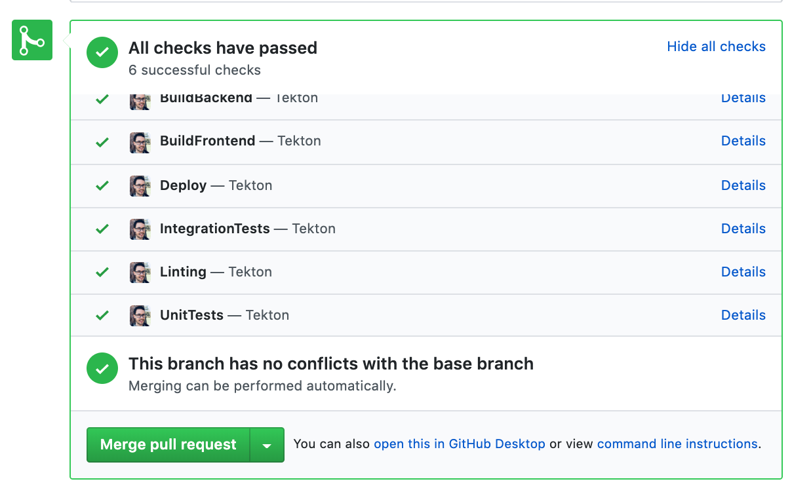

# Overview

Through this article we will explore the current ecosystem of pipelining tooling and then demonstrate an end-to-end example of a Tekton based pipeline, as well as how we can enable things like **GitHub Webhooks** for triggering pipelines, and the tooling available for visualizing the state of our pipeline.

The pipelining we'll explore today acts to implement two hemispheres of application development and deployment - *Continuous Integration* (linting, testing, and build artifacts) and *Continuos Delivery* (Deploying our application and post-deployment validation/assessment).

## Pipelining ecosystem

The pipelining/workflow/CI/CD tooling ecosystem is incredibly rich with many projects out their providing similar feature sets, but perhaps tailoring their solution to specific types of environments. As part of the quick research done for this article, I discovered that there are [over 33 projects within the CI/CD category provided by the CNCF](https://landscape.cncf.io/category=continuous-integration-delivery&format=card-mode&grouping=category), with even more being available outside of whats captured by the CNCF. In this article we'll focus more specifically tools which are very kubernetes-centric in nature, that is, run specifically within a Kubernetes cluster and can target deploying applications with a strong understanding of Kubernetes resources and life cycle patterns.



<center>
<i>Kubernetes centric pipeline ecosystem and feature comparison</i>
</center>

&nbsp;

So if we do a brief summary of each option i've consider "kubernetes-native", we have the following:

* **Jenkins** - An incumbent player that is commonly used across a lot of organizations. its not that "kubernetes-centric" in the sense that is hasn't been developed to run natively in Kubernetes. However there has been to make it support working seamlessly within a Kubernetes environment, where ephemeral workers can be created to execute a Jenkins pipeline. This is enabled through a Jenkins plugin called [kubernetes-plugin](https://github.com/jenkinsci/kubernetes-plugin). Jenkins has an incredible rich ecosystem of other plugins which enable a whole range of capability.
* **Jenkins X** - The goal of Jenkins X is to provide an end-to-end cloud native experience, including the management of peripheral tools which aim to meet all of the requirements of a feature rich workflow. These tools include:
  * Jenkins - Managing pipelines and orchestration the interaction with Kubernetes and artifact storage
  * Nexus - acts as a dependency cache for NodeJS and Java applications to dramatically improve build times
  * Docker Registry - an in cluster docker registry where our pipelines push application images
  * Chart Museum - a Repository for publishing Helm charts (used when not integrating some given cloud provider option like ECR/GCR)
  * Monocular -  a UI used for discovering and running Helm charts
  * Skaffold - build and push image actions in a pipeline. Managing the integration with cloud provider container registries (GCR, ECR, ACB)
  * Tekton - providing the reconciliation engine for running underlying CI and CD pipelines and/or tasks

  From my initial inspection it looks fairly complex, but does provide a full solution. The use of Jenkins within Jenkins X is fairly abstract and not something that needs to be directly interacted with, this can be favorable as there can be overheads using Jenkins directly. The final result is a nice interface for defining a pipeline with given steps, a reference for this "front-end" interface can be found [here](https://jenkins-x.io/docs/reference/pipeline-syntax-reference/). The opinionated structure of Jenkins X may not be flexible enough for some teams, but may provide a safe and quick start for teams starting their Kubernetes journey, looking to have a "best practice" end-to-end implementation provided for their CI/CD workflow.

* **ArgoCD** - A fast growing pipeline/workflow toolset. Providing a clean model for representing an applications life cycle through the available CRD's [Application](https://github.com/argoproj/argo-cd/blob/master/docs/operator-manual/application.yaml) and [Workflow](https://github.com/argoproj/argo/tree/master/examples#hello-world), these primitives provide an incredibly complete mechanism for deploying and managing a variety of Kubernetes based applications with potentially different requirements/setups. The *Argo Project* tooling also has nice integrations with common templating tools such as Helm,Skaffold, and Jsonnet. With these capabilities, ArgoCD seems to be the best solution available for enabling a production-grade CI/CD pipelining solution flexible enough to support most environments. Some more information on project layout and how to get started can be found [here](https://github.com/argoproj/argo-cd/blob/master/docs/getting_started.md).
* **Tekton** - Providing primitive constructs for developing rich pipelining capabilities, where higher level abstractions and/or frameworks could be constructed on top. You could think of Tekton as providing a similar capability as *Argo Workflows*. The Tekton project has a number of actively developing tools within the [GitHub organization](https://github.com/tektoncd), looking to providing the peripheral capabilities like trigger/eventing, dashboard/ui and a cli. With backing from Google/GoogleCloudPlatform the project will hopefully continue to be extended and mature into having a stronger awareness of application delivery. Or in the meantime using something like Skaffold or ArgoCD's tooling via Tekton could be sufficient. I can see Tekton becoming a defacto standard for teams looking for a hybrid cloud solution for pipelining, where you can literally run it anywhere Kubernetes runs.
* **Spinnaker** - Perhaps one of the most mature and fully featured solutions. Having been birthed out of the need of scaling to Netflix's size, it has a lot of features which meet a larger enterprises requirements. Consequently it is a fairly complex solution to run, comprised of over [10 microservices](https://www.spinnaker.io/reference/architecture/) which enable the end-to-end capability. This can all be deployed within a Kubernetes cluster and the [Kubernetes V2 provider](https://www.spinnaker.io/reference/providers/kubernetes-v2/) enables Spinnaker to manage a Kubernetes based application deployment environment natively. If you are within an organization looking to scale a pipelining solution across a number of Kubernetes cluster and a large number of applications, this could be a good fit.
* **WeaveFlux** - With an strong focus on enabling [GitOps](https://www.weave.works/technologies/gitops/) workflows, WeaveFlux provides a structured way of managing the promotion of their concept of a `HelmRelease` through different environments. The `HelmRelease` is a [CRD](https://kubernetes.io/docs/concepts/extend-kubernetes/api-extension/custom-resources/) which is consumed by the WeaveFlux operation to work out which Helm chart to use and how it should release an associated version of an application. The GitOps workflow has some expectations around effectuating a Git repository with changes occurring in the release, so you must give access to your deployment repository. Additionally, it uses Helm's Tiller component, this has some security concerns - where the tiller component must have escalated privileges to deploy, which is harder to control via RBAC - something to be mitigated in [Helm v3](https://helm.sh/blog/helm-3-preview-pt2/). Some more information on a project layout and how to get started can be found [here](https://github.com/fluxcd/helm-operator-get-started)

With these summaries in mind, we've got a practical implementation of one of these options (Tekton) below. The idea is to expand on each of these described options in more detail and also demonstrate the end-to-end capability available on the other options. All captured within the [kubernetes-cicd](https://github.com/castlemilk/kubernetes-cicd)

## Tekton

We've talked in detail about what **Tekton** is, and more specifically how we can go about using its core primitives in [Getting started with Tekton](https://benebsworth.com/getting-started-with-tekton/). For this article we'll go through how we can standup a **Tekton** environment on GKE using our [kubernetes-cicd](https://github.com/castlemilk/kubernetes-cicd) repository. The instructs are detailed [here](https://github.com/castlemilk/kubernetes-cicd/docs/install-tekton.md), but let break down the sections to help explain each of the key components making up our **Tekton** pipelining stack.

### Tekton Control Plane

The *Tekton Controller* is responsible for implementing the reconciliation loop when we created the set of Tekton [CRDS](https://github.com/tektoncd/pipeline/tree/master/docs). This involves working out the *Directed Acyclic Graph (DAG)* and executing the steps in the optimal parallelized order as `Pod`'s within our Kubernetes cluster.

The deployment consists of two components:

* **Controller** - Responsible for reconciliation workflow
* **Webhook** - Acts as an admission controller before creating pipelines, enabling a validation capability of Tekton resources that are applied to the cluster

To deploy the tekton control-plane from our [kubernetes-cicd](https://github.com/castlemilk/kubernetes-cicd), run the following:

```bash
make component.tekton.install CLUSTER=[local|gke|...]
```

> Where CLUSTER can be set to either `local` or `gke`, which enables you to target an environment more specifically with potentially different configuration.

On a successful deployment you should see the following `Pod`'s running:

```bash
$ kubectl get po -n tekton-pipelines  
NAME                                           READY   STATUS    RESTARTS   AGE
tekton-pipelines-controller-55c6b5b9f6-5cnq2   1/1     Running   0          3m43s
tekton-pipelines-webhook-6794d5bcc8-l5j2g      1/1     Running   0          3m43s
```

Once this has completed, we're ready to start deploying *Tekton* resources!

### Tekton Dashboard

The *Tekton* Dashboard provides visibility into the state of your `TaskRrun`, `ClusterRun` and `PipelineRun` pipelines, and the ability to view the deployed resources currently existing within your environment.

To install the tekton dashboard component we did need consider a few pre-requisites or dependencies to enable us to make the deployed dashboard available to external users. In the current repository we enable access via Istio, using something as complex as Istio may be unnecessary, however we also utilise Istio with Knative for the webhook trigger capability we describe later in the article - this allows us to trigger `PipelineRun`'s on GitHub PR's.

In order to install istio run the following from the root of the [kubernetes-cicd](https://github.com/castlemilk/kubernetes-cicd) repository:

```bash
make components.istio.install CLUSTER=[local|gke|...]
```

This will install our istio control and data plane, enable ingress to services running within our Kubernetes cluster.At this point we can install our Tekton dashboard by running:

```bash
make components.tekton.dashboard.install CLUSTER=[local|gke|...]
```

Now we need some DNS configured to point to the IP address allocated to our *Istio* ingress gateway. You can do this in a number of ways, in my case I'm using Google's **Cloud DNS**, you can set up your configuration (domain name etc) in the `env/${CLUSTER}.parameters` file and run the following:

```bash
make components.kubernetes.gke.dns
```

This entrypoint will discover the IP address allocated to the **Global LoadBalancer** for your *Istio* ingressgateway, then create the *Zones* and *RecordSets* for the required mapping.

Once everything has been successfully deployed you'll be able to navigate to your **Tekton Dashboard** UI, in my default configuration - used for demonstrations etc - this would be at `tekton-dashboard.tekton-pipelines.cicd.benebsworth.com`. You'll see the following:



<center>
<i>Tekton Dashboard, with a fully featured pipeline showing the status of each stage and the associated logs</i>
</center>

&nbsp;

### Tekton Webhook Extension

As part of the experimental feature development actively occurring within the Tekton organization there's the capability to add the **Webhook Extension** onto the Tekton Dashboard UI. This extension then provides the capability to create and manage **GitHub Webhook's* via the Tekton Dashboard. This has some dependencies on [Knative](https://knative.dev/docs) in order to provide a serverless webhook endpoint for GitHub to hit, when hit it will trigger the creation of a `PipelineRun` which then executes your defined `Pipeline`.

In order to enable this we'll first install **Knative**, run the following:

```bash
make components.knative.install
```

This will deploy **Knative** to your cluster, Knative has a dependency on **Istio**, but we've installed that in an earlier step 🎉. The specific resource that we get out of the Knative deploy is the `GitHubSource`, which is part of the set of eventing `CRD`s available from the `knative-contrib` tooling available [here](https://github.com/knative/eventing-contrib).

Now with these resources available, we can install the **Tekton** webhook extension by running the following:

```bash
make components.tekton.webhook.install
```

This will restart your Tekton Dashboard `Pod` to have the changes take effect, once complete you should see the webhook extension in the UI like below.



<center>
<i>Tekton Dashboard with the Webhook Extension installed</i>
</center>

&nbsp;

This extension will now give us to ability to create a webhook on a target repository. In order to do this, we specify the following:

* target repository to create the webhook on
* the required app-credentials token, created from your github profile [here](https://github.com/settings/tokens)
* the target `PipelineRun` to execute when the webhook event in triggered
* the `ServiceAccount` permissions to use when creating the given `Pipeline`

If all goes well you should see a webhook created in your repository like so:



<center>
<i>GitHub webhook created on the targeted repository</i>
</center>

&nbsp;

Now when we raise a PR, it will trigger the running of the targeted `PipelineRun`.

### Tekton Triggers

&nbsp;

<more information available soon! repo is available [here](https://github.com/tektoncd/triggers)>

&nbsp;

## Pipeline

In a previous post - [getting started with tekton](https://benebsworth.com/getting-started-with-tekton/) - we discussed core primitives defined by `Tekton`. These are used to construct an end-to-end pipeline which manages the linting, testing, building and deployment of our application, all completely self-contained within our Kubernetes cluster.



<center>
<i>End-to-end tekton pipeline architecture</i>
</center>

&nbsp;

Where each labeled component is described as follows:

1. **GitHub Events** - Tekton is capable of auto-configuration our target GitHub repository to hit a webhook endpoint on generated events such as `pull_request` and `push`.
2. **Webhook Listener** - A [knative](https://knative.dev/docs/) based service, which ephemerally spins up when the webhook endpoint is hit by GitHub. This listener service will be responsible for creating a `PipelineRun` from the received GitHub event.
3. **PipelineRun** - A core primitive in *Tekton* which is responsible for running a defined `Pipeline` resource. Both being represented as [Custom Resource Definitions (CRD)](https://kubernetes.io/docs/concepts/extend-kubernetes/api-extension/custom-resources/) and applied to our Kubernetes cluster.
4. **Linting** - In order to ensure the quality of code being developed and the formatting and idiosyncrasies of the given languages used. We can also enforce certain syntaxes for things like `Dockerfile`'s, Kubernetes resources. In this case we are using [golangci-lint](https://github.com/golangci/golangci-lint) metalinter.
5. **Unit Tests** - These tests are being run during the pipeline, validating the functionality of specific functions within our application
6. **Integration Tests** - A deeper end-to-end validation of the expected functionality is tested during the *Integration Testing* phase, these will check the developed API's responses meet a contact/expected payload. This runs via the in build golang testing capability. It will stimulate the application to make real interactions with any external systems - such as databases, other API's etc.
7. **Build Backend Application (Golang)** - The golang app is built using [Kaniko](https://github.com/GoogleContainerTools/kaniko). This gives us a *Dockerless* and *Rootless* build capability of images, as well as some nice remote cache optimization options on a per-layer basis.
8. **Build Frontend Application (React)** - Stock standard build of a webpack based project. Kaniko is also responsible for this build, and can directly consume the `Dockerfile` we've defined for the application.
9. **Deploy Application** - Once all of the linting, testing, and building are successful, we are ready to deploy the application. This is done using `Skaffold` which has a "production" profile. This captures the required configuration and mapping of the resources we'll need for the production environment. Skaffold is providing a consistent interfacing for deploying, whether that be in our local/staging environment or to production via a pipeline. We discuss *Skaffold* in further detail in [Kubernetes-centric Continuous Delivery - Part 1 (Developer Experience)](https://benebsworth.com/kubernetes-cicd-part-1)
10. **Google Kubernetes Engine** - At the heart of this is Kubernetes, in this case we're using Google Cloud Platform (GCP) Kubernetes offering GKE. The coolest part of the GKE service is the ability to scale to zero, where your worker nodes will be scale down to zero, and you don't pay for the *Kubernetes API Server* and other control-plane components. It's within the kubernetes substrate that we deploy our end-to-end platform stack.

This above described pipeline can be found [here](https://github.com/castlemilk/kubernetes-cicd/blob/master/pipelines/tekton/gke/cicd.yaml). You'll see this is a fairly complex and feature rich pipeline. Because of **Tekton's** verbosity it does become quite complex, but the idea is really to abstract from these lower-level primitives to simplify the user experience and enable re-usability, templating and validation of policy as its consumed/defined.

### Pipeline Status

Within each stage of our `Pipeline` we're able to provide feedback relating to how each stage has proceeded. This results in the final status check view within our PR:



<center>
<i>GitHub Status API View, providing feedback to users on the status of a PR that triggered a <code>PipelineRun</code>!</i>
</center>

&nbsp;

This is achieved pretty simply by running the following step within our tekton pipeline which gits the github status API:

```yaml
apiVersion: tekton.dev/v1alpha1
kind: Task
metadata:
  name: backend-unit-tests
spec:
  inputs:
    resources:
    - ...
    params:
    - ...
  steps:
  - name: update-status-success
    image: castlemilk/curl
    command:
    - /bin/sh
    args:
    - '-c'
    - |
      curl 'https://api.github.com/repos/castlemilk/kubernetes-cicd/statuses/${inputs.resources.workspace.revision}?access_token=_GITHUB_STATUS_TOKEN' \
        -H 'Content-Type: application/json' \
        -X POST \
        -d '{"state": "success", "description": "Tekton", "context": "UnitTests","target_url": "http://tekton-dashboard.tekton-pipelines.cicd.benebsworth.com/#/namespaces/tekton-pipelines/pipelineruns"}'
```

This way we can contextualize our status according to the given step.

## Wrap Up

Hopefully you've gotten a feel for how *Tekton* can be used to deliver fairly rich pipelining capabilities for the *Continuous Integration* and *Continuous Delivery* of applications. Where with the primitives available we can construct arbitrarily sophisticated steps in our pipelines to achieve the required outcomes for our application and environments. The space of Kubernetes native pipelining of heating up and I'm excited to see the future developments of *Tekton* and the other tools we've mentioned. Through the [kubernetes-cicd](https://github.com/castlemilk/kubernetes-cicd) repository we'll explore the other available options such as the *Argo Project*, demonstrating a similar end-to-end application CI/CD workflow. Please follow this repository for future developments 😀
