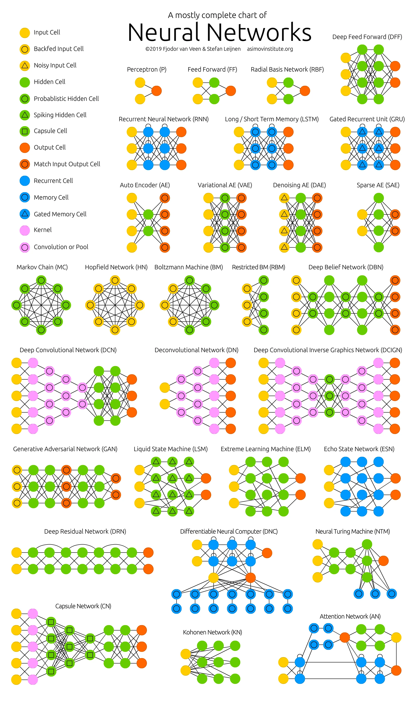

There's a famous cheat sheet called [The Neural Network Zoo](https://www.asimovinstitute.org/neural-network-zoo/) drawn by Fjodor van Veen at the Asimov Institute. It's a single poster that maps out, as node graphs, almost every well-known neural network architecture — feed-forward, recurrent, convolutional, adversarial, attention — and the relationships between them. As of its most recent update (2025), the poster carries around two dozen primary architecture cells — and once you count the closely related variants noted alongside them, well over thirty — grouped visually into related families.

It's a great reference. But it's a *map*, not a tour. The poster shows you the topology of each network (how the nodes connect), and a one-line caption for each. The harder question — the one the poster deliberately side-steps — is **what each architecture is actually for, and why it exists in the form it does**.

This post is the tour. I'll walk through the Zoo's architectures in roughly the order they appear on the poster, group them by family, and try to leave you with a working mental model of which architecture you reach for when. The original Asimov descriptions are paraphrased and extended with my own framing; the original post is the source of truth if anything I say disagrees with it.

**One twist**: along the way I've also built a small interactive SVG component for the major architectures. Each one is a tiny forward pass in JavaScript that runs in your browser, with data-flow particles animated along the edges. Drag the input sliders on the right of each diagram and watch the activations update in real time. They're meant to make the "what is each architecture actually doing" answer a *seen* answer, not a memorised one.

Each diagram has a small toolbar at the top: a **speed** selector (0.25× to 4×, default 0.5× so things are readable), **Pause/Play** and **Reset** buttons, and a **Reroll weights** button. On the right panel there is also a **weight scale** slider — try dragging it down to 0.1× and watch every output collapse to zero (the "dying ReLU" problem), or up to 2× and watch everything saturate to ±1 (the "exploding" problem). Edge thickness and opacity in the graph follow the magnitude of each weight, so you can see at a glance which edges are strong.

## How to read the diagrams

Both the Asimov poster and the interactive diagrams use a small colour vocabulary. Once you have it in your head, the rest of the Zoo is much easier to read.

<ColorLegend />

Lines are connections (weights), and arrows show the direction of data flow. Solid lines are weighted; in the Asimov poster, a small dashed loop attached to a neuron means "this neuron is recurrent — it feeds itself at the next time step". The colour of a line is the colour of the layer it comes from, not the layer it goes to.

A few things to notice once you have the colour vocabulary:

- **Input → hidden → output** is the default backbone. Almost every architecture in the Zoo is a variation on that.
- **Memory cells (pink)** and **gates (yellow)** are the tell that something is time-aware. If you see them, the network has some notion of past vs. present.
- **Probabilistic nodes (purple)** are the tell that the network is generative — it's not just computing a function of its input, it's sampling from a learned distribution.

With that in mind, here's the poster:

And here's the same zoo, but reduced to the six architectures I built interactive diagrams for. Click any of them to jump straight to its diagram.

<ZooMiniMap />

## Why a zoo?

The first thing worth noticing about the Zoo is that most of the "architectures" are not really different at the node level. A vanilla RNN, an LSTM, and a GRU are all little loops of neurons with different gating structures bolted on. A VAE looks like an autoencoder with a hat on. A Deep Residual Network is just a feed-forward network with skip connections. The differences are small in number of lines of math, but enormous in what the network can actually learn and what it tends to do well.

So the natural question to ask about each architecture is: **what constraint does it relax, or what new capability does it unlock, compared to the simpler thing it grew out of?** Almost every entry in the Zoo has a one-sentence answer to that question. I'll try to be that concise.

A second observation: the Zoo is honest about the fact that no list is ever complete. New architectures appear every year. Anything I say here is a snapshot of architectures that were current around the time the Zoo was first published, with notes where things have moved on.

## Perceptrons and feed-forward networks

The most basic neural network is a **perceptron** (P): a single artificial neuron that takes some weighted inputs, sums them, applies a step function, and outputs 0 or 1. Stack a bunch of them into layers where every neuron in layer *N* is connected to every neuron in layer *N+1* and you've got a **feed-forward neural network** (FFNN), sometimes misleadingly called a "vanilla" neural network.

The FFNN is the universal baseline. With one hidden layer of arbitrary width, it can in principle approximate any continuous function (this is the [universal approximation theorem](https://en.wikipedia.org/wiki/Universal_approximation_theorem)) — which is a fun theoretical result and almost entirely useless in practice. In practice, you usually need either much more depth, much more width, or both; the depth helps with hierarchy in features, the width helps with parallel hypotheses. Training is back-propagation plus gradient descent on some loss function — almost always mean squared error for regression or cross-entropy for classification. Inputs are fed in, the network produces an output, the error is computed against the ground truth, and the error gradient is propagated back through the weights.

A useful way to think about an FFNN: it's a learned function approximator. You give it `(x, y)` pairs and it learns a mapping. It has no memory of the past, no notion of position in a sequence, no spatial structure built in. It is to other architectures what a `HashMap` is to a database — the building block, the thing everything else is built on top of.

A historical note: **radial basis function networks** (RBF) are FFNNs that use a radial basis function (typically a Gaussian) as the activation instead of a sigmoid or ReLU. They had a moment in the late '80s and early '90s as a go-to architecture for function approximation and time-series prediction, but they were largely displaced by sigmoid- and ReLU-activated FFNNs once back-propagation scaled up. They get their own entry in the Zoo mostly because of the timing of their invention — a good activation function at the right moment matters more than it should.

Below is a tiny FFNN — four inputs, two hidden layers of 5 and 4 units, two outputs — running in your browser. Drag the input sliders and watch the activations flow through. The numbers in the right panel are the live activations of each layer; the dots along the edges are data-flow particles whose speed and colour scale with the magnitude and sign of the source activation.

<FfnnFlow id="arch-ffnn" />

## Recurrent and memory-augmented networks

Once you need to deal with **sequences** — text, audio, time series, frames of a video — the stateless feed-forward design stops being enough. You need a network that can carry information from one step to the next.

### RNN, LSTM, GRU

A **recurrent neural network** (RNN) is a feed-forward network with a twist: the hidden layer feeds back into itself at the next time step. So the network's "state" at time *t+1* depends not just on the input at *t+1* but on the state at *t*, which in turn depended on *t-1*, and so on. This is what gives RNNs their memory.

The classic problem with vanilla RNNs is the **vanishing / exploding gradient**:

<Callout type="warning" title="The classic RNN failure mode">
When you back-propagate through time, the gradient at step *t* is the product of many small (or large) numbers — one for each step back. After a few dozen steps, you've either multiplied yourself to zero (the gradient vanishes and the network can't learn long-range dependencies) or to a number so large it's NaN. RNNs in their pure form are essentially limited to learning dependencies over short windows.
</Callout>

Here's an RNN unrolled across three time steps. The curved edge running from `h(t+1)` back to `h(t-1)` is the recurrence — the same hidden column, shifted one step in time. In a real RNN this is the *same* neurons, just with a different input at each step; here we unroll them so you can see the data flow:

<RnnFlow id="arch-rnn" />

**LSTM** (Long Short-Term Memory) and **GRU** (Gated Recurrent Unit) both attack this problem by adding learned gates that explicitly control what information flows through the cell and what gets thrown away. An LSTM has three gates — input, forget, output — plus an explicit memory cell. A GRU merges these into an update gate and a reset gate, has no separate memory cell, and exposes its full state at every step. GRUs are slightly cheaper to run and slightly less expressive; in practice the performance difference is usually noise.

The natural extension is **bidirectional** variants (BiRNN, BiLSTM, BiGRU). These run the sequence through the network once forward and once backward, concatenating the two hidden states. They're great for tasks where you can see the whole sequence at inference time (filling in a missing word, classifying a sentence) and terrible for tasks where you can't (autocompletion, real-time speech). The architecture is the same as the unidirectional version; the difference is the inputs you feed it. (The Asimov post doesn't draw them on the poster because, visually, they look identical to their unidirectional counterparts — only the data flow is different.)

Here's an LSTM cell, opened up. The three amber nodes on the left (i, f, o) are the input, forget and output gates. They control what enters and leaves the pink memory cell `c` in the middle. The two right-hand nodes are the hidden state `h` that gets passed to the next time step:

<LstmFlow id="arch-lstm" />

### The vanishing-gradient family in general

<Callout type="thinking" title="The same question, three answers">
Notice that LSTMs, GRUs, and (later) Transformers are all different answers to the same problem: **how do you let information travel a long way through a network without it getting drowned out?** The Zoo doesn't make this super obvious, but the same question comes up over and over.
</Callout>

A **Deep Residual Network** (DRN) is another answer — but to the depth version of the problem, not the time version. A "regular" feed-forward network has trouble training past a few dozen layers because the gradient has to be back-propagated through all of them. A ResNet adds skip connections that let the input to a block be added back to the block's output before being passed on. Now the network only has to learn the *residual* — the difference from the identity. In practice, you can train ResNets that are hundreds of layers deep. (As the Zoo notes, ResNets are mathematically very similar to unrolled RNNs without the explicit time dimension — the same idea, just stacked in space instead of time.)

### Liquid state machines, echo state networks, extreme learning machines

These three are cousins. They share the "reservoir computing" idea: don't train the recurrent connections at all. Just fix them to random values and only train the readout layer.

- **Echo state networks** (ESN): random recurrent connections in the hidden layer, only the output weights are trained.
- **Liquid state machines** (LSM): the same idea, but the neurons are **spiking** — they accumulate input until a threshold is reached, then fire. Closer to biological neurons.
- **Extreme learning machines** (ELM): random connections, but no recurrence. Only the readout is trained. The cheapest of the three, also the least expressive.

In all three cases, the trick is that a high-dimensional random projection is surprisingly good at separating your data into something a linear classifier can handle. You don't need to learn the projection if it's random; you just need to learn the linear layer on top. Trade-off: much faster training, much less flexibility, and you usually need a bigger hidden layer to recover the expressiveness.

### Neural Turing Machines and Differentiable Neural Computers

**Neural Turing Machines** (NTM) and their successors, **Differentiable Neural Computers** (DNC), are an interesting dead end. The idea: an LSTM-style controller with an external, content-addressable memory bank that it can read from and write to. The network learns *where* in memory to look and where to write, using a soft attention mechanism. In principle, you get a neural network with the equivalent of RAM.

DNCs add a few attention heads (similarity, temporal linkage, recent-write) to make the memory operations more useful. The result is Turing-complete: it can in principle run any algorithm a regular computer can run, provided you train it well.

In practice, the world moved on to Transformers for most sequence tasks, and NTMs/DNCs ended up as a fascinating research line that didn't really ship. The Zoo still lists them because they're conceptually important — they were the first serious attempt to give neural networks an explicit, separable memory — but if you're building a real system today, you almost certainly want a Transformer or a state-space model instead.

## Autoencoders and friends

**Autoencoders** (AE) are another re-use of the feed-forward building block, but for a very different purpose. The idea: take an FFNN, give it a bottleneck layer in the middle, and train it to output whatever you put in. The network is forced to learn a compressed representation of its input in the bottleneck, because that's the only way to reconstruct the full input at the other end.

The encoding half (input → bottleneck) is a **compressor**. The decoding half (bottleneck → output) is a **decompressor**. The bottleneck is the **code** — the compressed representation. Train an autoencoder on a million faces and the bottleneck ends up holding a 64-dimensional vector that somehow captures "face-ness".

The four autoencoder variants in the Zoo each tweak this basic idea. The most architecturally interesting one is the VAE — it's the one that turns a compression network into a generative model:

<Callout type="thinking" title="VAE: compression becomes generation">
**Variational autoencoders** (VAE): the bottleneck holds a probability distribution over codes, not a single code. You sample from the distribution at training time. The result is a **generative model**: you can sample a new point from the latent distribution and decode it to get a new, plausible output. VAEs are blurry compared to GANs but more stable to train.
</Callout>

The interactive version shows the encoder collapsing the input into a `(μ, σ)` pair, sampling a code `z` from that distribution, and the decoder expanding `z` back to a reconstruction. Watch what happens when you push an input slider — the sample node `z` should jitter even when the encoder output is held still, because of the noise in the sampling step:

<VaeFlow id="arch-vae" />

- **Denoising autoencoders** (DAE): feed in noisy input, ask the network to reconstruct the *clean* input. Forces the network to learn the broader, more stable features of the data instead of memorising noise. The intuition: a network that can recover the clean signal from the noisy one has to have learned the underlying structure, not the noise. (This is a precursor to modern self-supervised learning tricks like SimCLR and MAE.)

- **Sparse autoencoders** (SAE): the opposite of a regular autoencoder. Instead of compressing to a small bottleneck, you *expand* to a large sparse layer. The sparsity is enforced by adding a constraint that only a few neurons should fire for any given input. The result is a network that learns to detect many small features independently — useful for things like dictionary learning. (As of 2026, sparse autoencoders are a hot topic again as a tool for interpreting the internal activations of large language models.)

The cleanest way to think about autoencoders:

<Callout type="thinking" title="The AE family, in one line">
They are **learned compression with a constraint on the shape of the compression**. AE = bottleneck. DAE = bottleneck + robustness. VAE = bottleneck + probabilistic. SAE = expansion + sparsity.
</Callout>

## Convolutional networks and their inverses

If you have a feed-forward network, all input features are treated equally. If you have a 200×200-pixel image, that's 40,000 input features, and your first hidden layer is a 40,000×*N* weight matrix for whatever *N* you want. That's a lot of parameters, and the network has to learn from scratch that nearby pixels are related to each other.

**Convolutional neural networks** (CNN, or DCNN when very deep) solve this by making the assumption that **local structure matters and translation matters**. Instead of fully connecting the first layer, you use a small kernel (say 3×3 or 5×5) that slides over the input, and you use the *same* kernel weights at every position. Now your first layer has 9 (or 25) parameters per feature map instead of 40,000 per neuron, and the network is forced to learn features that work anywhere in the image. Stacking convolutional layers builds up a hierarchy: edges → textures → parts → objects.

A few details that always seem to come up:

- **Pooling layers** (usually max pooling) shrink the spatial dimensions between conv layers. This is a cheap way to get some translation invariance and to reduce the number of parameters as you go deeper.
- The 20×20 scanner example in the original Zoo post is a bit dated — modern CNNs just use small kernels (3×3) with stride 1 and a lot of channels. But the principle is the same: local receptive field, shared weights, no global connectivity in the early layers.
- A CNN almost always has a fully-connected head at the end for classification. The conv layers do the feature extraction; the FFNN at the end does the decision.

**Deconvolutional networks** (DN), sometimes called inverse graphics networks, are the reverse: they upsample instead of downsampling, going from a small spatial code to a larger image. They're commonly used as the decoder half of a VAE for image generation. The "deconvolution" name is a bit of a misnomer — what they actually do is more like transposed convolution or nearest-neighbour upsampling followed by a regular convolution. The maths is fiddly but the idea is straightforward: a CNN's job is to compress images to meaning; a DN's job is to expand meaning back to images.

A **deep convolutional inverse graphics network** (DCIGN) is a VAE where the encoder is a CNN and the decoder is a DN. The "inverse graphics" bit is the claim: if you train it well, the network learns a disentangled representation where you can independently control pose, lighting, and identity of an object in the image. The original Zoo post is a bit more bullish on this than the field turned out to be — the paper was influential, but the disentanglement claim is hard to verify in practice and modern generative work uses different architectures.

## Generative adversarial networks

**GANs** are the most architecturally different entry in the Zoo. They are *two* networks trained against each other:

- A **generator** that takes random noise and produces a sample.
- A **discriminator** that takes a sample (either real or generated) and tries to predict which it is.

The two are trained in alternation. The discriminator's loss is straightforward: classify real as real, generated as fake. The generator's loss is *derived from* the discriminator: succeed at fooling the discriminator. The result, when it works, is a generator that produces samples indistinguishable from real data.

The Zoo's description is good: GANs work partly because, in a high-dimensional space, real data lives on a thin manifold, and a generator that learns to land on that manifold will produce realistic samples. The discriminator provides the learning signal by being a learned measure of *realness* — how likely a sample is to belong to the real-data manifold. It gets good at telling the difference between the generator's output and real data, which gives the generator gradient information about *how* to be more realistic.

<Callout type="warning" title="Why GANs are hard to train">
The two networks have to be kept in balance: if the discriminator gets too good, the generator's gradient vanishes and it stops learning; if the generator gets too good, the discriminator can't tell the difference and the whole signal disappears. Mode collapse — the generator finding a single output that consistently fools the discriminator and producing only that — is a common failure mode. There are dozens of variant architectures (DCGAN, WGAN, StyleGAN, CycleGAN, etc.) that all try to make this training process more stable.
</Callout>

The "two networks working as a pair" pattern is also a useful conceptual primitive: the same idea shows up in actor-critic reinforcement learning, in some self-play setups, and in diffusion models (where the "discriminator" is replaced by a learned denoiser). GANs were the first architecture to make this pattern famous.

Below is a generator and a discriminator laid out as two parallel columns. The generator (teal) takes noise on the left and produces a fake sample; the discriminator (orange) takes either a real or a generated sample and produces a `P(real)` score on the right. The discriminator in this demo averages the real and fake inputs together for visualisation — in a real GAN, D sees only one of them at a time, and the loss is computed from how often it gets the answer right:

<GanFlow id="arch-gan" />

## Attention and the Transformer family

**Attention networks** (AN) and the closely related **Transformer** architecture are the newest entry in the Zoo — the Asimov post was originally published in 2016 and has been updated several times to include them. They're also the ones that turned out to matter the most.

The core idea: instead of forcing all of a sequence's information to flow through a fixed-size hidden state (as in an RNN), let the network learn which parts of the input to pay attention to at each step. A self-attention layer computes, for every position in the input, a weighted sum of every other position, where the weights are learned and depend on the content.

The key consequence: **information can travel across the entire sequence in a single layer.** Compare that to an RNN, where information has to flow through every step. With attention, the path length between any two positions in the input is O(1), not O(n). This is the main reason Transformers train so much more efficiently on long sequences than RNNs do.

The "attention network" line in the Zoo post is a useful starting point but it understates the importance of the architecture. The 2017 paper [Attention Is All You Need](https://arxiv.org/abs/1706.03762) showed that you can build a sequence model out of attention layers *alone* — no recurrence, no convolution — and get state-of-the-art results on machine translation. That design became GPT, BERT, and essentially every modern large language model.

In the Zoo's diagram, attention networks have a memory cell on the side that the decoder queries. That's a fair representation of the original sequence-to-sequence attention mechanism. Modern Transformers dropped the explicit memory cell and replaced it with multi-head self-attention plus positional encodings — but the idea of "storing all previous states and using a learned attention context to pick the right one" is the same.

Three tokens on the left, three attention heads in the middle, one output on the right. The key thing to look at is the **edge structure**: every input token has an edge to every head, and every head has an edge to every output. That's "every token attends to every other token" — the property that makes the path length between two positions O(1) instead of O(n):

<TransformerFlow id="arch-transformer" />

## Capsule networks and Kohonen networks

Two more entries worth knowing about.

**Capsule Networks** (CapsNet) are a proposed alternative to pooling in CNNs. The critique they're responding to: max pooling throws away too much information — you only keep the strongest activation in a window, and lose track of which orientation and position the feature was in. Capsules are groups of neurons whose output is a *vector* (not a scalar), and the vector's magnitude is the probability that a feature exists, while the vector's direction encodes its properties (pose, orientation, colour, etc.). Routing between capsules is dynamic and learned, not a fixed max-pool. The original paper (Hinton et al., 2017) was exciting; in practice capsule networks have not displaced CNNs for most tasks, but the idea of vector-valued activations has been influential.

**Kohonen networks** (KN, also called Self-Organising Maps, SOM) are one of the oldest neural network architectures and the only *truly unsupervised* entry in the Zoo. The training rule is competitive learning: for each input, find the neuron whose weight vector is most similar to the input, and move that neuron's weights to be even more similar. Then move the neighbours' weights a little bit, with the amount depending on distance. Over training, the neurons arrange themselves in a low-dimensional grid that topologically mirrors the structure of the input space. They're useful for visualisation and clustering of high-dimensional data; you don't see them used for end-to-end learning much any more, but they're a great teaching example for how simple local rules can produce globally organised structure.

## Markov chains and Boltzmann machines

The last cluster in the Zoo is the **energy-based** family. These networks are a bit different from everything else because their training objective isn't "minimise the difference between my output and the ground truth". It's "minimise the energy of the configurations I want, and maximise the energy of the configurations I don't want".

**Markov chains** (MC, or discrete-time Markov chains, DTMC) aren't a neural network, strictly — but they're the theoretical foundation. A Markov chain is a state machine where the next state depends only on the current state. They're "memoryless" in the sense that the entire history of the chain is summarised in the current state. The Zoo includes them because:

1. They inspired the energy-based networks that came after.
2. They're used as a sampling mechanism inside Boltzmann machines and Deep Belief Networks.

**Hopfield networks** (HN) are the historical precursor. Every neuron is connected to every other neuron — a fully entangled plate of spaghetti where every node acts as input, hidden, and output depending on the phase. Training sets the weights so that specific patterns are stable states of the network; once trained, the network relaxes to whichever learned pattern is closest to whatever you set the initial state to. The training is one-shot, not iterative, and the network is associative-memory: present half a pattern, get the full pattern back. Hopfield networks fell out of fashion for decades, then came back into view around 2020 in the context of modern Hopfield networks and attention — the math is closely related ([Ramsauer et al., 2020](https://arxiv.org/abs/2008.02217)).

**Boltzmann machines** (BM) are bidirectional, fully connected networks of binary neurons trained using a global "energy" function. Some neurons are clamped to input values; others are free. The network settles into a low-energy configuration; that configuration is the output. The training procedure (contrastive divergence) uses a Markov chain to sample from the network's distribution, and the gradient is the difference between the data-driven statistics and the model's own statistics. Boltzmann machines are theoretically beautiful and almost never used in practice — they're slow to train, and the binary activations are a pain to deal with.

**Restricted Boltzmann machines** (RBM) are Boltzmann machines with the restriction that no two visible neurons are connected and no two hidden neurons are connected — only cross-connections. This restriction makes them trainable with a sensible algorithm, and makes them stackable into a **Deep Belief Network** (DBN) by training one RBM at a time, using the hidden layer of the previous one as the visible layer of the next. DBNs were the first practical way to train deep networks, before ReLUs and batch normalisation made end-to-end back-propagation work well.

This entire family is mostly historical now. ReLU-activated feed-forward networks turned out to be easier to train than Boltzmann machines, and Variational Autoencoders turned out to be a better way to do generative modelling with energy-based intuitions. But the contrastive-divergence idea — using a Markov chain to estimate the gradient of an intractable distribution — is still around in the form of contrastive learning and some reinforcement learning algorithms.

## Putting it together

A few patterns that fall out of walking through the Zoo:

- **Most architectures are compositions.** A VAE is an AE plus Bayesian inference. A DCIGN is a VAE with a CNN encoder and a DN decoder. A BiLSTM is two LSTMs glued together. A Transformer is an attention network with positional encoding and a feed-forward head. Once you see the building blocks, the Zoo starts to look like a periodic table.

- **The most useful question to ask about an architecture is what it can't do.** RNNs can't handle long dependencies. CNNs can't handle arbitrary translations without pooling or data augmentation. FFNNs can't handle spatial or sequential structure at all. GANs can't easily count or enforce global constraints on their outputs. Transformers can't efficiently process sequences longer than their training context window. Each architecture's existence is a workaround for a different failure mode of the one before it.

- **The fields that the Zoo tracks have changed a lot since 2016.** Capsule networks and Deep Belief Networks are largely historical. Transformers, which barely made the cut when the post was updated in 2019, are (as of 2026) the dominant architecture for any sequence task. Diffusion models — which the Zoo doesn't have a separate entry for, because they were invented later — have largely displaced GANs for image generation. State-space models (Mamba, S4) have come back as a way to handle very long sequences where Transformers' O(n²) attention cost is prohibitive.

- **The "abbreviation soup" problem hasn't gone away.** The Zoo post complained that "DCIGN, BiLSTM, DCGAN, anyone?" was overwhelming. If anything it's gotten worse: we now also have MoE, SSM, Mamba, RAG, RLHF, DPO, GRPO, ICL, and dozens of others. The same advice still applies — pick a few architectures to learn deeply, and treat the rest as combinations of things you already know.

The Neural Network Zoo is still the best single-image overview of the field. It's worth printing out, sticking on a wall, and using as a reference when you read about a new architecture. The diagrams are stylised, the names are sometimes non-standard, and the list is necessarily incomplete — but as a *map*, it's hard to beat.

## References

- [The Neural Network Zoo](https://www.asimovinstitute.org/neural-network-zoo/) — Fjodor van Veen, Asimov Institute (2016, updated 2019 and 2025). The source of truth for the architectures covered in this post, with the original research papers linked for each.
- [Attention Is All You Need](https://arxiv.org/abs/1706.03762) — Vaswani et al., 2017. The Transformer paper.
- [Universal approximation theorem](https://en.wikipedia.org/wiki/Universal_approximation_theorem) — the theoretical result behind why FFNNs can in principle learn anything.
- [Deep Residual Learning for Image Recognition](https://arxiv.org/abs/1512.03385) — He et al., 2015. The ResNet paper.
- [Generative Adversarial Nets](https://arxiv.org/abs/1406.2661) — Goodfellow et al., 2014. The GAN paper.
- [Long Short-Term Memory](https://www.bioinf.jku.at/publications/older/2604.pdf) — Hochreiter & Schmidhuber, 1997. The original LSTM paper.
- [Auto-Encoding Variational Bayes](https://arxiv.org/abs/1312.6114) — Kingma & Welling, 2013. The VAE paper.
- [Dynamic Routing Between Capsules](https://arxiv.org/abs/1710.09829) — Sabour, Frosst & Hinton, 2017. The CapsNet paper.
- [Hopfield Networks is All You Need](https://arxiv.org/abs/2008.02217) — Ramsauer et al., 2020. Shows that modern (continuous) Hopfield networks are closely related to the attention mechanism of Transformers.
- [Neural Turing Machines](https://arxiv.org/abs/1410.5401) — Graves, Wayne & Danihelka, 2014.
- [Hybrid Computing Using a Neural Network With Dynamic External Memory](https://www.nature.com/articles/nature20101) — Graves et al., 2016. The DNC paper.
- [Gradient-Based Learning Applied to Document Recognition](http://vision.stanford.edu/cs598_spring07/papers/Lecun98.pdf) — LeCun et al., 1998. The foundational CNN paper.
