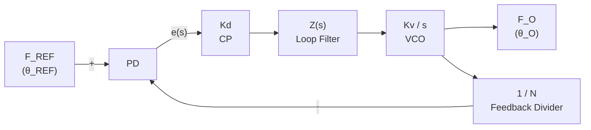

## Key takeaways

- A PLL is a PID controller whose process variable is phase: the phase detector is the subtractor, the loop filter is the controller, and the VCO is the plant.
- The VCO is a pure integrator (K_vco/s) in phase, so even a first-order PLL with proportional gain alone is a second-order system.
- P loop filters leave a non-zero steady-state phase error under a frequency offset; the integral term of a PI filter drives it to zero, which is why PI is the workhorse.
- Lock, capture, and pull-in ranges are distinct and ordered: capture < pull-in < lock; first-order filters collapse all three into one degenerate case.

A **phase-locked loop** is one of those circuits that shows up everywhere and is rarely understood deeply. The 1970s TV tuner. The 1990s modem. The 2010s radio base station. The 2020s clock-data-recovery circuit on a serialiser. In every case, it's the same three blocks: a phase detector, a loop filter, a voltage-controlled oscillator. The output is a clean synthesised frequency that tracks a noisy input.

> [LabSide component] Side-by-side lab layout: the same interactive lab effect as LabCanvas (referenced by its `effect` slug) rendered in one column with the post's prose (`children`) beside it, stacking vertically on mobile. `reverse` swaps the columns; `params` override defaults and `controls={false}` hides the effect's controls. Used to weave explanation and visualisation together rather than dropping the lab as an isolated figure. The rendered post has the live version; this is a placeholder for the markdown-only sibling.

The lab above is the canonical picture of a PLL in action. The reference is **chirped**: its frequency rises linearly with time, modelling a Doppler-shifted signal or a frequency-hopping transmitter. The PLL is locked at low chirp rates, slips a cycle as the chirp rate exceeds the loop bandwidth, and goes out of lock entirely beyond a critical chirp slope. The PI filter gives a wider lock range than a pure P filter, at the cost of slower convergence.

The goal of this post is to replace the textbook sequence ("here is a phase detector, here is a VCO, here is a transfer function") with the *control-system* picture: a PLL is a control loop, and the same intuition you've got for a PID controller carries over more or less directly.

## The control-system picture

> [Callout component] Styled info-block component (ported from the feelingdesigner project at ~/projects/feelingdesigner). Renders a rounded card with a tinted background, a 1px left accent bar in the type-specific colour, a quarter-circle SVG in the top-left corner that visually "cuts" the corner, and a floating icon badge that sits half-off the top edge. Seven types are available, each with its own accent colour and icon: info (blue, Info icon, neutral information), warning (yellow, AlertCircle, subtle caution), success (blue, CheckCircle, positive confirmation), error (red, XCircle, something is wrong), thinking (orange, Brain, an insight or mental model), feeling (red, Heart, a subjective observation), and doing (yellow, Hammer, a practical step to take). Used in the post to highlight key insights, contrasts, and gotchas without breaking the prose flow.

A PLL is a feedback control system whose **process variable is the phase difference** between two signals. The phase detector measures the error, the loop filter amplifies and integrates it, and the VCO's output is the control signal. The PLL's job is to drive the phase error to zero. That is the same objective as any other control loop, but applied to a periodic signal where the "setpoint" is a frequency match and the "error" is a phase difference.

The three blocks of a PLL map onto the canonical feedback loop:

# DIAGRAM: Phase-Locked Loop
> Negative feedback continuously minimizes phase error Δθ

## Nodes
- **[in]** F_REF - (θ_REF) (Type: frontend)
- **[pd]** PD (Type: backend)
- **[cp]** Kd - CP (Type: backend)
- **[lf]** Z(s) - Loop Filter (Type: backend)
- **[vco]** Kv / s - VCO (Type: backend)
- **[out]** F_O - (θ_O) (Type: frontend)
- **[div]** 1 / N - Feedback Divider (Type: backend)

## Flow
[in] --[+]--> [pd]
[pd] --[e(s)]--> [cp]
[cp] ----> [lf]
[lf] ----> [vco]
[vco] ----> [out]
[vco] ----> [div]
[div] --[-]--> [pd]

## Highlighted Journeys
- Journey 1: in -> pd -> cp -> lf -> vco -> out
- Journey 2: vco -> div -> pd

## Mermaid Representation


The phase detector is a **subtractor** that compares the reference phase to the VCO phase. The loop filter is a **controller** with proportional and integral terms. The VCO is the **plant**: its frequency is proportional to the control voltage, so its phase is the integral of the control voltage.

This is the same picture as a PID controller regulating the speed of a motor. The only unusual bit is that the **error signal is periodic**: phase wraps at 2π, so the linearisation is only valid inside a small region around the lock point. Worth keeping in the back of your mind.

## The phase detector: a multiply, in disguise

> [Equation component] Labeled display-math block (KaTeX-rendered). Wraps a `$$...$$` math expression with an optional `id` for cross-references, an explicit `number` like "(3.2)", and a short `caption` shown below in monospace muted text. The math is rendered server-side via `remark-math` + `rehype-katex` (Katex is the rendering engine, not MathJax). Use this for the *important* equations — the ones the reader should remember, the ones the post's argument hinges on. A 2,000-word post should have 3-5 numbered equations, not 30; the rest stay as inline `$...$` math in running prose. Cross-reference via `<a href="#eqn:...">equation (1)</a>`.

```latex
2 \sin(\omega_\text{ref} t + \phi_\text{ref}) \cdot \sin(\omega_\text{vco} t + \phi_\text{vco}) = \cos\!\big((\omega_\text{ref} - \omega_\text{vco})\,t + (\phi_\text{ref} - \phi_\text{vco})\big) - \cos\!\big((\omega_\text{ref} + \omega_\text{vco})\,t + (\phi_\text{ref} + \phi_\text{vco})\big)
```

$$
2 \sin(\omega_\text{ref} t + \phi_\text{ref}) \cdot \sin(\omega_\text{vco} t + \phi_\text{vco}) =
   \cos\!\big((\omega_\text{ref} - \omega_\text{vco})\,t + (\phi_\text{ref} - \phi_\text{vco})\big) - \cos\!\big((\omega_\text{ref} + \omega_\text{vco})\,t + (\phi_\text{ref} + \phi_\text{vco})\big)
$$

The simplest phase detector is a **multiplier** followed by a low-pass filter. The high-frequency term $\cos\!\big((\omega_\text{ref} + \omega_\text{vco})\,t + \ldots\big)$ is filtered out. What we're left with is $\cos\!\big((\omega_\text{ref} - \omega_\text{vco})\,t + (\phi_\text{ref} - \phi_\text{vco})\big)$. This signal is:

- DC (zero) when $\omega_\text{ref} = \omega_\text{vco}$ and $\phi_\text{ref} = \phi_\text{vco}$, the lock condition
- A slow sinusoid when the frequencies are close but not equal
- A faster sinusoid as the frequency difference grows

So the phase detector's output is really the **sin of the phase error**, in disguise. To get a clean phase error, the textbook options are:

- A **XOR gate** for digital square waves (output is a triangle wave around the lock point, linear over ±π/2)
- A **Gilbert cell multiplier** for analogue signals (true sin of phase error, linear near lock)
- A **phase-frequency detector** (PFD) for digital signals that may have a frequency offset, with a directional pulse train as its output

The lab uses a PFD-style phase detector, which is the most common choice in modern digital PLLs.

> [Callout component] Styled info-block component (ported from the feelingdesigner project at ~/projects/feelingdesigner). Renders a rounded card with a tinted background, a 1px left accent bar in the type-specific colour, a quarter-circle SVG in the top-left corner that visually "cuts" the corner, and a floating icon badge that sits half-off the top edge. Seven types are available, each with its own accent colour and icon: info (blue, Info icon, neutral information), warning (yellow, AlertCircle, subtle caution), success (blue, CheckCircle, positive confirmation), error (red, XCircle, something is wrong), thinking (orange, Brain, an insight or mental model), feeling (red, Heart, a subjective observation), and doing (yellow, Hammer, a practical step to take). Used in the post to highlight key insights, contrasts, and gotchas without breaking the prose flow.

The textbook lock range of a first-order PLL (no loop filter) is determined by the phase detector's linear range. A multiplier has a small linear range near lock and saturates for phase errors past roughly π/4. Once the loop slips out of this linear range, it can't re-acquire. This is the equivalent of a controller's saturation, and the fix is the same. A wider controller bandwidth (here, a higher loop filter gain) extends the lock range at the cost of noise rejection.

## The VCO: integrator by design

A voltage-controlled oscillator's output frequency is a linear function of its input voltage:

> [Equation component] Labeled display-math block (KaTeX-rendered). Wraps a `$$...$$` math expression with an optional `id` for cross-references, an explicit `number` like "(3.2)", and a short `caption` shown below in monospace muted text. The math is rendered server-side via `remark-math` + `rehype-katex` (Katex is the rendering engine, not MathJax). Use this for the *important* equations — the ones the reader should remember, the ones the post's argument hinges on. A 2,000-word post should have 3-5 numbered equations, not 30; the rest stay as inline `$...$` math in running prose. Cross-reference via `<a href="#eqn:...">equation (1)</a>`.

```latex
\omega_\text{vco} = \omega_0 + K_\text{vco} \cdot u_c
```

$$
\omega_\text{vco} = \omega_0 + K_\text{vco} \cdot u_c
$$

The phase is the integral of the frequency:

> [Equation component] Labeled display-math block (KaTeX-rendered). Wraps a `$$...$$` math expression with an optional `id` for cross-references, an explicit `number` like "(3.2)", and a short `caption` shown below in monospace muted text. The math is rendered server-side via `remark-math` + `rehype-katex` (Katex is the rendering engine, not MathJax). Use this for the *important* equations — the ones the reader should remember, the ones the post's argument hinges on. A 2,000-word post should have 3-5 numbered equations, not 30; the rest stay as inline `$...$` math in running prose. Cross-reference via `<a href="#eqn:...">equation (1)</a>`.

```latex
\phi_\text{vco} = \int \omega_\text{vco}\, dt = \omega_0 t + K_\text{vco} \int u_c\, dt
```

$$
\phi_\text{vco} = \int \omega_\text{vco}\, dt = \omega_0 t + K_\text{vco} \int u_c\, dt
$$

In Laplace notation, the VCO is a pure integrator with gain $K_\text{vco}/s$. This is the plant. The phase detector measures $\phi_\text{ref} - \phi_\text{vco}$, the loop filter amplifies and integrates the result, and the VCO integrates again to produce its phase. Two integrators stacked back to back, which is where the second-order behaviour comes from.

A first-order PLL (no loop filter, just a gain $K$) is a **second-order system** with one integrator in the controller-free path (the VCO) and another from the phase detector's transfer. The closed-loop transfer function is:

> [Equation component] Labeled display-math block (KaTeX-rendered). Wraps a `$$...$$` math expression with an optional `id` for cross-references, an explicit `number` like "(3.2)", and a short `caption` shown below in monospace muted text. The math is rendered server-side via `remark-math` + `rehype-katex` (Katex is the rendering engine, not MathJax). Use this for the *important* equations — the ones the reader should remember, the ones the post's argument hinges on. A 2,000-word post should have 3-5 numbered equations, not 30; the rest stay as inline `$...$` math in running prose. Cross-reference via `<a href="#eqn:...">equation (1)</a>`.

```latex
H(s) = \frac{\omega_n^2}{s^2 + 2\zeta\omega_n s + \omega_n^2}, \qquad \omega_n^2 = K \cdot K_\text{vco}
```

$$
H(s) = \frac{\omega_n^2}{s^2 + 2\zeta\omega_n s + \omega_n^2}, \qquad \omega_n^2 = K \cdot K_\text{vco}
$$

That's a **second-order system** with natural frequency $\omega_n = \sqrt{K \cdot K_\text{vco}}$. With realistic loop-filter damping the ratio tends to land around $\zeta = 0.5$. Underdamped, just barely. A textbook result that surprises nobody who's tuned a control loop.

> [Callout component] Styled info-block component (ported from the feelingdesigner project at ~/projects/feelingdesigner). Renders a rounded card with a tinted background, a 1px left accent bar in the type-specific colour, a quarter-circle SVG in the top-left corner that visually "cuts" the corner, and a floating icon badge that sits half-off the top edge. Seven types are available, each with its own accent colour and icon: info (blue, Info icon, neutral information), warning (yellow, AlertCircle, subtle caution), success (blue, CheckCircle, positive confirmation), error (red, XCircle, something is wrong), thinking (orange, Brain, an insight or mental model), feeling (red, Heart, a subjective observation), and doing (yellow, Hammer, a practical step to take). Used in the post to highlight key insights, contrasts, and gotchas without breaking the prose flow.

The VCO's transfer function $K_\text{vco}/s$ is a pure integrator. Its Bode plot is a constant gain at low frequency rolling off at −20 dB/decade, with a phase of −90° at all frequencies. Multiply by a proportional loop filter $K$ and you have the open-loop transfer function $K \cdot K_\text{vco}/s$, the same shape as a Type-1 control system.

Adding an integrator in the loop filter (the I in PI) gives $K \cdot (1 + 1/(\tau s)) \cdot K_\text{vco}/s$, a Type-2 system. Zero steady-state phase error, but at the cost of phase margin.

## The loop filter: a P, PI, or PID, by another name

The lab exposes the loop filter as a dropdown. The three options map directly onto the three controllers we already know:

- **P (proportional)**: $F(s) = K_p$. The simplest possible loop. Phase error in steady state is $\Delta\omega / (K_p \cdot K_\text{vco})$, non-zero if the reference frequency is offset.
- **PI (proportional + integral)**: $F(s) = K_p + K_i / s$. The integral term drives the steady-state phase error to zero. This is the **workhorse**, used in the overwhelming majority of PLLs.
- **PID (with derivative)**: $F(s) = K_p + K_i / s + K_d s$. The derivative term extends the loop bandwidth but amplifies phase-detector noise. Rare in practice for PLLs, because the phase detector's noise is already a problem.

The textbook design problem ("given a reference frequency accuracy, a noise floor, and a settling time requirement, choose K_p, K_i, K_d") is identical to the textbook PID design problem. The same Bode-stability methods, the same trade-off between bandwidth and noise, the same instability when you push the gain too high.

> [LabSide component] Side-by-side lab layout: the same interactive lab effect as LabCanvas (referenced by its `effect` slug) rendered in one column with the post's prose (`children`) beside it, stacking vertically on mobile. `reverse` swaps the columns; `params` override defaults and `controls={false}` hides the effect's controls. Used to weave explanation and visualisation together rather than dropping the lab as an isolated figure. The rendered post has the live version; this is a placeholder for the markdown-only sibling.

The Bode plot above is the textbook way to design the loop. The **0 dB crossing** of the open-loop gain sets the loop bandwidth. Wider bandwidth means faster tracking of frequency changes (and reference noise). Narrower means better rejection of VCO phase noise and reference spurs. It's the same tension you fight in any control loop.

The phase margin at the crossover is the stability margin. The textbook 45–60° target is the same as for any Type-2 control system.

## Tracking, lock range, and pull-in

Three concepts in PLL design, often confused:

- **Lock range**: the range of frequencies the PLL can hold lock on, given that it is *already* locked. Set by the loop's linear range.
- **Capture range** is the range of frequencies the PLL can acquire lock on, starting from *unlocked*. Smaller than the lock range; limited by the loop filter's bandwidth.
- **Pull-in range** is the range from which the PLL will eventually acquire lock, after a slow transient. Larger than the capture range; set by the loop filter's natural frequency.

> [StatGroup component] Editorial metric row — a wrapper for 2-4 `<Stat>` components, rendered as a horizontal band that breaks up long prose. The individual stats follow as their own placeholders.

> [Stat component] Editorial stat callout. Renders one key metric as large `value` text under a `label` header, with optional smaller `context` subtext beneath. Used inside a `<StatGroup>` to surface the numbers the post hinges on.

  

> [Stat component] Editorial stat callout. Renders one key metric as large `value` text under a `label` header, with optional smaller `context` subtext beneath. Used inside a `<StatGroup>` to surface the numbers the post hinges on.

  

> [Stat component] Editorial stat callout. Renders one key metric as large `value` text under a `label` header, with optional smaller `context` subtext beneath. Used inside a `<StatGroup>` to surface the numbers the post hinges on.

The relationships between these three define what the PLL can do in practice. A PLL with a first-order loop filter has all three ranges equal, a degenerate case. A second-order PLL (with PI filter) has capture range < lock range, because the filter's pole at the origin creates a low-pass behaviour during acquisition. A third-order loop (with a narrow filter at high frequency) can have a very wide lock range but a very narrow capture range. In practice you're usually trading one against the other.

> [Callout component] Styled info-block component (ported from the feelingdesigner project at ~/projects/feelingdesigner). Renders a rounded card with a tinted background, a 1px left accent bar in the type-specific colour, a quarter-circle SVG in the top-left corner that visually "cuts" the corner, and a floating icon badge that sits half-off the top edge. Seven types are available, each with its own accent colour and icon: info (blue, Info icon, neutral information), warning (yellow, AlertCircle, subtle caution), success (blue, CheckCircle, positive confirmation), error (red, XCircle, something is wrong), thinking (orange, Brain, an insight or mental model), feeling (red, Heart, a subjective observation), and doing (yellow, Hammer, a practical step to take). Used in the post to highlight key insights, contrasts, and gotchas without breaking the prose flow.

Add a third integrator to the loop filter (Type-3 system), and the PLL is **structurally unstable**. The reference frequency can drift arbitrarily, the VCO follows it, but the control signal to the VCO is unbounded. The same trap exists in any third-order control loop: you can't have a Type-3 system track a ramp without a feedforward path.

The fix in the PLL world: a *lead* compensator (a real zero near the origin) that gives a finite DC gain without a true integrator. The fix in the controls world: the same.

## The lab: what to look for

The PLL lab at the top of this post is a sandbox for the dynamics described above. Three experiments are worth running:

1. **Lock range vs. loop filter type.** Switch the filter dropdown between P, PI, and PID. With a small frequency step in the reference, watch the phase error settle. PI gives zero steady-state error; P does not. PID converges faster but with more overshoot.

2. **Capture range vs. loop bandwidth.** With a chirped reference, the capture range is the maximum chirp slope at which the loop can still acquire. Increase the chirp rate until the loop fails. Notice that increasing K_p extends the capture range but the loop becomes noisier.

3. **Stability and gain.** Crank K_p up until the loop starts oscillating. This is the **conditional stability** boundary of a Type-2 system. Reduce K_p until the oscillation just damps. That point is roughly your stability margin.

The same three experiments on a real PLL would take a soldering iron and an afternoon. The lab collapses them into a few clicks.

> [LabCanvas component] Inline interactive lab canvas. Embeds any effect registered in `lib/lab/registry.ts` (referenced by its `effect` slug) as a live Canvas2D/WebGL visualisation, with the effect's own controls rendered below unless `controls={false}`. Optional `params` override the effect's defaults and `caption` adds a figcaption. The rendered post has the live, interactive version; this is a static placeholder for the markdown-only sibling — read the matching lab explainer under `/lab/<slug>/` for the full description of what the effect shows.

The PID lab above is the controls-engineering twin of the PLL lab. **Same plant, same controller topology, same dynamics.**

> [PullQuote component] Editorial pull-quote. Renders a striking sentence from the surrounding prose as a large, italicised blockquote with a branded accent border. The quote text follows this placeholder verbatim, so the LLM reader still sees the highlighted sentence.

A PLL is a phase-domain PID controller; a motor drive is a speed-domain PID controller. The mathematics, the design heuristics, the failure modes: they map 1:1.

This isn't a coincidence. The control system is a *pattern*, and the PLL is one of its many instantiations. Once you've got the pattern, you can recognise it everywhere.

## Why this post exists

The PLL is the **canonical example** of a feedback control system operating on a non-electrical variable. A PID controller regulates a motor speed. A PLL regulates a phase. The pattern is the same; the application is different.

The lab at the top is a working sketchpad for that pattern. Drag the controls, watch the dynamics, observe the regimes (locked, slipping, unlocked) emerge from the same equations. The PID lab in "The lab: what to look for" is the controls lab: the same Bode plot (from "The loop filter: a P, PI, or PID, by another name"), the same design rules, a different physical system. The same loop, twice.

The two labs are the most direct demonstration I know of the *transfer function as a unifying concept* in modern engineering: once you can read a Bode plot, you can design a PLL, a PID, a state-space observer, a Kalman filter. The transfer function is the language, and the labs are where we get to have the conversation. Go break one and see what falls out.

## Reading further

- **Gardner, *Phaselock Techniques*, 3rd ed. (2005)** is the canonical reference, dense but complete. Chapter 1 is a one-paragraph summary; chapter 2 is the maths; chapter 6 is the loop filter design.
- **Best, *Phase-Locked Loops: Design, Simulation, and Applications*, 6th ed. (2007)**: more accessible, better for engineers who want to build one.
- **Abramovitch, *Phase-Locked Loops: A Control Centric Tutorial* (2002)** is free online. The clearest treatment of the control-system picture, written by a controls engineer for controls engineers.
- **Franklin, Powell, Emami-Naeini, *Feedback Control of Dynamic Systems*, 8th ed. (2019)**, chapter 8: phase-locked loops as a control-system application. The reason a PLL feels familiar if you've read a controls textbook.
